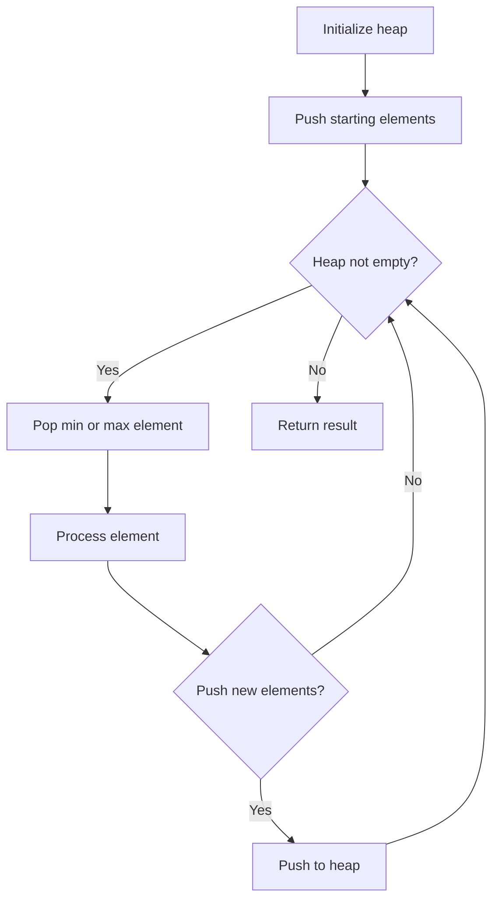
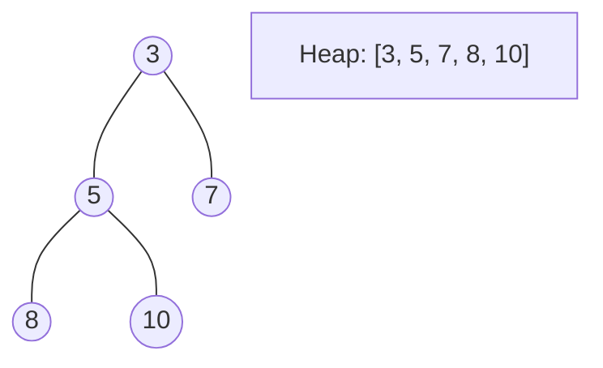
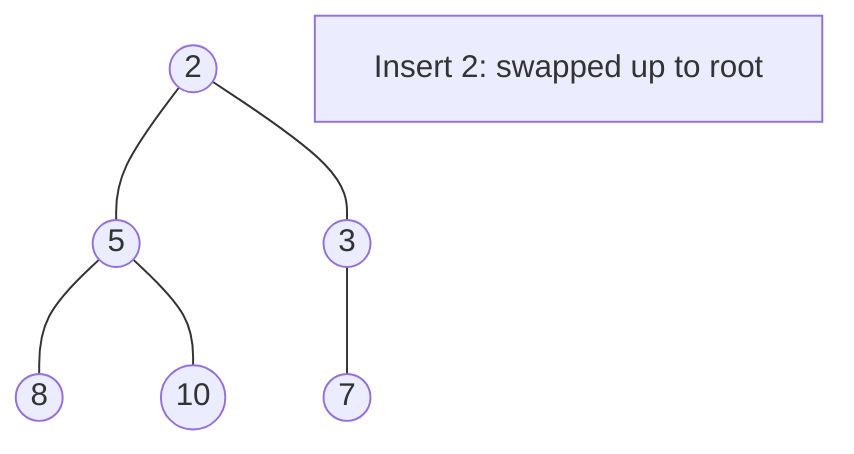
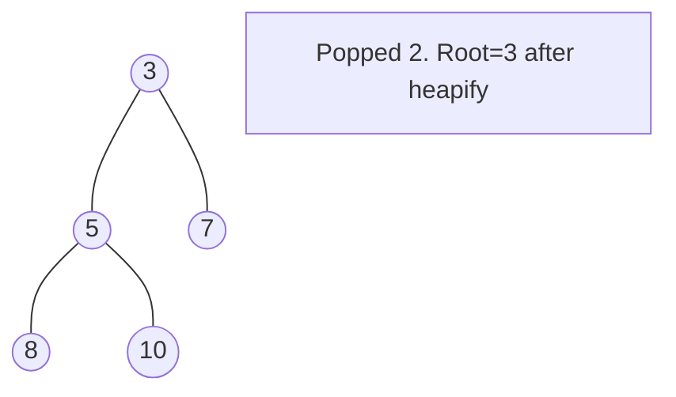

# Problem 1514: Path with Maximum Probability

**Difficulty:** Medium  
**Tags:** Array, Graph Theory, Heap (Priority Queue), Shortest Path  
**Pattern:** Dijkstra (Max Probability)  
**Link:** [leetcode.com/problems/path-with-maximum-probability](https://leetcode.com/problems/path-with-maximum-probability/)

## Description

You are given an undirected weighted graph of `n` nodes (0-indexed), represented by an edge list where `edges[i] = [a, b]` is an undirected edge connecting the nodes `a` and `b` with a probability of success of traversing that edge `succProb[i]`.

Given two nodes `start` and `end`, find the path with the maximum probability of success to go from `start` to `end` and return its success probability.

If there is no path from `start` to `end`, **return 0**. Your answer will be accepted if it differs from the correct answer by at most **1e-5**.

 

Example 1:

****

```

**Input:** n = 3, edges = [[0,1],[1,2],[0,2]], succProb = [0.5,0.5,0.2], start = 0, end = 2
**Output:** 0.25000
**Explanation:** There are two paths from start to end, one having a probability of success = 0.2 and the other has 0.5 * 0.5 = 0.25.

```

Example 2:

****

```

**Input:** n = 3, edges = [[0,1],[1,2],[0,2]], succProb = [0.5,0.5,0.3], start = 0, end = 2
**Output:** 0.30000

```

Example 3:

****

```

**Input:** n = 3, edges = [[0,1]], succProb = [0.5], start = 0, end = 2
**Output:** 0.00000
**Explanation:** There is no path between 0 and 2.

```

 

**Constraints:**

	- `2 <= n <= 10^4`
	- `0 <= start, end < n`
	- `start != end`
	- `0 <= a, b < n`
	- `a != b`
	- `0 <= succProb.length == edges.length <= 2*10^4`
	- `0 <= succProb[i] <= 1`
	- There is at most one edge between every two nodes.

## Approach: Dijkstra (Max Probability)

Modified Dijkstra: maximize probability instead of minimizing distance.

## Pseudocode

```
1. Initialize heap (min or max)
2. Push initial elements onto heap
3. While heap not empty and condition:
   a. Pop top element (min or max)
   b. Process element
   c. Push new elements if needed
4. Return result
```

## Algorithm Flow



## Visual State Transitions

**Heap Operations (Min-Heap):**

**Frame 1: Initial heap**


**Frame 2: Insert 2 - bubble up**


**Frame 3: Pop minimum (2) - heapify down**



## Complexity Analysis

- **Time:** O(E log V)
- **Space:** O(V + E)

## Solution (Python3)

```python
import heapq
from collections import defaultdict

class Solution:
    def maxProbability(self, n, edges, succProb, start_node, end_node):
        graph = defaultdict(list)
        for i, (a, b) in enumerate(edges):
            graph[a].append((b, succProb[i]))
            graph[b].append((a, succProb[i]))
        dist = [0.0] * n
        dist[start_node] = 1.0
        heap = [(-1.0, start_node)]
        while heap:
            neg_prob, u = heapq.heappop(heap)
            prob = -neg_prob
            if u == end_node:
                return prob
            if prob < dist[u]:
                continue
            for v, p in graph[u]:
                new_prob = prob * p
                if new_prob > dist[v]:
                    dist[v] = new_prob
                    heapq.heappush(heap, (-new_prob, v))
        return 0.0
```

## Solution (C++)

```cpp
#include <queue>
#include <string>
#include <vector>
using namespace std;

class Solution {
public:
    double maxProbability(int n, vector<vector<int>>& edges, vector<double>& succProb, int start_node, int end_node) {
        // Heap/Priority Queue - O(n log k) time
        priority_queue<int, vector<int>, greater<int>> pq;
        for (int val : n) {
            pq.push(val);
            if ((int)pq.size() > edges)
                pq.pop();
        }
        return pq.empty() ? 0.0 : pq.top();
    }
};
```
