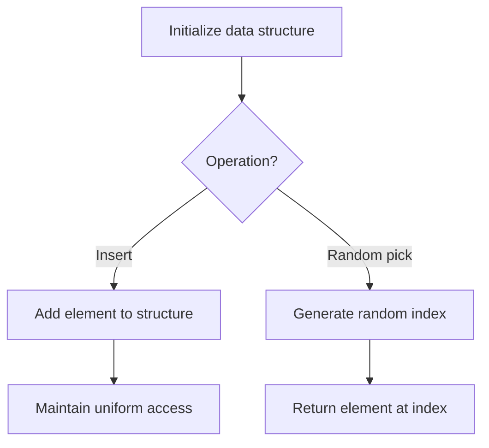

# Problem 1515: Best Position for a Service Centre

**Difficulty:** Hard  
**Tags:** Array, Math, Geometry, Randomized  
**Pattern:** Randomized Algorithm  
**Link:** [leetcode.com/problems/best-position-for-a-service-centre](https://leetcode.com/problems/best-position-for-a-service-centre/)

## Description

A delivery company wants to build a new service center in a new city. The company knows the positions of all the customers in this city on a 2D-Map and wants to build the new center in a position such that **the sum of the euclidean distances to all customers is minimum**.

Given an array `positions` where `positions[i] = [xi, yi]` is the position of the `ith` customer on the map, return *the minimum sum of the euclidean distances* to all customers.

In other words, you need to choose the position of the service center `[xcentre, ycentre]` such that the following formula is minimized:

Answers within `10^-5` of the actual value will be accepted.

 

Example 1:

```

**Input:** positions = [[0,1],[1,0],[1,2],[2,1]]
**Output:** 4.00000
**Explanation:** As shown, you can see that choosing [xcentre, ycentre] = [1, 1] will make the distance to each customer = 1, the sum of all distances is 4 which is the minimum possible we can achieve.

```

Example 2:

```

**Input:** positions = [[1,1],[3,3]]
**Output:** 2.82843
**Explanation:** The minimum possible sum of distances = sqrt(2) + sqrt(2) = 2.82843

```

 

**Constraints:**

	- `1 <= positions.length <= 50`
	- `positions[i].length == 2`
	- `0 <= xi, yi <= 100`

## Approach: Randomized Algorithm

Use randomization for expected-case efficiency. Random sampling, Fisher-Yates shuffle, or reservoir sampling.

## Pseudocode

```
1. Set up data structure for random access
2. On query:
   - Generate random index/number
   - Return corresponding element
3. Ensure uniform distribution
```

## Algorithm Flow



## Complexity Analysis

- **Time:** O(n) or varies
- **Space:** O(n)

## Solution (Python3)

```python
class Solution:
    def getMinDistSum(self, positions: List[List[int]]) -> float:
        # Randomized approach
        import random
        # Fisher-Yates shuffle or random sampling
        arr = list(positions)
        for i in range(len(arr) - 1, 0, -1):
            j = random.randint(0, i)
            arr[i], arr[j] = arr[j], arr[i]
        return arr
```

## Solution (C++)

```cpp
#include <cstdlib>
#include <ctime>
#include <string>
#include <vector>
using namespace std;

class Solution {
public:
    double getMinDistSum(vector<vector<int>>& positions) {
        // Randomized approach (Fisher-Yates shuffle)
        vector<int> arr = positions;
        srand(time(0));
        for (int i = arr.size() - 1; i > 0; i--) {
            int j = rand() % (i + 1);
            swap(arr[i], arr[j]);
        }
        return arr;
    }
};
```
