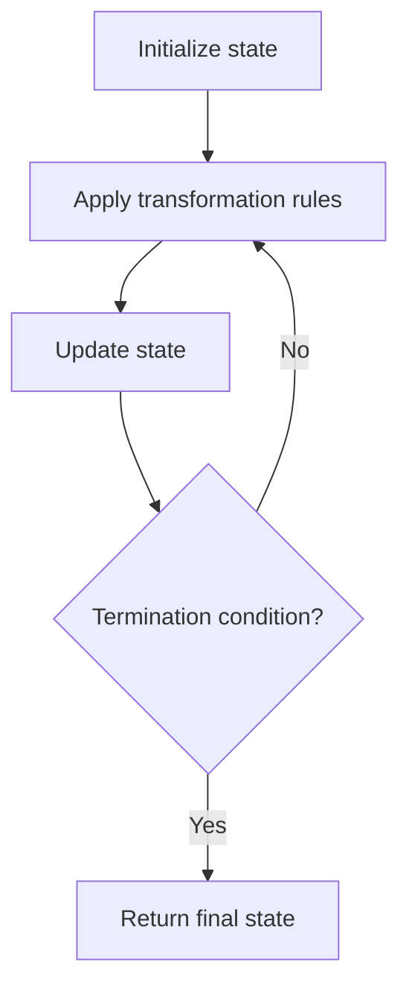

# Problem 1518: Water Bottles

**Difficulty:** Easy  
**Tags:** Math, Simulation  
**Pattern:** Simulation  
**Link:** [leetcode.com/problems/water-bottles](https://leetcode.com/problems/water-bottles/)

## Description

There are `numBottles` water bottles that are initially full of water. You can exchange `numExchange` empty water bottles from the market with one full water bottle.

The operation of drinking a full water bottle turns it into an empty bottle.

Given the two integers `numBottles` and `numExchange`, return *the **maximum** number of water bottles you can drink*.

 

Example 1:

```

**Input:** numBottles = 9, numExchange = 3
**Output:** 13
**Explanation:** You can exchange 3 empty bottles to get 1 full water bottle.
Number of water bottles you can drink: 9 + 3 + 1 = 13.

```

Example 2:

```

**Input:** numBottles = 15, numExchange = 4
**Output:** 19
**Explanation:** You can exchange 4 empty bottles to get 1 full water bottle. 
Number of water bottles you can drink: 15 + 3 + 1 = 19.

```

 

**Constraints:**

	- `1 <= numBottles <= 100`
	- `2 <= numExchange <= 100`

## Approach: Simulation

Simulate the process described in the problem step by step. Follow the rules exactly, tracking state at each step.

## Pseudocode

```
1. Initialize state (grid, pointers, counters)
2. For each step / iteration:
   a. Apply the transformation rules
   b. Update state
   c. Check termination condition
3. Return final state or result
```

## Algorithm Flow



## Complexity Analysis

- **Time:** O(n) or O(n * k)
- **Space:** O(n)

## Solution (Python3)

```python
class Solution:
    def numWaterBottles(self, numBottles: int, numExchange: int) -> int:
        # Simulation approach - follow the rules step by step
        result = 0
        for i in range(len(numBottles) if isinstance(numBottles, list) else numBottles):
            # Simulate each step
            pass
        return result
```

## Solution (C++)

```cpp
#include <string>
#include <vector>
using namespace std;

class Solution {
public:
    int numWaterBottles(int numBottles, int numExchange) {
        // Simulation approach
        int n = numBottles.size();
        for (int i = 0; i < n; i++) {
            // Simulate each step
        }
        return 0;
    }
};
```
