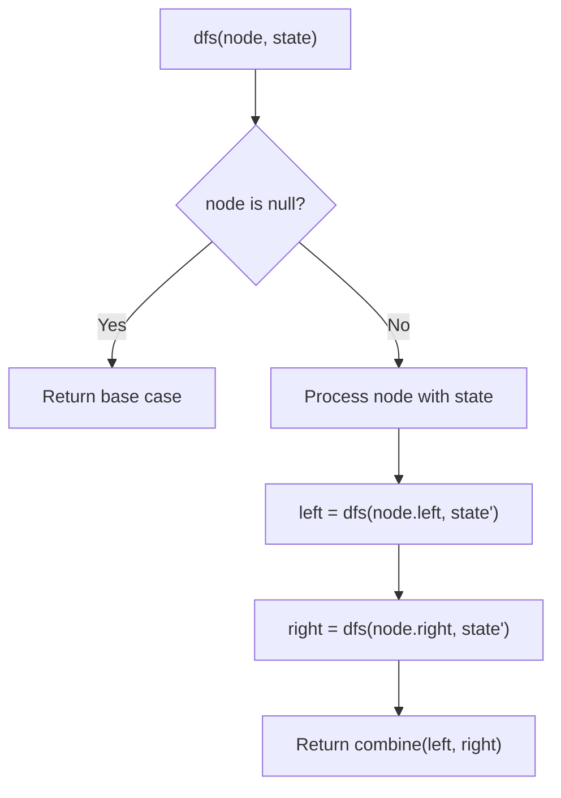
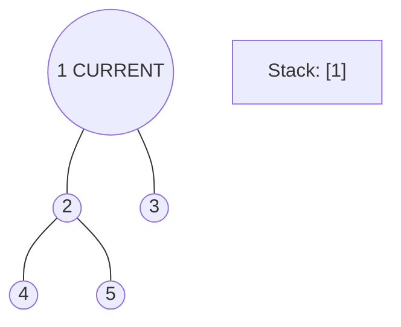
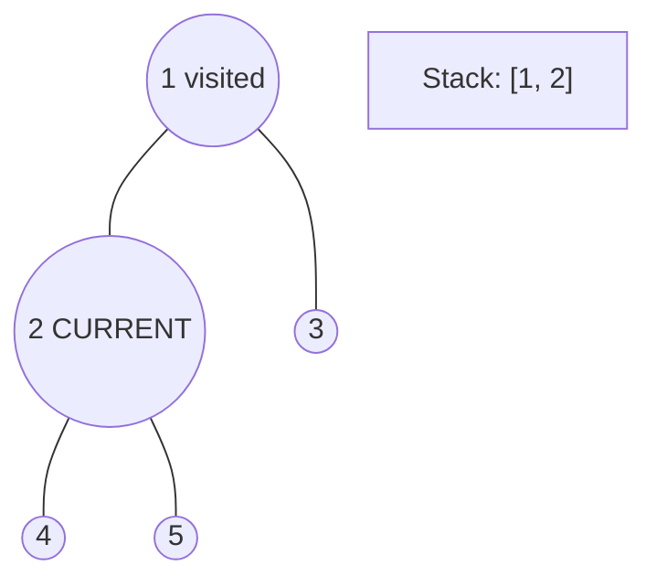
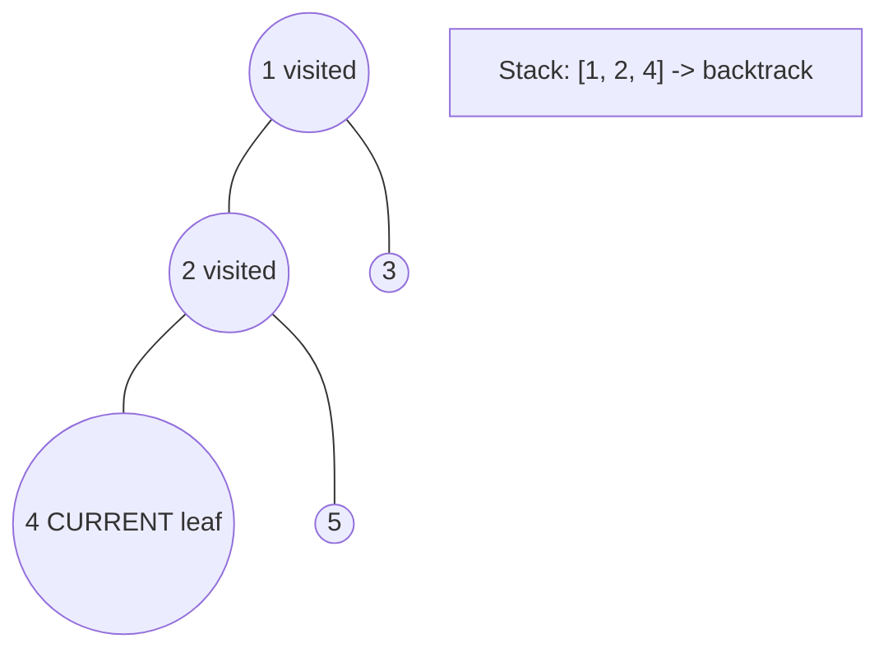
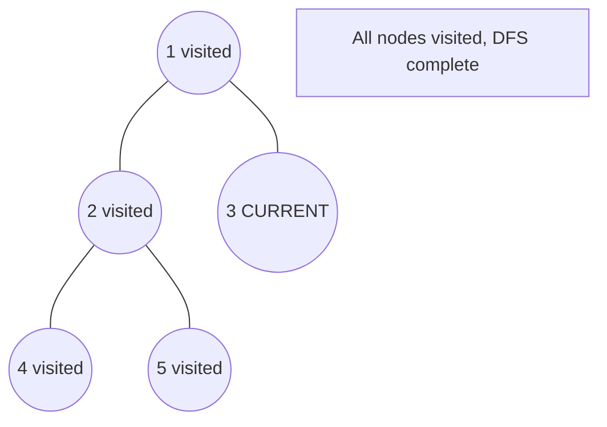

# Problem 1519: Number of Nodes in the Sub-Tree With the Same Label

**Difficulty:** Medium  
**Tags:** Hash Table, Tree, Depth-First Search, Breadth-First Search, Counting  
**Pattern:** DFS Tree Traversal  
**Link:** [leetcode.com/problems/number-of-nodes-in-the-sub-tree-with-the-same-label](https://leetcode.com/problems/number-of-nodes-in-the-sub-tree-with-the-same-label/)

## Description

You are given a tree (i.e. a connected, undirected graph that has no cycles) consisting of `n` nodes numbered from `0` to `n - 1` and exactly `n - 1` `edges`. The **root** of the tree is the node `0`, and each node of the tree has **a label** which is a lower-case character given in the string `labels` (i.e. The node with the number `i` has the label `labels[i]`).

The `edges` array is given on the form `edges[i] = [ai, bi]`, which means there is an edge between nodes `ai` and `bi` in the tree.

Return *an array of size `n`* where `ans[i]` is the number of nodes in the subtree of the `i^th` node which have the same label as node `i`.

A subtree of a tree `T` is the tree consisting of a node in `T` and all of its descendant nodes.

 

Example 1:

```

**Input:** n = 7, edges = [[0,1],[0,2],[1,4],[1,5],[2,3],[2,6]], labels = "abaedcd"
**Output:** [2,1,1,1,1,1,1]
**Explanation:** Node 0 has label 'a' and its sub-tree has node 2 with label 'a' as well, thus the answer is 2. Notice that any node is part of its sub-tree.
Node 1 has a label 'b'. The sub-tree of node 1 contains nodes 1,4 and 5, as nodes 4 and 5 have different labels than node 1, the answer is just 1 (the node itself).

```

Example 2:

```

**Input:** n = 4, edges = [[0,1],[1,2],[0,3]], labels = "bbbb"
**Output:** [4,2,1,1]
**Explanation:** The sub-tree of node 2 contains only node 2, so the answer is 1.
The sub-tree of node 3 contains only node 3, so the answer is 1.
The sub-tree of node 1 contains nodes 1 and 2, both have label 'b', thus the answer is 2.
The sub-tree of node 0 contains nodes 0, 1, 2 and 3, all with label 'b', thus the answer is 4.

```

Example 3:

```

**Input:** n = 5, edges = [[0,1],[0,2],[1,3],[0,4]], labels = "aabab"
**Output:** [3,2,1,1,1]

```

 

**Constraints:**

	- `1 <= n <= 10^5`
	- `edges.length == n - 1`
	- `edges[i].length == 2`
	- `0 <= ai, bi < n`
	- `ai != bi`
	- `labels.length == n`
	- `labels` is consisting of only of lowercase English letters.

## Approach: DFS Tree Traversal

Perform depth-first search on the tree. Recurse on left and right subtrees, combining results bottom-up. Track state (path, depth, sum) during traversal.

## Pseudocode

```
1. Define dfs(node, state):
   a. Base case: if null, return default
   b. Process node with current state
   c. left_result = dfs(node.left, updated_state)
   d. right_result = dfs(node.right, updated_state)
   e. Return combine(left_result, right_result)
2. Return dfs(root, initial_state)
```

## Algorithm Flow



## Visual State Transitions

**DFS Tree Traversal Step-by-Step:**

**Frame 1: Start at root**


**Frame 2: Go left - visit node 2**


**Frame 3: Go left - visit node 4 (leaf)**


**Frame 4: Backtrack, visit node 5, then node 3**



## Complexity Analysis

- **Time:** O(n)
- **Space:** O(h)

## Solution (Python3)

```python
class Solution:
    def countSubTrees(self, n: int, edges: List[List[int]], labels: str) -> List[int]:
        # DFS on binary tree - O(n) time, O(h) space
        def dfs(node):
            if not node:
                return 0
            left = dfs(node.left)
            right = dfs(node.right)
            return 1 + max(left, right)
        
        result = dfs(n)
        return result
```

## Solution (C++)

```cpp
#include <algorithm>
#include <functional>
#include <string>
#include <vector>
using namespace std;

class Solution {
public:
    vector<int> countSubTrees(int n, vector<vector<int>>& edges, string& labels) {
        // DFS on binary tree - O(n) time, O(h) space
        function<int(TreeNode*)> dfs = [&](TreeNode* node) -> int {
            if (!node) return 0;
            int left = dfs(node->left);
            int right = dfs(node->right);
            return 1 + max(left, right);
        };
        return dfs(n);
    }
};
```
