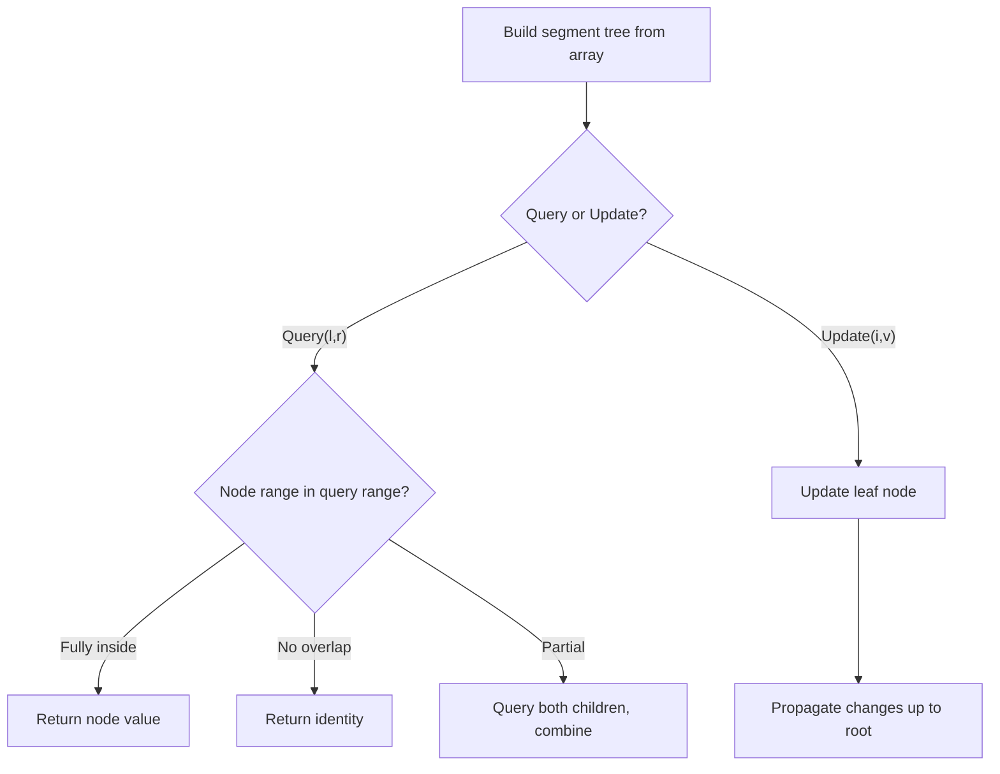

# Problem 1521: Find a Value of a Mysterious Function Closest to Target

**Difficulty:** Hard  
**Tags:** Array, Binary Search, Bit Manipulation, Segment Tree  
**Pattern:** Segment Tree  
**Link:** [leetcode.com/problems/find-a-value-of-a-mysterious-function-closest-to-target](https://leetcode.com/problems/find-a-value-of-a-mysterious-function-closest-to-target/)

## Description

Winston was given the above mysterious function `func`. He has an integer array `arr` and an integer `target` and he wants to find the values `l` and `r` that make the value `|func(arr, l, r) - target|` minimum possible.

Return *the minimum possible value* of `|func(arr, l, r) - target|`.

Notice that `func` should be called with the values `l` and `r` where `0 <= l, r < arr.length`.

 

Example 1:

```

**Input:** arr = [9,12,3,7,15], target = 5
**Output:** 2
**Explanation:** Calling func with all the pairs of [l,r] = [[0,0],[1,1],[2,2],[3,3],[4,4],[0,1],[1,2],[2,3],[3,4],[0,2],[1,3],[2,4],[0,3],[1,4],[0,4]], Winston got the following results [9,12,3,7,15,8,0,3,7,0,0,3,0,0,0]. The value closest to 5 is 7 and 3, thus the minimum difference is 2.

```

Example 2:

```

**Input:** arr = [1000000,1000000,1000000], target = 1
**Output:** 999999
**Explanation:** Winston called the func with all possible values of [l,r] and he always got 1000000, thus the min difference is 999999.

```

Example 3:

```

**Input:** arr = [1,2,4,8,16], target = 0
**Output:** 0

```

 

**Constraints:**

	- `1 <= arr.length <= 10^5`
	- `1 <= arr[i] <= 10^6`
	- `0 <= target <= 10^7`

## Approach: Segment Tree

Build a segment tree for range queries (sum, min, max) with point or range updates. Each node covers a range; queries are answered by combining relevant segments.

## Pseudocode

```
1. Build segment tree from array (O(n))
2. Query(l, r):
   - If node range within [l,r]: return node value
   - If no overlap: return identity
   - Else: combine query(left_child) and query(right_child)
3. Update(i, val): update leaf and propagate up
```

## Algorithm Flow



## Complexity Analysis

- **Time:** O(n log n) build, O(log n) query/update
- **Space:** O(n)

## Solution (Python3)

```python
class Solution:
    def closestToTarget(self, arr: List[int], target: int) -> int:
        # Segment tree for range queries - O(n log n) build, O(log n) query
        n = len(arr)
        tree = [0] * (4 * n)
        
        def build(node, start, end):
            if start == end:
                tree[node] = arr[start]
                return
            mid = (start + end) // 2
            build(2*node, start, mid)
            build(2*node+1, mid+1, end)
            tree[node] = tree[2*node] + tree[2*node+1]
        
        def query(node, start, end, l, r):
            if r < start or end < l:
                return 0
            if l <= start and end <= r:
                return tree[node]
            mid = (start + end) // 2
            return query(2*node, start, mid, l, r) + query(2*node+1, mid+1, end, l, r)
        
        build(1, 0, n-1)
        return 0
```

## Solution (C++)

```cpp
#include <functional>
#include <string>
#include <vector>
using namespace std;

class Solution {
public:
    int closestToTarget(vector<int>& arr, int target) {
        // Segment tree for range queries
        int n = arr.size();
        vector<int> tree(4 * n, 0);
        function<void(int, int, int)> build = [&](int node, int s, int e) {
            if (s == e) { tree[node] = arr[s]; return; }
            int mid = (s + e) / 2;
            build(2*node, s, mid);
            build(2*node+1, mid+1, e);
            tree[node] = tree[2*node] + tree[2*node+1];
        };
        function<int(int, int, int, int, int)> query = [&](int node, int s, int e, int l, int r) -> int {
            if (r < s || e < l) return 0;
            if (l <= s && e <= r) return tree[node];
            int mid = (s + e) / 2;
            return query(2*node, s, mid, l, r) + query(2*node+1, mid+1, e, l, r);
        };
        build(1, 0, n-1);
        return 0;
    }
};
```
