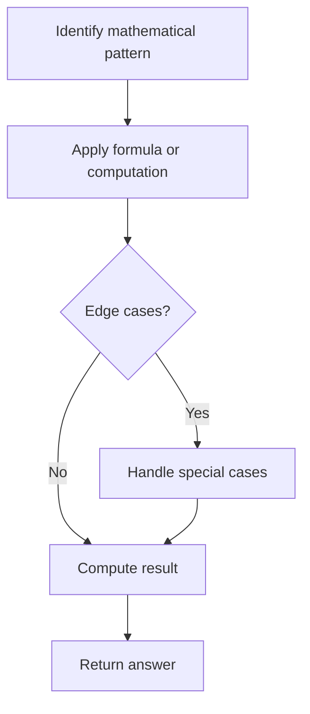

# Problem 1523: Count Odd Numbers in an Interval Range

**Difficulty:** Easy  
**Tags:** Math  
**Pattern:** Math  
**Link:** [leetcode.com/problems/count-odd-numbers-in-an-interval-range](https://leetcode.com/problems/count-odd-numbers-in-an-interval-range/)

## Description

Given two non-negative integers `low` and `high`. Return the *count of odd numbers between *`low`* and *`high`* (inclusive)*.


 

Example 1:


```

**Input:** low = 3, high = 7
**Output:** 3
**Explanation: **The odd numbers between 3 and 7 are [3,5,7].
```


Example 2:


```

**Input:** low = 8, high = 10
**Output:** 1
**Explanation: **The odd numbers between 8 and 10 are [9].
```


 

**Constraints:**


	- `0 <= low <= high <= 10^9`

## Approach: Math

Apply mathematical properties, formulas, or number-theoretic concepts. Look for patterns, modular arithmetic, or closed-form solutions.

## Pseudocode

```
1. Identify the mathematical pattern or formula
2. Apply computation:
   - Modular arithmetic for large numbers
   - GCD/LCM for divisibility
   - Sieve for primes
3. Handle edge cases
4. Return result
```

## Algorithm Flow



## Complexity Analysis

- **Time:** O(n) or O(sqrt(n))
- **Space:** O(1)

## Solution (Python3)

```python
class Solution:
    def countOdds(self, low: int, high: int) -> int:
        # Mathematical approach
        result = 0
        x = low
        while x != 0:
            result = result * 10 + x % 10
            x //= 10 if isinstance(x, int) else 1
        return result
```

## Solution (C++)

```cpp
#include <string>
#include <vector>
using namespace std;

class Solution {
public:
    int countOdds(int low, int high) {
        // Mathematical approach
        long long result = 0;
        int x = low;
        while (x != 0) {
            result = result * 10 + x % 10;
            x /= 10;
        }
        return (int)result;
    }
};
```
