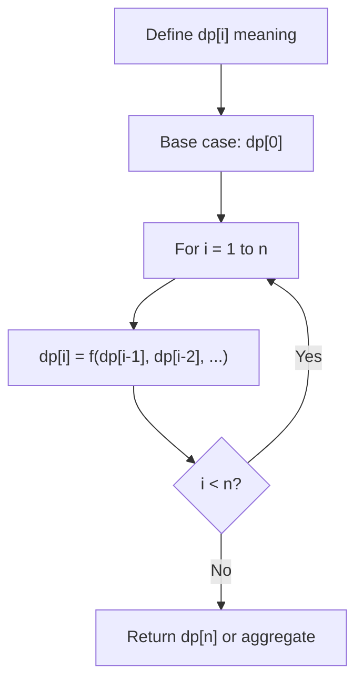
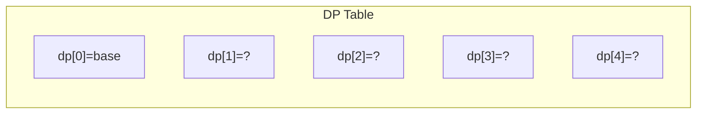
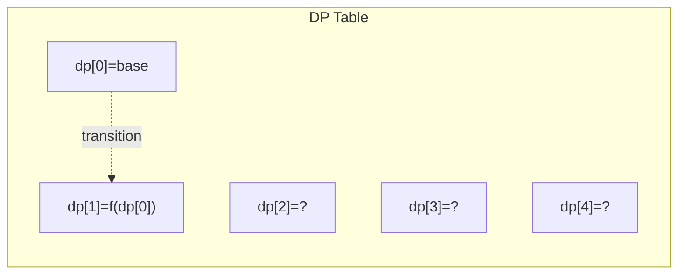
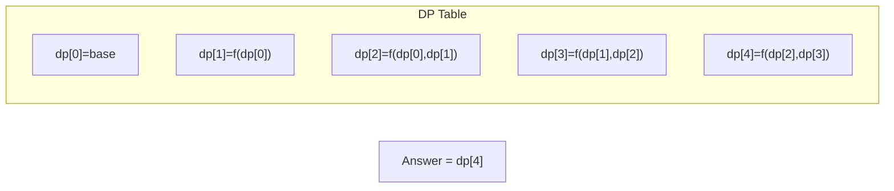

# Problem 1524: Number of Sub-arrays With Odd Sum

**Difficulty:** Medium  
**Tags:** Array, Math, Dynamic Programming, Prefix Sum  
**Pattern:** Dynamic Programming (1D)  
**Link:** [leetcode.com/problems/number-of-sub-arrays-with-odd-sum](https://leetcode.com/problems/number-of-sub-arrays-with-odd-sum/)

## Description

Given an array of integers `arr`, return *the number of subarrays with an **odd** sum*.

Since the answer can be very large, return it modulo `10^9 + 7`.

 

Example 1:

```

**Input:** arr = [1,3,5]
**Output:** 4
**Explanation:** All subarrays are [[1],[1,3],[1,3,5],[3],[3,5],[5]]
All sub-arrays sum are [1,4,9,3,8,5].
Odd sums are [1,9,3,5] so the answer is 4.

```

Example 2:

```

**Input:** arr = [2,4,6]
**Output:** 0
**Explanation:** All subarrays are [[2],[2,4],[2,4,6],[4],[4,6],[6]]
All sub-arrays sum are [2,6,12,4,10,6].
All sub-arrays have even sum and the answer is 0.

```

Example 3:

```

**Input:** arr = [1,2,3,4,5,6,7]
**Output:** 16

```

 

**Constraints:**

	- `1 <= arr.length <= 10^5`
	- `1 <= arr[i] <= 100`

## Approach: Dynamic Programming (1D)

Break the problem into overlapping subproblems. Define dp[i] as the optimal value for the subproblem ending at or considering index i. Build the solution bottom-up, using previously computed dp values.

## Pseudocode

```
1. Define dp[i] = optimal value for subproblem i
2. Base case: dp[0] = initial value
3. For i from 1 to n:
   a. dp[i] = recurrence(dp[i-1], dp[i-2], ...)
4. Return dp[n] or max/min of dp
```

## Algorithm Flow



## Visual State Transitions

**1D Dynamic Programming Table Build:**

**Frame 1: Initialize base cases**


**Frame 2: Fill dp[1] from dp[0]**


**Frame 3: Fill remaining cells**



## Complexity Analysis

- **Time:** O(n)
- **Space:** O(n)

## Solution (Python3)

```python
class Solution:
    def numOfSubarrays(self, arr: List[int]) -> int:
        # Dynamic programming (1D) - O(n) time, O(n) space
        if not arr:
            return 0
        n = len(arr) if isinstance(arr, list) else arr
        dp = [0] * (n + 1)
        dp[0] = 1  # base case
        for i in range(1, n + 1):
            dp[i] = dp[i-1]  # transition (customize per problem)
            if i >= 2:
                dp[i] += dp[i-2]
        return dp[n]
```

## Solution (C++)

```cpp
#include <string>
#include <vector>
using namespace std;

class Solution {
public:
    int numOfSubarrays(vector<int>& arr) {
        // Dynamic programming (1D) - O(n) time, O(n) space
        int n = arr;
        if (n <= 0) return 0;
        vector<int> dp(n + 1, 0);
        dp[0] = 1;
        for (int i = 1; i <= n; i++) {
            dp[i] = dp[i-1];
            if (i >= 2) dp[i] += dp[i-2];
        }
        return dp[n];
    }
};
```
