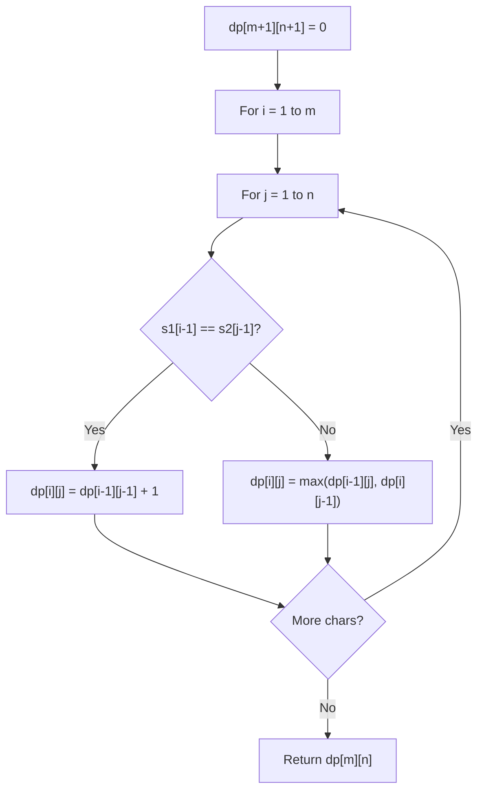

# Problem 1525: Number of Good Ways to Split a String

**Difficulty:** Medium  
**Tags:** Hash Table, String, Dynamic Programming, Bit Manipulation  
**Pattern:** Dynamic Programming (String)  
**Link:** [leetcode.com/problems/number-of-good-ways-to-split-a-string](https://leetcode.com/problems/number-of-good-ways-to-split-a-string/)

## Description

You are given a string `s`.

A split is called **good** if you can split `s` into two non-empty strings `sleft` and `sright` where their concatenation is equal to `s` (i.e., `sleft + sright = s`) and the number of distinct letters in `sleft` and `sright` is the same.

Return *the number of **good splits** you can make in `s`*.

 

Example 1:

```

**Input:** s = "aacaba"
**Output:** 2
**Explanation:** There are 5 ways to split `"aacaba"` and 2 of them are good. 
("a", "acaba") Left string and right string contains 1 and 3 different letters respectively.
("aa", "caba") Left string and right string contains 1 and 3 different letters respectively.
("aac", "aba") Left string and right string contains 2 and 2 different letters respectively (good split).
("aaca", "ba") Left string and right string contains 2 and 2 different letters respectively (good split).
("aacab", "a") Left string and right string contains 3 and 1 different letters respectively.

```

Example 2:

```

**Input:** s = "abcd"
**Output:** 1
**Explanation:** Split the string as follows ("ab", "cd").

```

 

**Constraints:**

	- `1 <= s.length <= 10^5`
	- `s` consists of only lowercase English letters.

## Approach: Dynamic Programming (String)

Compare or match two strings using a 2D DP table. dp[i][j] represents the answer for substrings s1[0..i-1] and s2[0..j-1]. Common patterns: LCS, edit distance, regex matching.

## Pseudocode

```
1. Create dp[m+1][n+1]
2. Initialize base cases
3. For i from 1 to m:
   For j from 1 to n:
     If s1[i-1] == s2[j-1]: dp[i][j] = dp[i-1][j-1] + 1
     Else: dp[i][j] = best of (dp[i-1][j], dp[i][j-1], dp[i-1][j-1])
4. Return dp[m][n]
```

## Algorithm Flow



## Complexity Analysis

- **Time:** O(m * n)
- **Space:** O(m * n)

## Solution (Python3)

```python
class Solution:
    def numSplits(self, s: str) -> int:
        # String DP - O(m*n) time and space
        m, n = len(s), len(s)
        dp = [[0] * (n + 1) for _ in range(m + 1)]
        for i in range(1, m + 1):
            for j in range(1, n + 1):
                if s[i-1] == s[j-1]:
                    dp[i][j] = dp[i-1][j-1] + 1
                else:
                    dp[i][j] = max(dp[i-1][j], dp[i][j-1])
        return dp[m][n]
```

## Solution (C++)

```cpp
#include <algorithm>
#include <string>
#include <vector>
using namespace std;

class Solution {
public:
    int numSplits(string& s) {
        // String DP - O(m*n) time and space
        int m = s.size(), n = s.size();
        vector<vector<int>> dp(m + 1, vector<int>(n + 1, 0));
        for (int i = 1; i <= m; i++) {
            for (int j = 1; j <= n; j++) {
                if (s[i-1] == s[j-1])
                    dp[i][j] = dp[i-1][j-1] + 1;
                else
                    dp[i][j] = max(dp[i-1][j], dp[i][j-1]);
            }
        }
        return dp[m][n];
    }
};
```
