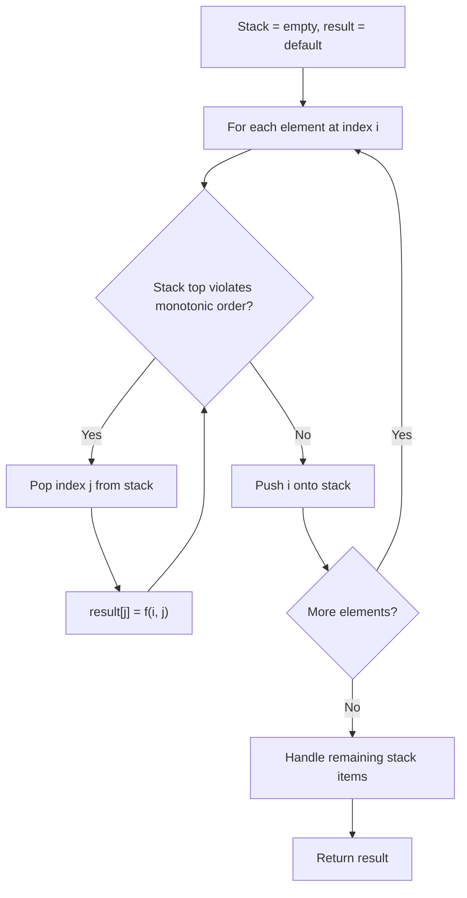
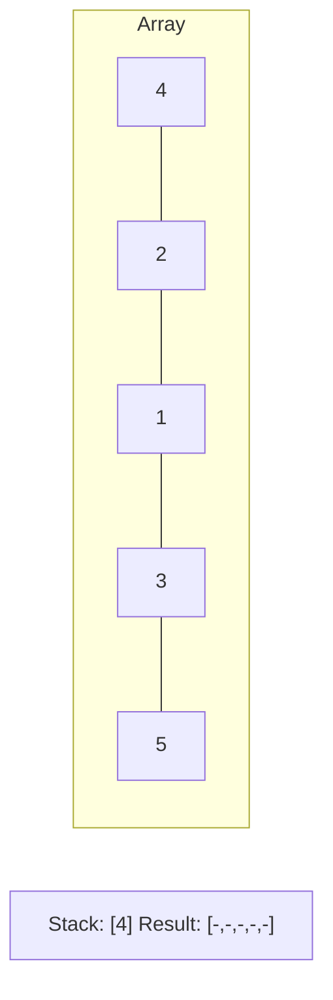
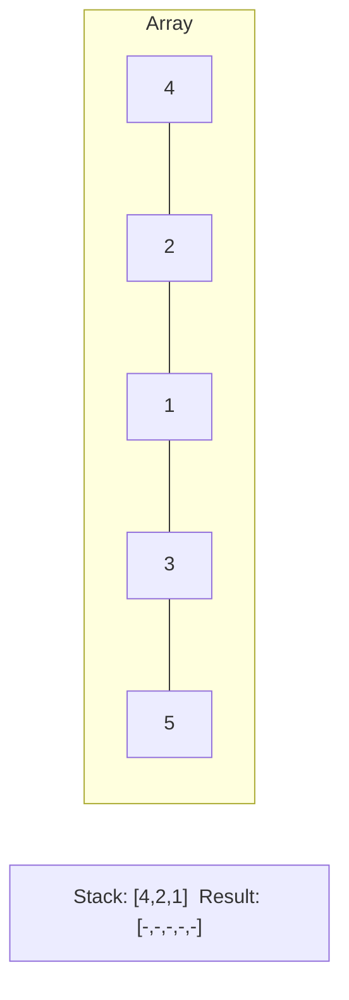
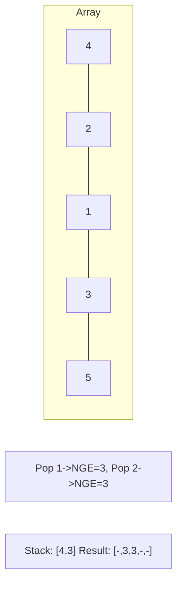
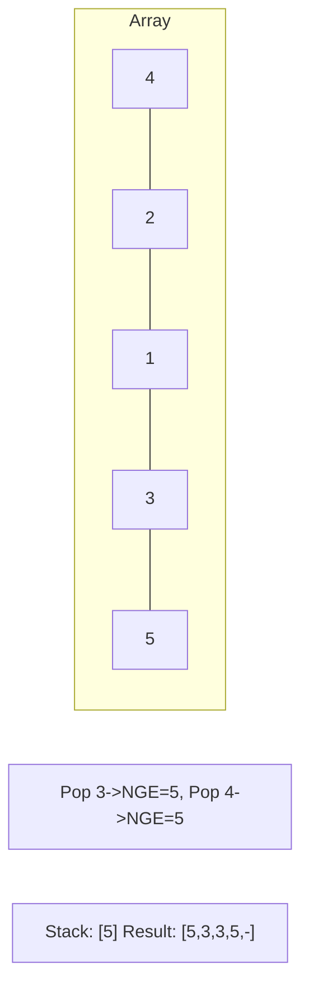

# Problem 1526: Minimum Number of Increments on Subarrays to Form a Target Array

**Difficulty:** Hard  
**Tags:** Array, Dynamic Programming, Stack, Greedy, Monotonic Stack  
**Pattern:** Monotonic Stack  
**Link:** [leetcode.com/problems/minimum-number-of-increments-on-subarrays-to-form-a-target-array](https://leetcode.com/problems/minimum-number-of-increments-on-subarrays-to-form-a-target-array/)

## Description

You are given an integer array `target`. You have an integer array `initial` of the same size as `target` with all elements initially zeros.

In one operation you can choose **any** subarray from `initial` and increment each value by one.

Return *the minimum number of operations to form a *`target`* array from *`initial`.

The test cases are generated so that the answer fits in a 32-bit integer.

 

Example 1:

```

**Input:** target = [1,2,3,2,1]
**Output:** 3
**Explanation:** We need at least 3 operations to form the target array from the initial array.
[**0,0,0,0,0**] increment 1 from index 0 to 4 (inclusive).
[1,**1,1,1**,1] increment 1 from index 1 to 3 (inclusive).
[1,2,**2**,2,1] increment 1 at index 2.
[1,2,3,2,1] target array is formed.

```

Example 2:

```

**Input:** target = [3,1,1,2]
**Output:** 4
**Explanation:** [**0,0,0,0**] -> [1,1,1,**1**] -> [**1**,1,1,2] -> [**2**,1,1,2] -> [3,1,1,2]

```

Example 3:

```

**Input:** target = [3,1,5,4,2]
**Output:** 7
**Explanation:** [**0,0,0,0,0**] -> [**1**,1,1,1,1] -> [**2**,1,1,1,1] -> [3,1,**1,1,1**] -> [3,1,**2,2**,2] -> [3,1,**3,3**,2] -> [3,1,**4**,4,2] -> [3,1,5,4,2].

```

 

**Constraints:**

	- `1 <= target.length <= 10^5`
	- `1 <= target[i] <= 10^5`
	- ​​​​​​​The input is generated such that the answer fits inside a 32 bit integer.

## Approach: Monotonic Stack

Maintain a stack where elements are always in monotonic order (increasing or decreasing). When a new element violates the monotonic property, pop elements and compute results (e.g., next greater/smaller element, spans, areas).

## Pseudocode

```
1. Initialize empty stack, result array
2. For each element (index i):
   a. While stack not empty and arr[i] breaks monotonic order:
      - Pop index j from stack
      - result[j] = compute(i, j)
   b. Push i onto stack
3. Handle remaining elements in stack
4. Return result
```

## Algorithm Flow



## Visual State Transitions

**Monotonic Stack (Next Greater Element):**

**Frame 1: Process first elements**


**Frame 2: Push smaller elements**


**Frame 3: Element 3 pops 1 and 2**


**Frame 4: Element 5 pops all**



## Complexity Analysis

- **Time:** O(n)
- **Space:** O(n)

## Solution (Python3)

```python
class Solution:
    def minNumberOperations(self, target: List[int]) -> int:
        # Monotonic stack - O(n) time, O(n) space
        n = len(target)
        result = [0] * n
        stack = []  # indices
        for i in range(n):
            while stack and target[i] > target[stack[-1]]:
                idx = stack.pop()
                result[idx] = i - idx
            stack.append(i)
        return result
```

## Solution (C++)

```cpp
#include <stack>
#include <string>
#include <vector>
using namespace std;

class Solution {
public:
    int minNumberOperations(vector<int>& target) {
        // Monotonic stack - O(n) time, O(n) space
        int n = target.size();
        vector<int> result(n, 0);
        stack<int> st;
        for (int i = 0; i < n; i++) {
            while (!st.empty() && target[i] > target[st.top()]) {
                int idx = st.top(); st.pop();
                result[idx] = i - idx;
            }
            st.push(i);
        }
        return result;
    }
};
```
