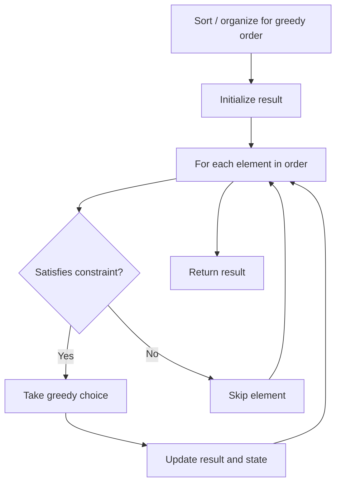

# Problem 1529: Minimum Suffix Flips

**Difficulty:** Medium  
**Tags:** String, Greedy  
**Pattern:** Greedy  
**Link:** [leetcode.com/problems/minimum-suffix-flips](https://leetcode.com/problems/minimum-suffix-flips/)

## Description

You are given a **0-indexed** binary string `target` of length `n`. You have another binary string `s` of length `n` that is initially set to all zeros. You want to make `s` equal to `target`.

In one operation, you can pick an index `i` where `0 <= i < n` and flip all bits in the **inclusive** range `[i, n - 1]`. Flip means changing `'0'` to `'1'` and `'1'` to `'0'`.

Return *the minimum number of operations needed to make *`s`* equal to *`target`.

 

Example 1:

```

**Input:** target = "10111"
**Output:** 3
**Explanation:** Initially, s = "00000".
Choose index i = 2: "00000" -> "00111"
Choose index i = 0: "00111" -> "11000"
Choose index i = 1: "11000" -> "10111"
We need at least 3 flip operations to form target.

```

Example 2:

```

**Input:** target = "101"
**Output:** 3
**Explanation:** Initially, s = "000".
Choose index i = 0: "000" -> "111"
Choose index i = 1: "111" -> "100"
Choose index i = 2: "100" -> "101"
We need at least 3 flip operations to form target.

```

Example 3:

```

**Input:** target = "00000"
**Output:** 0
**Explanation:** We do not need any operations since the initial s already equals target.

```

 

**Constraints:**

	- `n == target.length`
	- `1 <= n <= 10^5`
	- `target[i]` is either `'0'` or `'1'`.

## Approach: Greedy

Make the locally optimal choice at each step, trusting it leads to a global optimum. Greedy works when the problem has the greedy-choice property and optimal substructure.

## Pseudocode

```
1. Sort or organize data for greedy ordering
2. Initialize result
3. For each element in greedy order:
   a. If element satisfies constraint:
      - Take the greedy choice
      - Update result and state
4. Return result
```

## Algorithm Flow



## Complexity Analysis

- **Time:** O(n log n)
- **Space:** O(1)

## Solution (Python3)

```python
class Solution:
    def minFlips(self, target: str) -> int:
        # Greedy approach - O(n) time
        result = 0
        curr_max = 0
        for i in range(len(target)):
            if isinstance(target[i], int):
                curr_max = max(curr_max, target[i])
                result = max(result, curr_max)
            else:
                result += 1
        return result
```

## Solution (C++)

```cpp
#include <algorithm>
#include <string>
#include <vector>
using namespace std;

class Solution {
public:
    int minFlips(string& target) {
        // Greedy approach - O(n) time
        int result = 0, curr_max = 0;
        for (int i = 0; i < (int)target.size(); i++) {
            curr_max = max(curr_max, target[i]);
            result = max(result, curr_max);
        }
        return result;
    }
};
```
