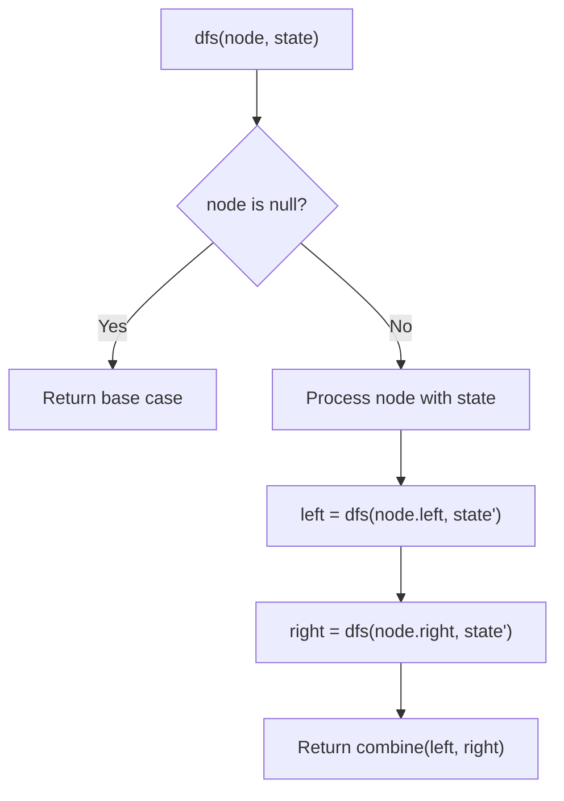
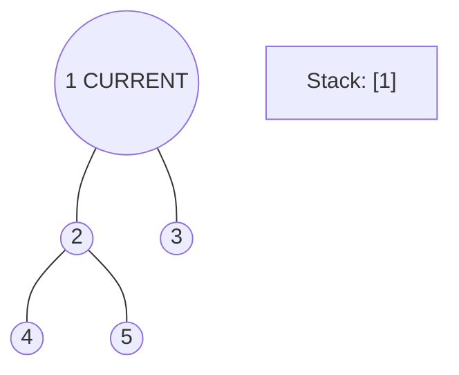
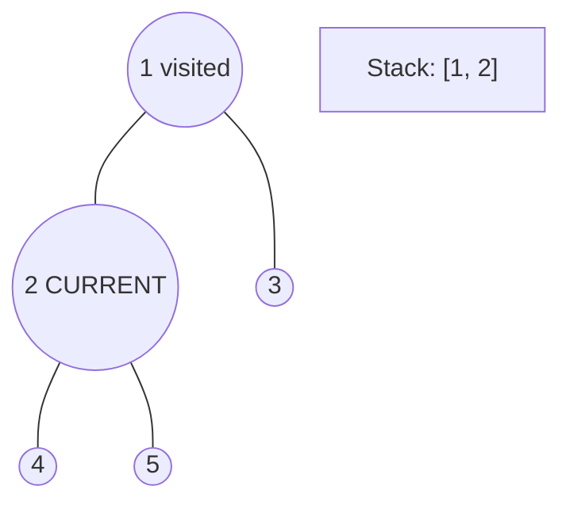
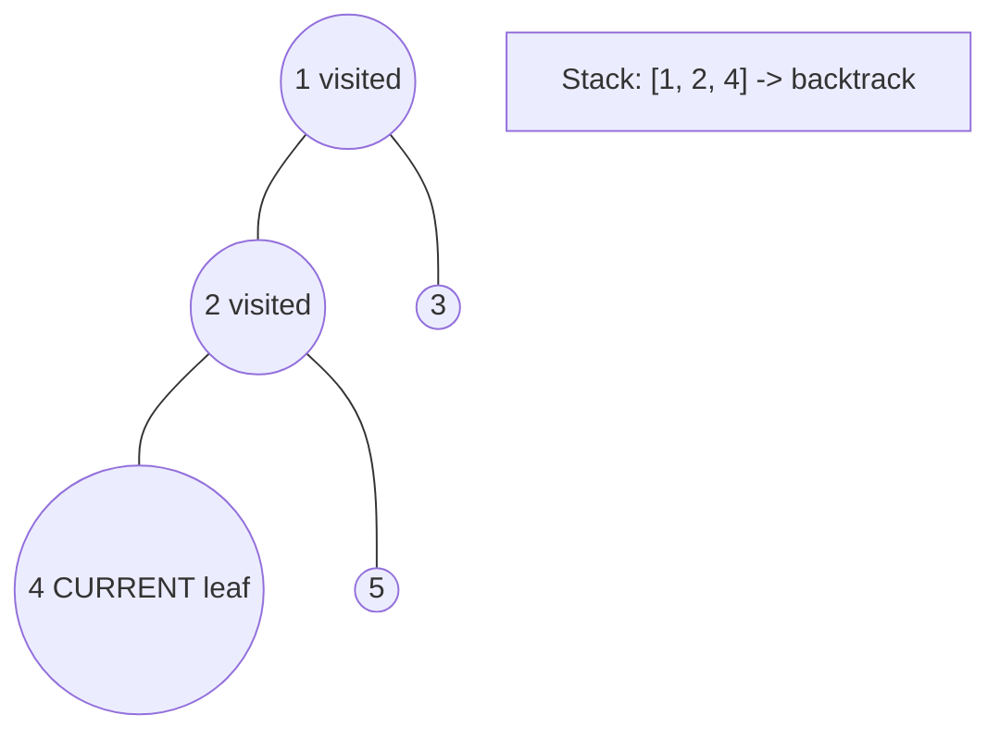
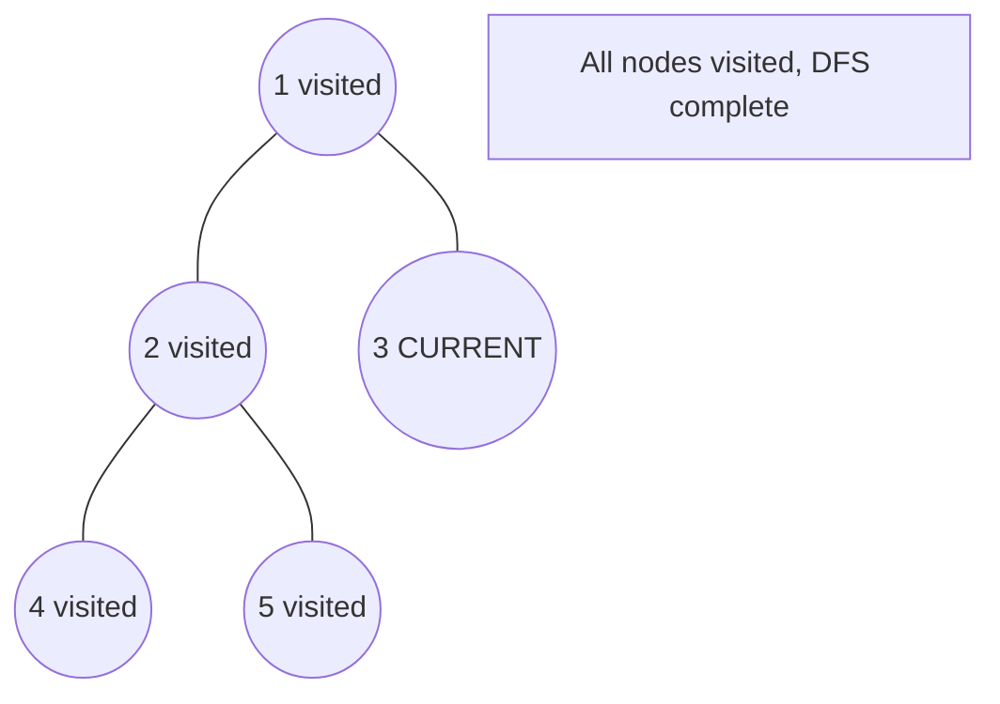

# Problem 1530: Number of Good Leaf Nodes Pairs

**Difficulty:** Medium  
**Tags:** Tree, Depth-First Search, Binary Tree  
**Pattern:** DFS Tree Traversal  
**Link:** [leetcode.com/problems/number-of-good-leaf-nodes-pairs](https://leetcode.com/problems/number-of-good-leaf-nodes-pairs/)

## Description

You are given the `root` of a binary tree and an integer `distance`. A pair of two different **leaf** nodes of a binary tree is said to be good if the length of **the shortest path** between them is less than or equal to `distance`.

Return *the number of good leaf node pairs* in the tree.

 

Example 1:

```

**Input:** root = [1,2,3,null,4], distance = 3
**Output:** 1
**Explanation:** The leaf nodes of the tree are 3 and 4 and the length of the shortest path between them is 3. This is the only good pair.

```

Example 2:

```

**Input:** root = [1,2,3,4,5,6,7], distance = 3
**Output:** 2
**Explanation:** The good pairs are [4,5] and [6,7] with shortest path = 2. The pair [4,6] is not good because the length of ther shortest path between them is 4.

```

Example 3:

```

**Input:** root = [7,1,4,6,null,5,3,null,null,null,null,null,2], distance = 3
**Output:** 1
**Explanation:** The only good pair is [2,5].

```

 

**Constraints:**

	- The number of nodes in the `tree` is in the range `[1, 2^10].`
	- `1 <= Node.val <= 100`
	- `1 <= distance <= 10`

## Approach: DFS Tree Traversal

Perform depth-first search on the tree. Recurse on left and right subtrees, combining results bottom-up. Track state (path, depth, sum) during traversal.

## Pseudocode

```
1. Define dfs(node, state):
   a. Base case: if null, return default
   b. Process node with current state
   c. left_result = dfs(node.left, updated_state)
   d. right_result = dfs(node.right, updated_state)
   e. Return combine(left_result, right_result)
2. Return dfs(root, initial_state)
```

## Algorithm Flow



## Visual State Transitions

**DFS Tree Traversal Step-by-Step:**

**Frame 1: Start at root**


**Frame 2: Go left - visit node 2**


**Frame 3: Go left - visit node 4 (leaf)**


**Frame 4: Backtrack, visit node 5, then node 3**



## Complexity Analysis

- **Time:** O(n)
- **Space:** O(h)

## Solution (Python3)

```python
class Solution:
    def countPairs(self, root: Optional[TreeNode], distance: int) -> int:
        # DFS on binary tree - O(n) time, O(h) space
        def dfs(node):
            if not node:
                return 0
            left = dfs(node.left)
            right = dfs(node.right)
            return 1 + max(left, right)
        
        result = dfs(root)
        return result
```

## Solution (C++)

```cpp
#include <algorithm>
#include <functional>
#include <string>
#include <vector>
using namespace std;

class Solution {
public:
    int countPairs(TreeNode* root, int distance) {
        // DFS on binary tree - O(n) time, O(h) space
        function<int(TreeNode*)> dfs = [&](TreeNode* node) -> int {
            if (!node) return 0;
            int left = dfs(node->left);
            int right = dfs(node->right);
            return 1 + max(left, right);
        };
        return dfs(root);
    }
};
```
