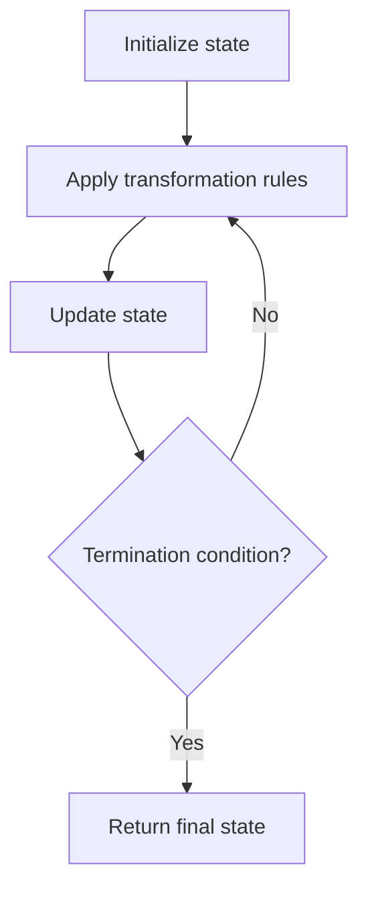

# Problem 1535: Find the Winner of an Array Game

**Difficulty:** Medium  
**Tags:** Array, Simulation  
**Pattern:** Simulation  
**Link:** [leetcode.com/problems/find-the-winner-of-an-array-game](https://leetcode.com/problems/find-the-winner-of-an-array-game/)

## Description

Given an integer array `arr` of **distinct** integers and an integer `k`.

A game will be played between the first two elements of the array (i.e. `arr[0]` and `arr[1]`). In each round of the game, we compare `arr[0]` with `arr[1]`, the larger integer wins and remains at position `0`, and the smaller integer moves to the end of the array. The game ends when an integer wins `k` consecutive rounds.

Return *the integer which will win the game*.

It is **guaranteed** that there will be a winner of the game.

 

Example 1:

```

**Input:** arr = [2,1,3,5,4,6,7], k = 2
**Output:** 5
**Explanation:** Let's see the rounds of the game:
Round |       arr       | winner | win_count
  1   | [2,1,3,5,4,6,7] | 2      | 1
  2   | [2,3,5,4,6,7,1] | 3      | 1
  3   | [3,5,4,6,7,1,2] | 5      | 1
  4   | [5,4,6,7,1,2,3] | 5      | 2
So we can see that 4 rounds will be played and 5 is the winner because it wins 2 consecutive games.

```

Example 2:

```

**Input:** arr = [3,2,1], k = 10
**Output:** 3
**Explanation:** 3 will win the first 10 rounds consecutively.

```

 

**Constraints:**

	- `2 <= arr.length <= 10^5`
	- `1 <= arr[i] <= 10^6`
	- `arr` contains **distinct** integers.
	- `1 <= k <= 10^9`

## Approach: Simulation

Simulate the process described in the problem step by step. Follow the rules exactly, tracking state at each step.

## Pseudocode

```
1. Initialize state (grid, pointers, counters)
2. For each step / iteration:
   a. Apply the transformation rules
   b. Update state
   c. Check termination condition
3. Return final state or result
```

## Algorithm Flow



## Complexity Analysis

- **Time:** O(n) or O(n * k)
- **Space:** O(n)

## Solution (Python3)

```python
class Solution:
    def getWinner(self, arr: List[int], k: int) -> int:
        # Simulation approach - follow the rules step by step
        result = 0
        for i in range(len(arr) if isinstance(arr, list) else arr):
            # Simulate each step
            pass
        return result
```

## Solution (C++)

```cpp
#include <string>
#include <vector>
using namespace std;

class Solution {
public:
    int getWinner(vector<int>& arr, int k) {
        // Simulation approach
        int n = arr.size();
        for (int i = 0; i < n; i++) {
            // Simulate each step
        }
        return 0;
    }
};
```
