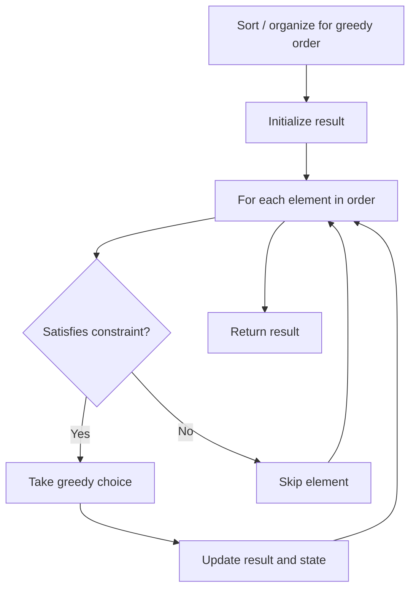

# Problem 1536: Minimum Swaps to Arrange a Binary Grid

**Difficulty:** Medium  
**Tags:** Array, Greedy, Matrix  
**Pattern:** Greedy  
**Link:** [leetcode.com/problems/minimum-swaps-to-arrange-a-binary-grid](https://leetcode.com/problems/minimum-swaps-to-arrange-a-binary-grid/)

## Description

Given an `n x n` binary `grid`, in one step you can choose two **adjacent rows** of the grid and swap them.

A grid is said to be **valid** if all the cells above the main diagonal are **zeros**.

Return *the minimum number of steps* needed to make the grid valid, or **-1** if the grid cannot be valid.

The main diagonal of a grid is the diagonal that starts at cell `(1, 1)` and ends at cell `(n, n)`.

 

Example 1:

```

**Input:** grid = [[0,0,1],[1,1,0],[1,0,0]]
**Output:** 3

```

Example 2:

```

**Input:** grid = [[0,1,1,0],[0,1,1,0],[0,1,1,0],[0,1,1,0]]
**Output:** -1
**Explanation:** All rows are similar, swaps have no effect on the grid.

```

Example 3:

```

**Input:** grid = [[1,0,0],[1,1,0],[1,1,1]]
**Output:** 0

```

 

**Constraints:**

	- `n == grid.length` `== grid[i].length`
	- `1 <= n <= 200`
	- `grid[i][j]` is either `0` or `1`

## Approach: Greedy

Make the locally optimal choice at each step, trusting it leads to a global optimum. Greedy works when the problem has the greedy-choice property and optimal substructure.

## Pseudocode

```
1. Sort or organize data for greedy ordering
2. Initialize result
3. For each element in greedy order:
   a. If element satisfies constraint:
      - Take the greedy choice
      - Update result and state
4. Return result
```

## Algorithm Flow



## Complexity Analysis

- **Time:** O(n log n)
- **Space:** O(1)

## Solution (Python3)

```python
class Solution:
    def minSwaps(self, grid: List[List[int]]) -> int:
        # Greedy approach - O(n) time
        result = 0
        curr_max = 0
        for i in range(len(grid)):
            if isinstance(grid[i], int):
                curr_max = max(curr_max, grid[i])
                result = max(result, curr_max)
            else:
                result += 1
        return result
```

## Solution (C++)

```cpp
#include <algorithm>
#include <string>
#include <vector>
using namespace std;

class Solution {
public:
    int minSwaps(vector<vector<int>>& grid) {
        // Greedy approach - O(n) time
        int result = 0, curr_max = 0;
        for (int i = 0; i < (int)grid.size(); i++) {
            curr_max = max(curr_max, grid[i]);
            result = max(result, curr_max);
        }
        return result;
    }
};
```
