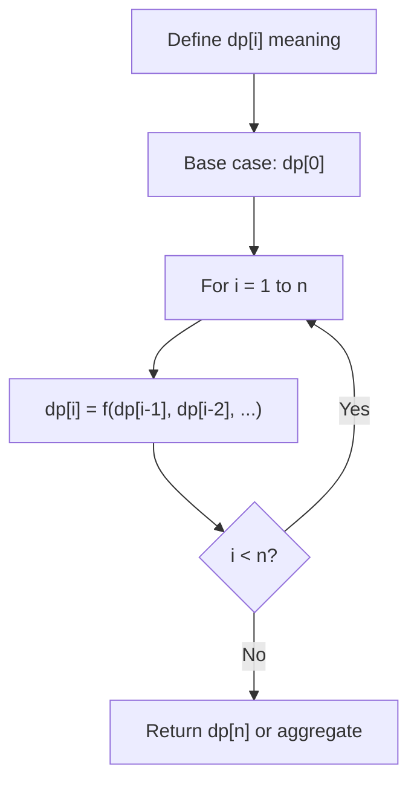
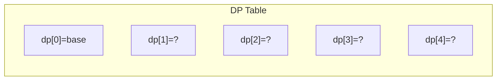
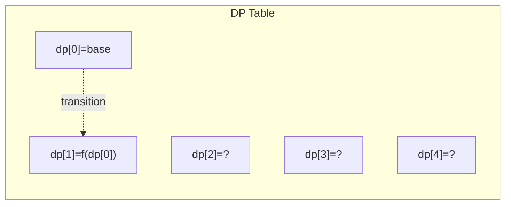
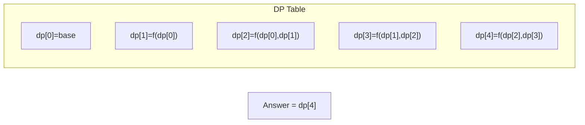

# Problem 1537: Get the Maximum Score

**Difficulty:** Hard  
**Tags:** Array, Two Pointers, Dynamic Programming, Greedy  
**Pattern:** Dynamic Programming (1D)  
**Link:** [leetcode.com/problems/get-the-maximum-score](https://leetcode.com/problems/get-the-maximum-score/)

## Description

You are given two **sorted** arrays of distinct integers `nums1` and `nums2`.

A **valid* ***path is defined as follows:

	- Choose array `nums1` or `nums2` to traverse (from index-0).
	- Traverse the current array from left to right.
	- If you are reading any value that is present in `nums1` and `nums2` you are allowed to change your path to the other array. (Only one repeated value is considered in the valid path).

The **score** is defined as the sum of unique values in a valid path.

Return *the maximum score you can obtain of all possible **valid paths***. Since the answer may be too large, return it modulo `10^9 + 7`.

 

Example 1:

```

**Input:** nums1 = [2,4,5,8,10], nums2 = [4,6,8,9]
**Output:** 30
**Explanation:** Valid paths:
[2,4,5,8,10], [2,4,5,8,9], [2,4,6,8,9], [2,4,6,8,10],  (starting from nums1)
[4,6,8,9], [4,5,8,10], [4,5,8,9], [4,6,8,10]    (starting from nums2)
The maximum is obtained with the path in green **[2,4,6,8,10]**.

```

Example 2:

```

**Input:** nums1 = [1,3,5,7,9], nums2 = [3,5,100]
**Output:** 109
**Explanation:** Maximum sum is obtained with the path **[1,3,5,100]**.

```

Example 3:

```

**Input:** nums1 = [1,2,3,4,5], nums2 = [6,7,8,9,10]
**Output:** 40
**Explanation:** There are no common elements between nums1 and nums2.
Maximum sum is obtained with the path [6,7,8,9,10].

```

 

**Constraints:**

	- `1 <= nums1.length, nums2.length <= 10^5`
	- `1 <= nums1[i], nums2[i] <= 10^7`
	- `nums1` and `nums2` are strictly increasing.

## Approach: Dynamic Programming (1D)

Break the problem into overlapping subproblems. Define dp[i] as the optimal value for the subproblem ending at or considering index i. Build the solution bottom-up, using previously computed dp values.

## Pseudocode

```
1. Define dp[i] = optimal value for subproblem i
2. Base case: dp[0] = initial value
3. For i from 1 to n:
   a. dp[i] = recurrence(dp[i-1], dp[i-2], ...)
4. Return dp[n] or max/min of dp
```

## Algorithm Flow



## Visual State Transitions

**1D Dynamic Programming Table Build:**

**Frame 1: Initialize base cases**


**Frame 2: Fill dp[1] from dp[0]**


**Frame 3: Fill remaining cells**



## Complexity Analysis

- **Time:** O(n)
- **Space:** O(n)

## Solution (Python3)

```python
class Solution:
    def maxSum(self, nums1: List[int], nums2: List[int]) -> int:
        # Dynamic programming (1D) - O(n) time, O(n) space
        if not nums1:
            return 0
        n = len(nums1) if isinstance(nums1, list) else nums1
        dp = [0] * (n + 1)
        dp[0] = 1  # base case
        for i in range(1, n + 1):
            dp[i] = dp[i-1]  # transition (customize per problem)
            if i >= 2:
                dp[i] += dp[i-2]
        return dp[n]
```

## Solution (C++)

```cpp
#include <string>
#include <vector>
using namespace std;

class Solution {
public:
    int maxSum(vector<int>& nums1, vector<int>& nums2) {
        // Dynamic programming (1D) - O(n) time, O(n) space
        int n = nums1;
        if (n <= 0) return 0;
        vector<int> dp(n + 1, 0);
        dp[0] = 1;
        for (int i = 1; i <= n; i++) {
            dp[i] = dp[i-1];
            if (i >= 2) dp[i] += dp[i-2];
        }
        return dp[n];
    }
};
```
