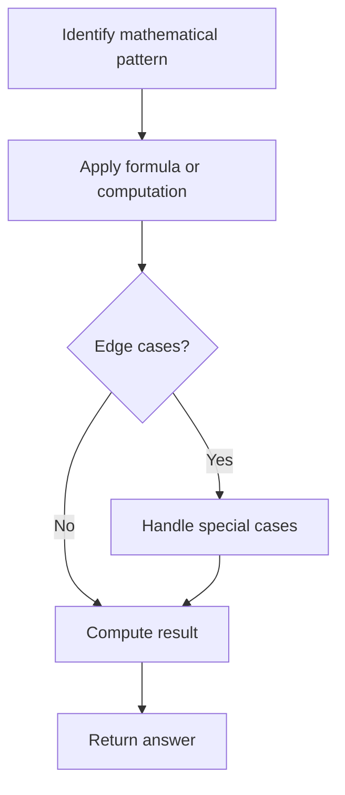

# Problem 1538: Guess the Majority in a Hidden Array

**Difficulty:** Medium  
**Tags:** Array, Math, Interactive  
**Pattern:** Math  
**Link:** [leetcode.com/problems/guess-the-majority-in-a-hidden-array](https://leetcode.com/problems/guess-the-majority-in-a-hidden-array/)

## Description

*(Premium problem -- description requires LeetCode subscription)*

## Approach: Math

Apply mathematical properties, formulas, or number-theoretic concepts. Look for patterns, modular arithmetic, or closed-form solutions.

## Pseudocode

```
1. Identify the mathematical pattern or formula
2. Apply computation:
   - Modular arithmetic for large numbers
   - GCD/LCM for divisibility
   - Sieve for primes
3. Handle edge cases
4. Return result
```

## Algorithm Flow



## Complexity Analysis

- **Time:** O(n) or O(sqrt(n))
- **Space:** O(1)

## Solution (Python3)

```python
class Solution:
    pass
```

## Solution (C++)

```cpp
class Solution {
public:
    // Design problem stub
};
```
