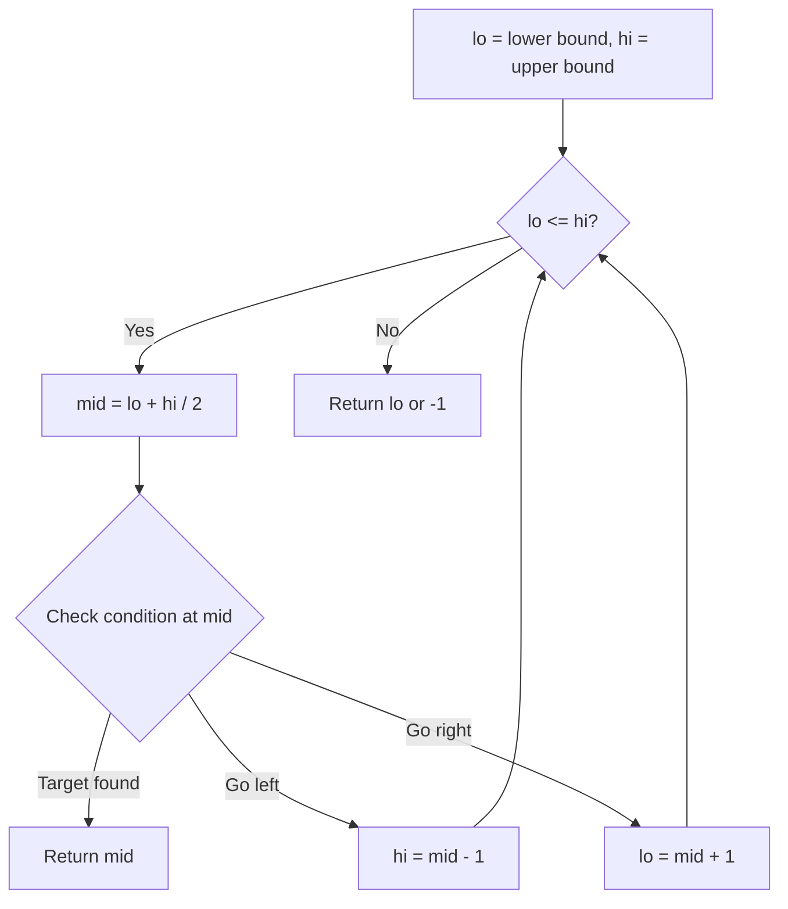
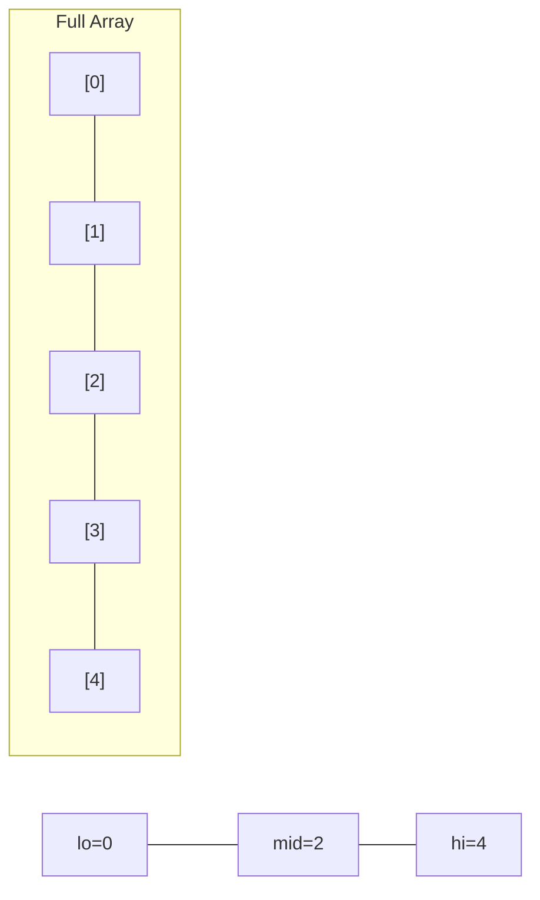
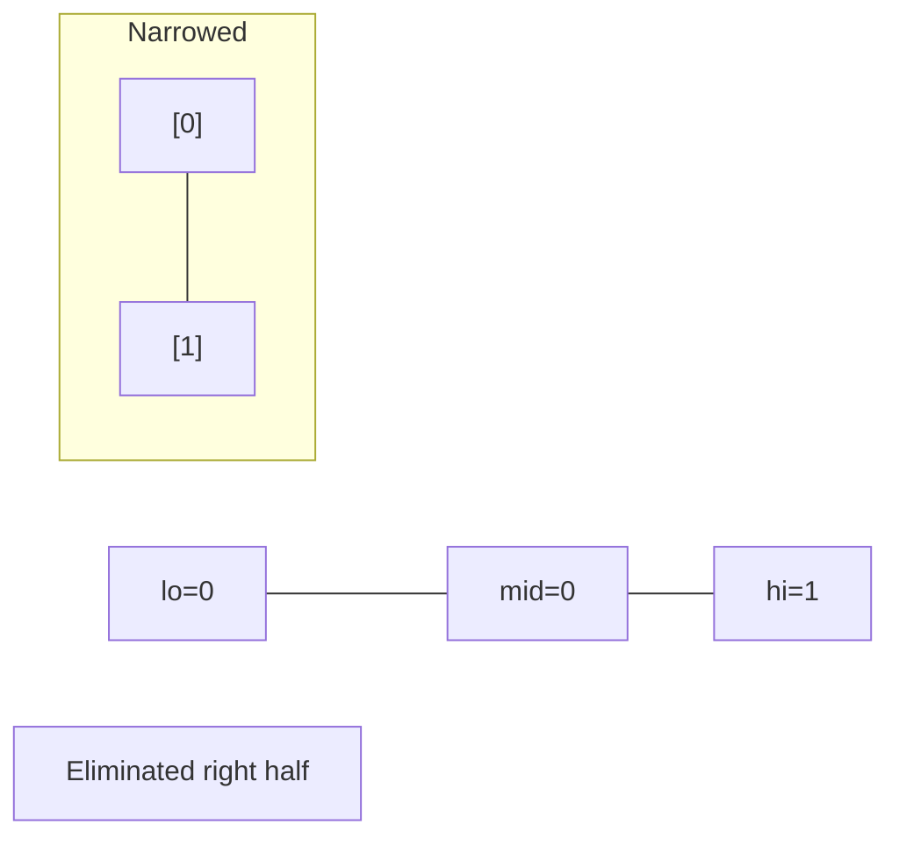
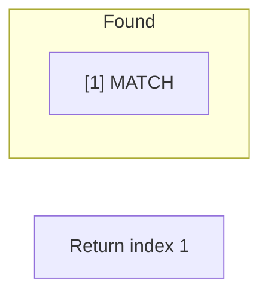

# Problem 1539: Kth Missing Positive Number

**Difficulty:** Easy  
**Tags:** Array, Binary Search  
**Pattern:** Binary Search  
**Link:** [leetcode.com/problems/kth-missing-positive-number](https://leetcode.com/problems/kth-missing-positive-number/)

## Description

Given an array `arr` of positive integers sorted in a **strictly increasing order**, and an integer `k`.

Return *the* `k^th` ***positive** integer that is **missing** from this array.*

 

Example 1:

```

**Input:** arr = [2,3,4,7,11], k = 5
**Output:** 9
**Explanation: **The missing positive integers are [1,5,6,8,9,10,12,13,...]. The 5th missing positive integer is 9.

```

Example 2:

```

**Input:** arr = [1,2,3,4], k = 2
**Output:** 6
**Explanation: **The missing positive integers are [5,6,7,...]. The 2nd missing positive integer is 6.

```

 

**Constraints:**

	- `1 <= arr.length <= 1000`
	- `1 <= arr[i] <= 1000`
	- `1 <= k <= 1000`
	- `arr[i] < arr[j]` for `1 <= i < j <= arr.length`

 

**Follow up:**

Could you solve this problem in less than O(n) complexity?

## Approach: Binary Search

Use binary search to halve the search space each iteration. Define the search range [lo, hi], compute mid, and decide which half to keep based on the problem's monotonic condition.

## Pseudocode

```
1. lo = lower_bound, hi = upper_bound
2. While lo <= hi (or lo < hi):
   a. mid = (lo + hi) // 2
   b. If condition(mid) is satisfied: record answer, search left half
   c. Else: search right half
3. Return answer
```

## Algorithm Flow



## Visual State Transitions

**Binary Search Step-by-Step:**

**Frame 1: Initial search space**


**Frame 2: Compare mid, narrow search**


**Frame 3: Found target**



## Complexity Analysis

- **Time:** O(log n)
- **Space:** O(1)

## Solution (Python3)

```python
class Solution:
    def findKthPositive(self, arr: List[int], k: int) -> int:
        # Binary search - O(log n) time, O(1) space
        lo, hi = 0, len(arr) - 1
        while lo <= hi:
            mid = lo + (hi - lo) // 2
            if arr[mid] == k:
                return mid
            elif arr[mid] < k:
                lo = mid + 1
            else:
                hi = mid - 1
        return 0
```

## Solution (C++)

```cpp
#include <string>
#include <vector>
using namespace std;

class Solution {
public:
    int findKthPositive(vector<int>& arr, int k) {
        // Binary search - O(log n) time, O(1) space
        int lo = 0, hi = arr.size() - 1;
        while (lo <= hi) {
            int mid = lo + (hi - lo) / 2;
            if (arr[mid] == k) {
                return mid;
            } else if (arr[mid] < k) {
                lo = mid + 1;
            } else {
                hi = mid - 1;
            }
        }
        return 0;
    }
};
```
