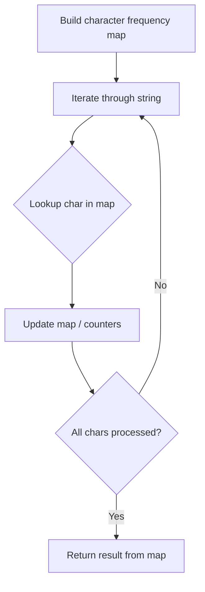

# Problem 1540: Can Convert String in K Moves

**Difficulty:** Medium  
**Tags:** Hash Table, String  
**Pattern:** Hash Map String Processing  
**Link:** [leetcode.com/problems/can-convert-string-in-k-moves](https://leetcode.com/problems/can-convert-string-in-k-moves/)

## Description

Given two strings `s` and `t`, your goal is to convert `s` into `t` in `k`** **moves or less.

During the `i^th` (`1 <= i <= k`) move you can:

	- Choose any index `j` (1-indexed) from `s`, such that `1 <= j <= s.length` and `j` has not been chosen in any previous move, and shift the character at that index `i` times.
	- Do nothing.

Shifting a character means replacing it by the next letter in the alphabet (wrapping around so that `'z'` becomes `'a'`). Shifting a character by `i` means applying the shift operations `i` times.

Remember that any index `j` can be picked at most once.

Return `true` if it's possible to convert `s` into `t` in no more than `k` moves, otherwise return `false`.

 

Example 1:

```

**Input:** s = "input", t = "ouput", k = 9
**Output:** true
**Explanation: **In the 6th move, we shift 'i' 6 times to get 'o'. And in the 7th move we shift 'n' to get 'u'.

```

Example 2:

```

**Input:** s = "abc", t = "bcd", k = 10
**Output:** false
**Explanation: **We need to shift each character in s one time to convert it into t. We can shift 'a' to 'b' during the 1st move. However, there is no way to shift the other characters in the remaining moves to obtain t from s.

```

Example 3:

```

**Input:** s = "aab", t = "bbb", k = 27
**Output:** true
**Explanation: **In the 1st move, we shift the first 'a' 1 time to get 'b'. In the 27th move, we shift the second 'a' 27 times to get 'b'.

```

 

**Constraints:**

	- `1 <= s.length, t.length <= 10^5`
	- `0 <= k <= 10^9`
	- `s`, `t` contain only lowercase English letters.

## Approach: Hash Map String Processing

Use a hash map to count character frequencies or map characters/strings for O(1) lookups. Process the string in one or two passes.

## Pseudocode

```
1. Build frequency map / char-to-index map
2. Iterate through string:
   a. Look up character in map
   b. Update counts or mappings
3. Return result based on map state
```

## Algorithm Flow



## Complexity Analysis

- **Time:** O(n)
- **Space:** O(n)

## Solution (Python3)

```python
class Solution:
    def canConvertString(self, s: str, t: str, k: int) -> bool:
        # Hash map for string/character frequency - O(n) time
        freq = {}
        for ch in s:
            freq[ch] = freq.get(ch, 0) + 1
        # Process frequency map
        for ch, cnt in freq.items():
            if cnt == 1:
                return s.index(ch)
        return False
```

## Solution (C++)

```cpp
#include <string>
#include <unordered_map>
#include <vector>
using namespace std;

class Solution {
public:
    bool canConvertString(string& s, string& t, int k) {
        // Hash map for string/character frequency - O(n) time
        unordered_map<char, int> freq;
        for (char ch : s) {
            freq[ch]++;
        }
        // Process frequency map
        for (int i = 0; i < s.size(); i++) {
            if (freq[s[i]] == 1) return i;
        }
        return false;
    }
};
```
