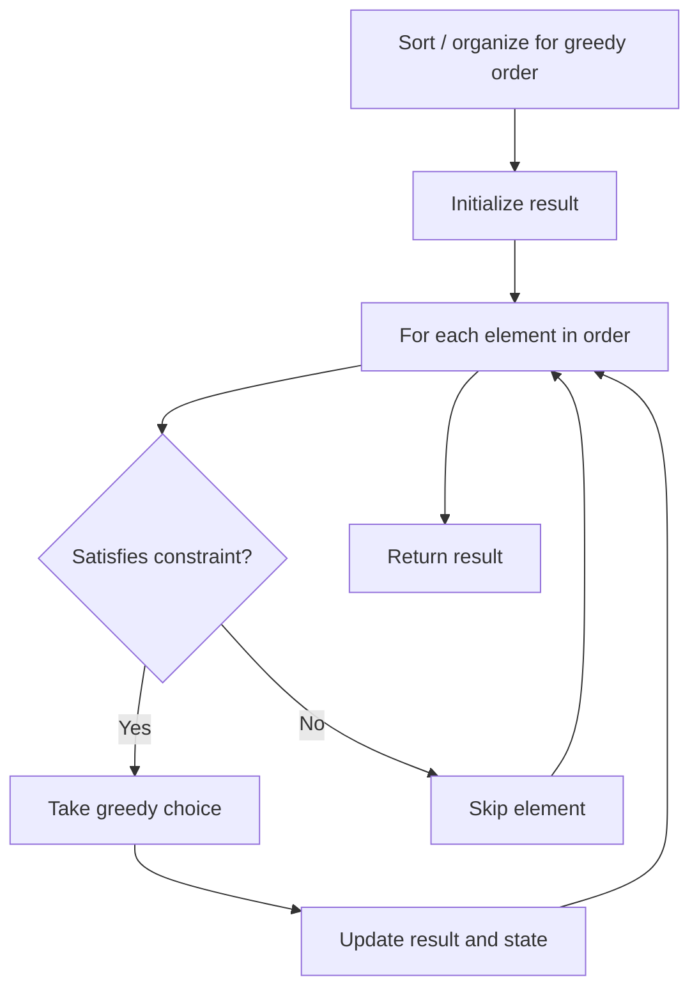

# Problem 1541: Minimum Insertions to Balance a Parentheses String

**Difficulty:** Medium  
**Tags:** String, Stack, Greedy  
**Pattern:** Greedy  
**Link:** [leetcode.com/problems/minimum-insertions-to-balance-a-parentheses-string](https://leetcode.com/problems/minimum-insertions-to-balance-a-parentheses-string/)

## Description

Given a parentheses string `s` containing only the characters `'('` and `')'`. A parentheses string is **balanced** if:

	- Any left parenthesis `'('` must have a corresponding two consecutive right parenthesis `'))'`.
	- Left parenthesis `'('` must go before the corresponding two consecutive right parenthesis `'))'`.

In other words, we treat `'('` as an opening parenthesis and `'))'` as a closing parenthesis.

	- For example, `"())"`, `"())(())))"` and `"(())())))"` are balanced, `")()"`, `"()))"` and `"(()))"` are not balanced.

You can insert the characters `'('` and `')'` at any position of the string to balance it if needed.

Return *the minimum number of insertions* needed to make `s` balanced.

 

Example 1:

```

**Input:** s = "(()))"
**Output:** 1
**Explanation:** The second '(' has two matching '))', but the first '(' has only ')' matching. We need to add one more ')' at the end of the string to be "(())))" which is balanced.

```

Example 2:

```

**Input:** s = "())"
**Output:** 0
**Explanation:** The string is already balanced.

```

Example 3:

```

**Input:** s = "))())("
**Output:** 3
**Explanation:** Add '(' to match the first '))', Add '))' to match the last '('.

```

 

**Constraints:**

	- `1 <= s.length <= 10^5`
	- `s` consists of `'('` and `')'` only.

## Approach: Greedy

Make the locally optimal choice at each step, trusting it leads to a global optimum. Greedy works when the problem has the greedy-choice property and optimal substructure.

## Pseudocode

```
1. Sort or organize data for greedy ordering
2. Initialize result
3. For each element in greedy order:
   a. If element satisfies constraint:
      - Take the greedy choice
      - Update result and state
4. Return result
```

## Algorithm Flow



## Complexity Analysis

- **Time:** O(n log n)
- **Space:** O(1)

## Solution (Python3)

```python
class Solution:
    def minInsertions(self, s: str) -> int:
        # Greedy approach - O(n) time
        result = 0
        curr_max = 0
        for i in range(len(s)):
            if isinstance(s[i], int):
                curr_max = max(curr_max, s[i])
                result = max(result, curr_max)
            else:
                result += 1
        return result
```

## Solution (C++)

```cpp
#include <algorithm>
#include <string>
#include <vector>
using namespace std;

class Solution {
public:
    int minInsertions(string& s) {
        // Greedy approach - O(n) time
        int result = 0, curr_max = 0;
        for (int i = 0; i < (int)s.size(); i++) {
            curr_max = max(curr_max, s[i]);
            result = max(result, curr_max);
        }
        return result;
    }
};
```
