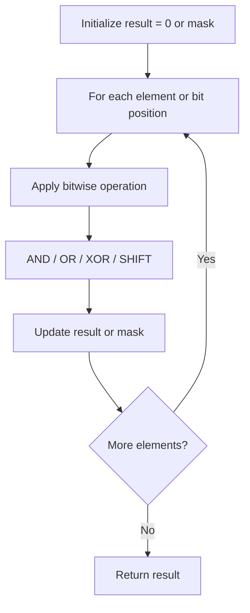

# Problem 1542: Find Longest Awesome Substring

**Difficulty:** Hard  
**Tags:** Hash Table, String, Bit Manipulation  
**Pattern:** Bit Manipulation  
**Link:** [leetcode.com/problems/find-longest-awesome-substring](https://leetcode.com/problems/find-longest-awesome-substring/)

## Description

You are given a string `s`. An **awesome** substring is a non-empty substring of `s` such that we can make any number of swaps in order to make it a palindrome.

Return *the length of the maximum length **awesome substring** of* `s`.

 

Example 1:

```

**Input:** s = "3242415"
**Output:** 5
**Explanation:** "24241" is the longest awesome substring, we can form the palindrome "24142" with some swaps.

```

Example 2:

```

**Input:** s = "12345678"
**Output:** 1

```

Example 3:

```

**Input:** s = "213123"
**Output:** 6
**Explanation:** "213123" is the longest awesome substring, we can form the palindrome "231132" with some swaps.

```

 

**Constraints:**

	- `1 <= s.length <= 10^5`
	- `s` consists only of digits.

## Approach: Bit Manipulation

Operate on individual bits using bitwise operators (AND, OR, XOR, shift). Common tricks: x & (x-1) removes lowest set bit, x ^ x = 0, XOR all elements to find unique.

## Pseudocode

```
1. Apply bitwise operations:
   - XOR all elements to cancel paired bits
   - Use bitmask to track state
   - Shift and mask to extract/set individual bits
2. Return result
```

## Algorithm Flow



## Complexity Analysis

- **Time:** O(n) or O(log n)
- **Space:** O(1)

## Solution (Python3)

```python
class Solution:
    def longestAwesome(self, s: str) -> int:
        # Bit manipulation - O(n) time, O(1) space
        result = 0
        for val in s:
            result ^= val
        return result
```

## Solution (C++)

```cpp
#include <string>
#include <vector>
using namespace std;

class Solution {
public:
    int longestAwesome(string& s) {
        // Bit manipulation - O(n) time, O(1) space
        int result = 0;
        for (int val : s) {
            result ^= val;
        }
        return result;
    }
};
```
