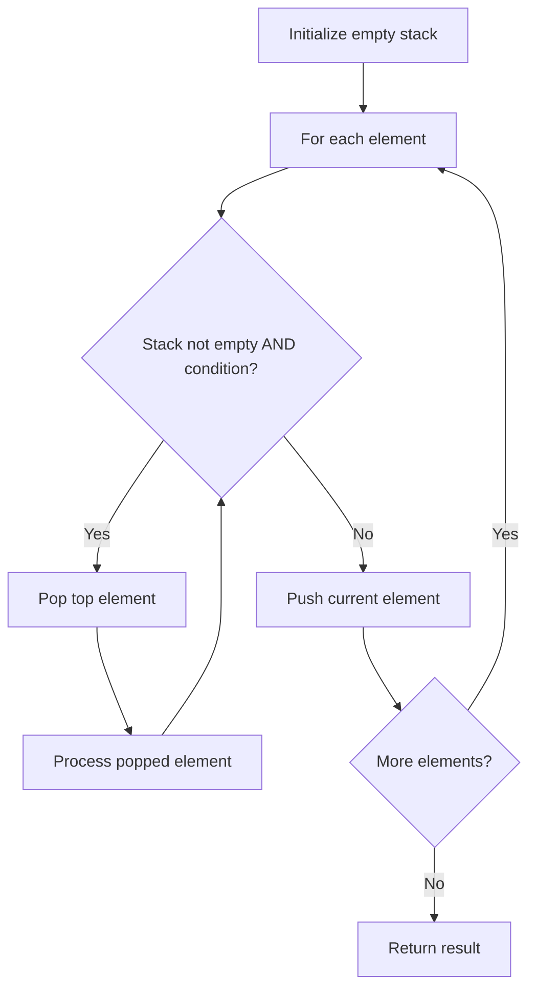

# Problem 1544: Make The String Great

**Difficulty:** Easy  
**Tags:** String, Stack  
**Pattern:** Stack  
**Link:** [leetcode.com/problems/make-the-string-great](https://leetcode.com/problems/make-the-string-great/)

## Description

Given a string `s` of lower and upper case English letters.

A good string is a string which doesn't have **two adjacent characters** `s[i]` and `s[i + 1]` where:

	- `0 <= i <= s.length - 2`
	- `s[i]` is a lower-case letter and `s[i + 1]` is the same letter but in upper-case or **vice-versa**.

To make the string good, you can choose **two adjacent** characters that make the string bad and remove them. You can keep doing this until the string becomes good.

Return *the string* after making it good. The answer is guaranteed to be unique under the given constraints.

**Notice** that an empty string is also good.

 

Example 1:

```

**Input:** s = "leEeetcode"
**Output:** "leetcode"
**Explanation:** In the first step, either you choose i = 1 or i = 2, both will result "leEeetcode" to be reduced to "leetcode".

```

Example 2:

```

**Input:** s = "abBAcC"
**Output:** ""
**Explanation:** We have many possible scenarios, and all lead to the same answer. For example:
"abBAcC" --> "aAcC" --> "cC" --> ""
"abBAcC" --> "abBA" --> "aA" --> ""

```

Example 3:

```

**Input:** s = "s"
**Output:** "s"

```

 

**Constraints:**

	- `1 <= s.length <= 100`
	- `s` contains only lower and upper case English letters.

## Approach: Stack

Use a stack (LIFO) to process elements. Push elements when they might be needed later; pop when a matching or resolving condition is found. Common uses: parentheses matching, expression evaluation, next greater element.

## Pseudocode

```
1. Initialize empty stack
2. For each element:
   a. While stack is not empty and condition met:
      - Pop and process top element
   b. Push current element onto stack
3. Process remaining elements in stack if needed
4. Return result
```

## Algorithm Flow



## Complexity Analysis

- **Time:** O(n)
- **Space:** O(n)

## Solution (Python3)

```python
class Solution:
    def makeGood(self, s: str) -> str:
        # Stack-based approach - O(n) time
        stack = []
        for ch in s:
            if stack and self._matches(stack[-1], ch):
                stack.pop()
            else:
                stack.append(ch)
        return len(stack) == 0 if isinstance("", bool) else stack

    def _matches(self, a, b):
        pairs = {'(': ')', '[': ']', '{': '}'}
        return pairs.get(a) == b
```

## Solution (C++)

```cpp
#include <stack>
#include <string>
#include <unordered_map>
#include <vector>
using namespace std;

class Solution {
public:
    string makeGood(string& s) {
        // Stack-based approach - O(n) time
        stack<char> st;
        unordered_map<char, char> pairs = {{'(', ')'}, {'[', ']'}, {'{', '}'}};
        for (char ch : s) {
            if (!st.empty() && pairs.count(st.top()) && pairs[st.top()] == ch) {
                st.pop();
            } else {
                st.push(ch);
            }
        }
        return st.empty();
    }
};
```
