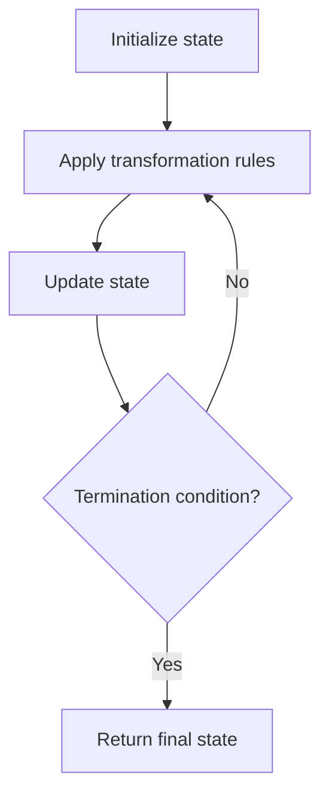

# Problem 1545: Find Kth Bit in Nth Binary String

**Difficulty:** Medium  
**Tags:** String, Recursion, Simulation  
**Pattern:** Simulation  
**Link:** [leetcode.com/problems/find-kth-bit-in-nth-binary-string](https://leetcode.com/problems/find-kth-bit-in-nth-binary-string/)

## Description

Given two positive integers `n` and `k`, the binary string `Sn` is formed as follows:

	- `S1 = "0"`
	- `Si = Si - 1 + "1" + reverse(invert(Si - 1))` for `i > 1`

Where `+` denotes the concatenation operation, `reverse(x)` returns the reversed string `x`, and `invert(x)` inverts all the bits in `x` (`0` changes to `1` and `1` changes to `0`).

For example, the first four strings in the above sequence are:

	- `S1 = "0"`
	- `S2 = "0**1**1"`
	- `S3 = "011**1**001"`
	- `S4 = "0111001**1**0110001"`

Return *the* `k^th` *bit* *in* `Sn`. It is guaranteed that `k` is valid for the given `n`.

 

Example 1:

```

**Input:** n = 3, k = 1
**Output:** "0"
**Explanation:** S3 is "**0**111001".
The 1st bit is "0".

```

Example 2:

```

**Input:** n = 4, k = 11
**Output:** "1"
**Explanation:** S4 is "0111001101**1**0001".
The 11th bit is "1".

```

 

**Constraints:**

	- `1 <= n <= 20`
	- `1 <= k <= 2^n - 1`

## Approach: Simulation

Simulate the process described in the problem step by step. Follow the rules exactly, tracking state at each step.

## Pseudocode

```
1. Initialize state (grid, pointers, counters)
2. For each step / iteration:
   a. Apply the transformation rules
   b. Update state
   c. Check termination condition
3. Return final state or result
```

## Algorithm Flow



## Complexity Analysis

- **Time:** O(n) or O(n * k)
- **Space:** O(n)

## Solution (Python3)

```python
class Solution:
    def findKthBit(self, n: int, k: int) -> str:
        # Simulation approach - follow the rules step by step
        result = ""
        for i in range(len(n) if isinstance(n, list) else n):
            # Simulate each step
            pass
        return result
```

## Solution (C++)

```cpp
#include <string>
#include <vector>
using namespace std;

class Solution {
public:
    string findKthBit(int n, int k) {
        // Simulation approach
        int n = n.size();
        for (int i = 0; i < n; i++) {
            // Simulate each step
        }
        return "";
    }
};
```
