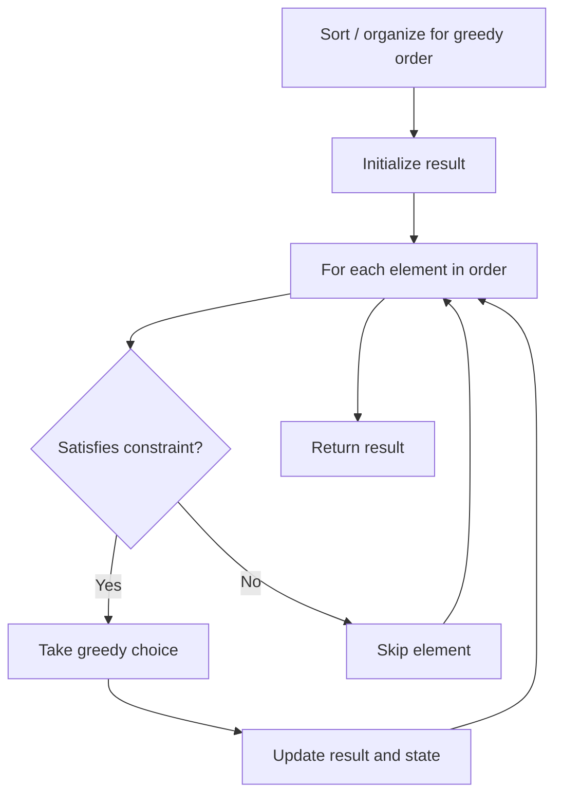

# Problem 1546: Maximum Number of Non-Overlapping Subarrays With Sum Equals Target

**Difficulty:** Medium  
**Tags:** Array, Hash Table, Greedy, Prefix Sum  
**Pattern:** Greedy  
**Link:** [leetcode.com/problems/maximum-number-of-non-overlapping-subarrays-with-sum-equals-target](https://leetcode.com/problems/maximum-number-of-non-overlapping-subarrays-with-sum-equals-target/)

## Description

Given an array `nums` and an integer `target`, return *the maximum number of **non-empty** **non-overlapping** subarrays such that the sum of values in each subarray is equal to* `target`.

 

Example 1:

```

**Input:** nums = [1,1,1,1,1], target = 2
**Output:** 2
**Explanation:** There are 2 non-overlapping subarrays [**1,1**,1,**1,1**] with sum equals to target(2).

```

Example 2:

```

**Input:** nums = [-1,3,5,1,4,2,-9], target = 6
**Output:** 2
**Explanation:** There are 3 subarrays with sum equal to 6.
([5,1], [4,2], [3,5,1,4,2,-9]) but only the first 2 are non-overlapping.

```

 

**Constraints:**

	- `1 <= nums.length <= 10^5`
	- `-10^4 <= nums[i] <= 10^4`
	- `0 <= target <= 10^6`

## Approach: Greedy

Make the locally optimal choice at each step, trusting it leads to a global optimum. Greedy works when the problem has the greedy-choice property and optimal substructure.

## Pseudocode

```
1. Sort or organize data for greedy ordering
2. Initialize result
3. For each element in greedy order:
   a. If element satisfies constraint:
      - Take the greedy choice
      - Update result and state
4. Return result
```

## Algorithm Flow



## Complexity Analysis

- **Time:** O(n log n)
- **Space:** O(1)

## Solution (Python3)

```python
class Solution:
    def maxNonOverlapping(self, nums: List[int], target: int) -> int:
        # Greedy approach - O(n) time
        result = 0
        curr_max = 0
        for i in range(len(nums)):
            if isinstance(nums[i], int):
                curr_max = max(curr_max, nums[i])
                result = max(result, curr_max)
            else:
                result += 1
        return result
```

## Solution (C++)

```cpp
#include <algorithm>
#include <string>
#include <vector>
using namespace std;

class Solution {
public:
    int maxNonOverlapping(vector<int>& nums, int target) {
        // Greedy approach - O(n) time
        int result = 0, curr_max = 0;
        for (int i = 0; i < (int)nums.size(); i++) {
            curr_max = max(curr_max, nums[i]);
            result = max(result, curr_max);
        }
        return result;
    }
};
```
