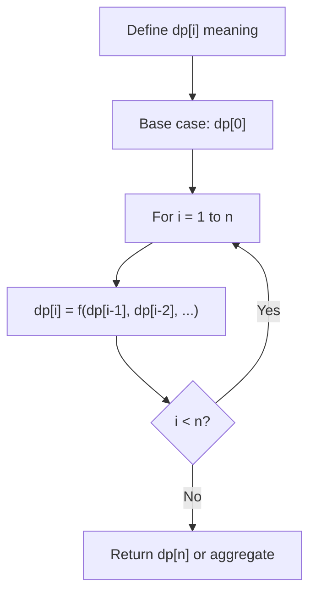
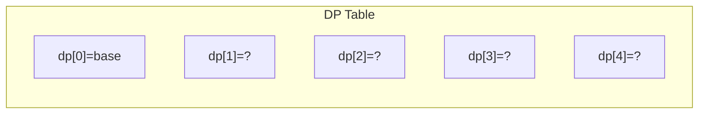
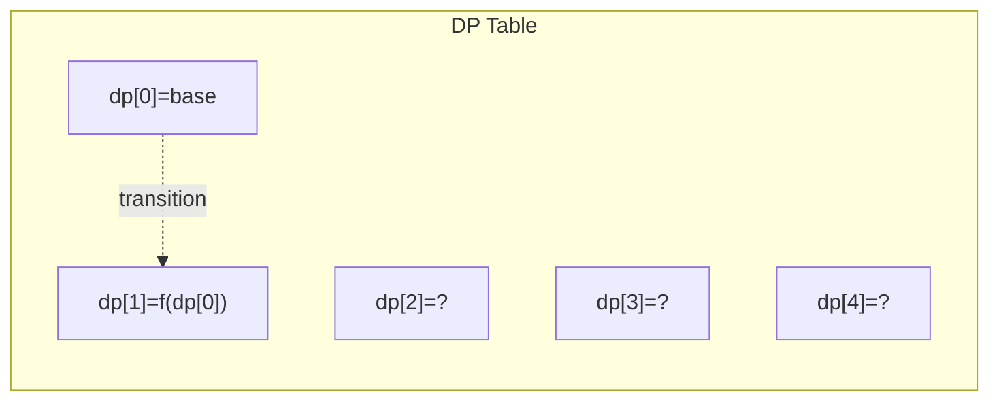
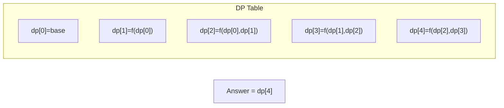

# Problem 1547: Minimum Cost to Cut a Stick

**Difficulty:** Hard  
**Tags:** Array, Dynamic Programming, Sorting  
**Pattern:** Dynamic Programming (1D)  
**Link:** [leetcode.com/problems/minimum-cost-to-cut-a-stick](https://leetcode.com/problems/minimum-cost-to-cut-a-stick/)

## Description

Given a wooden stick of length `n` units. The stick is labelled from `0` to `n`. For example, a stick of length **6** is labelled as follows:

Given an integer array `cuts` where `cuts[i]` denotes a position you should perform a cut at.

You should perform the cuts in order, you can change the order of the cuts as you wish.

The cost of one cut is the length of the stick to be cut, the total cost is the sum of costs of all cuts. When you cut a stick, it will be split into two smaller sticks (i.e. the sum of their lengths is the length of the stick before the cut). Please refer to the first example for a better explanation.

Return *the minimum total cost* of the cuts.

 

Example 1:

```

**Input:** n = 7, cuts = [1,3,4,5]
**Output:** 16
**Explanation:** Using cuts order = [1, 3, 4, 5] as in the input leads to the following scenario:

The first cut is done to a rod of length 7 so the cost is 7. The second cut is done to a rod of length 6 (i.e. the second part of the first cut), the third is done to a rod of length 4 and the last cut is to a rod of length 3. The total cost is 7 + 6 + 4 + 3 = 20.
Rearranging the cuts to be [3, 5, 1, 4] for example will lead to a scenario with total cost = 16 (as shown in the example photo 7 + 4 + 3 + 2 = 16).
```

Example 2:

```

**Input:** n = 9, cuts = [5,6,1,4,2]
**Output:** 22
**Explanation:** If you try the given cuts ordering the cost will be 25.
There are much ordering with total cost <= 25, for example, the order [4, 6, 5, 2, 1] has total cost = 22 which is the minimum possible.

```

 

**Constraints:**

	- `2 <= n <= 10^6`
	- `1 <= cuts.length <= min(n - 1, 100)`
	- `1 <= cuts[i] <= n - 1`
	- All the integers in `cuts` array are **distinct**.

## Approach: Dynamic Programming (1D)

Break the problem into overlapping subproblems. Define dp[i] as the optimal value for the subproblem ending at or considering index i. Build the solution bottom-up, using previously computed dp values.

## Pseudocode

```
1. Define dp[i] = optimal value for subproblem i
2. Base case: dp[0] = initial value
3. For i from 1 to n:
   a. dp[i] = recurrence(dp[i-1], dp[i-2], ...)
4. Return dp[n] or max/min of dp
```

## Algorithm Flow



## Visual State Transitions

**1D Dynamic Programming Table Build:**

**Frame 1: Initialize base cases**


**Frame 2: Fill dp[1] from dp[0]**


**Frame 3: Fill remaining cells**



## Complexity Analysis

- **Time:** O(n)
- **Space:** O(n)

## Solution (Python3)

```python
class Solution:
    def minCost(self, n: int, cuts: List[int]) -> int:
        # Dynamic programming (1D) - O(n) time, O(n) space
        if not n:
            return 0
        n = len(n) if isinstance(n, list) else n
        dp = [0] * (n + 1)
        dp[0] = 1  # base case
        for i in range(1, n + 1):
            dp[i] = dp[i-1]  # transition (customize per problem)
            if i >= 2:
                dp[i] += dp[i-2]
        return dp[n]
```

## Solution (C++)

```cpp
#include <string>
#include <vector>
using namespace std;

class Solution {
public:
    int minCost(int n, vector<int>& cuts) {
        // Dynamic programming (1D) - O(n) time, O(n) space
        int n = n;
        if (n <= 0) return 0;
        vector<int> dp(n + 1, 0);
        dp[0] = 1;
        for (int i = 1; i <= n; i++) {
            dp[i] = dp[i-1];
            if (i >= 2) dp[i] += dp[i-2];
        }
        return dp[n];
    }
};
```
