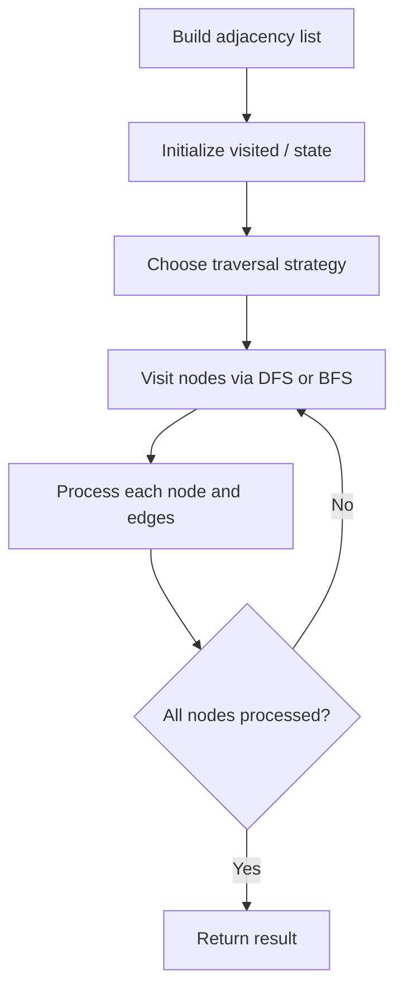

# Problem 1548: The Most Similar Path in a Graph

**Difficulty:** Hard  
**Tags:** Dynamic Programming, Graph Theory  
**Pattern:** Graph Algorithm  
**Link:** [leetcode.com/problems/the-most-similar-path-in-a-graph](https://leetcode.com/problems/the-most-similar-path-in-a-graph/)

## Description

*(Premium problem -- description requires LeetCode subscription)*

## Approach: Graph Algorithm

Build an adjacency list/matrix from the input. Apply graph traversal (DFS/BFS), shortest path, or connectivity algorithm as needed.

## Pseudocode

```
1. Build adjacency list from edges
2. Initialize visited/distance arrays
3. Apply traversal algorithm:
   - DFS/BFS for reachability
   - Dijkstra/Bellman-Ford for shortest path
   - Union-Find for connectivity
4. Return result
```

## Algorithm Flow



## Complexity Analysis

- **Time:** O(V + E)
- **Space:** O(V + E)

## Solution (Python3)

```python
class Solution:
    pass
```

## Solution (C++)

```cpp
class Solution {
public:
    // Design problem stub
};
```
