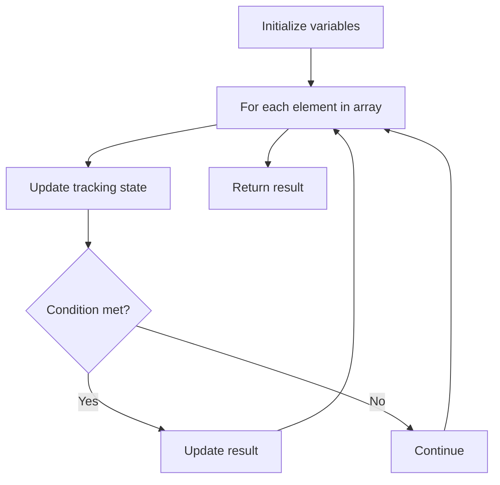

# Problem 1550: Three Consecutive Odds

**Difficulty:** Easy  
**Tags:** Array  
**Pattern:** Array Processing  
**Link:** [leetcode.com/problems/three-consecutive-odds](https://leetcode.com/problems/three-consecutive-odds/)

## Description

Given an integer array `arr`, return `true` if there are three consecutive odd numbers in the array. Otherwise, return `false`.
 

Example 1:

```

**Input:** arr = [2,6,4,1]
**Output:** false
**Explanation:** There are no three consecutive odds.

```

Example 2:

```

**Input:** arr = [1,2,34,3,4,5,7,23,12]
**Output:** true
**Explanation:** [5,7,23] are three consecutive odds.

```

 

**Constraints:**

	- `1 <= arr.length <= 1000`
	- `1 <= arr[i] <= 1000`

## Approach: Array Processing

Process the array with a linear scan, tracking state variables. Look for patterns: running maximum/minimum, counting, or transformations.

## Pseudocode

```
1. Initialize tracking variables
2. Iterate through array:
   a. Update tracking state
   b. Check conditions
   c. Update result
3. Return result
```

## Algorithm Flow



## Complexity Analysis

- **Time:** O(n)
- **Space:** O(1)

## Solution (Python3)

```python
class Solution:
    def threeConsecutiveOdds(self, arr: List[int]) -> bool:
        # Array processing - O(n) time
        result = False
        for i in range(len(arr)):
            # Process element
            pass
        return result
```

## Solution (C++)

```cpp
#include <string>
#include <vector>
using namespace std;

class Solution {
public:
    bool threeConsecutiveOdds(vector<int>& arr) {
        // Array processing - O(n) time
        for (int i = 0; i < (int)arr.size(); i++) {
            // Process element
        }
        return false;
    }
};
```
