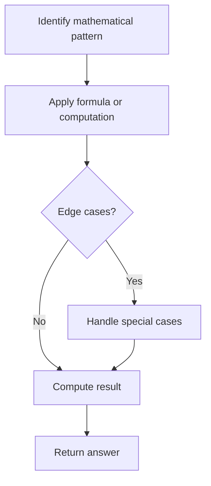

# Problem 1551: Minimum Operations to Make Array Equal

**Difficulty:** Medium  
**Tags:** Math  
**Pattern:** Math  
**Link:** [leetcode.com/problems/minimum-operations-to-make-array-equal](https://leetcode.com/problems/minimum-operations-to-make-array-equal/)

## Description

You have an array `arr` of length `n` where `arr[i] = (2 * i) + 1` for all valid values of `i` (i.e., `0 <= i < n`).

In one operation, you can select two indices `x` and `y` where `0 <= x, y < n` and subtract `1` from `arr[x]` and add `1` to `arr[y]` (i.e., perform `arr[x] -=1 `and `arr[y] += 1`). The goal is to make all the elements of the array **equal**. It is **guaranteed** that all the elements of the array can be made equal using some operations.

Given an integer `n`, the length of the array, return *the minimum number of operations* needed to make all the elements of arr equal.

 

Example 1:

```

**Input:** n = 3
**Output:** 2
**Explanation:** arr = [1, 3, 5]
First operation choose x = 2 and y = 0, this leads arr to be [2, 3, 4]
In the second operation choose x = 2 and y = 0 again, thus arr = [3, 3, 3].

```

Example 2:

```

**Input:** n = 6
**Output:** 9

```

 

**Constraints:**

	- `1 <= n <= 10^4`

## Approach: Math

Apply mathematical properties, formulas, or number-theoretic concepts. Look for patterns, modular arithmetic, or closed-form solutions.

## Pseudocode

```
1. Identify the mathematical pattern or formula
2. Apply computation:
   - Modular arithmetic for large numbers
   - GCD/LCM for divisibility
   - Sieve for primes
3. Handle edge cases
4. Return result
```

## Algorithm Flow



## Complexity Analysis

- **Time:** O(n) or O(sqrt(n))
- **Space:** O(1)

## Solution (Python3)

```python
class Solution:
    def minOperations(self, n: int) -> int:
        # Mathematical approach
        result = 0
        x = n
        while x != 0:
            result = result * 10 + x % 10
            x //= 10 if isinstance(x, int) else 1
        return result
```

## Solution (C++)

```cpp
#include <string>
#include <vector>
using namespace std;

class Solution {
public:
    int minOperations(int n) {
        // Mathematical approach
        long long result = 0;
        int x = n;
        while (x != 0) {
            result = result * 10 + x % 10;
            x /= 10;
        }
        return (int)result;
    }
};
```
