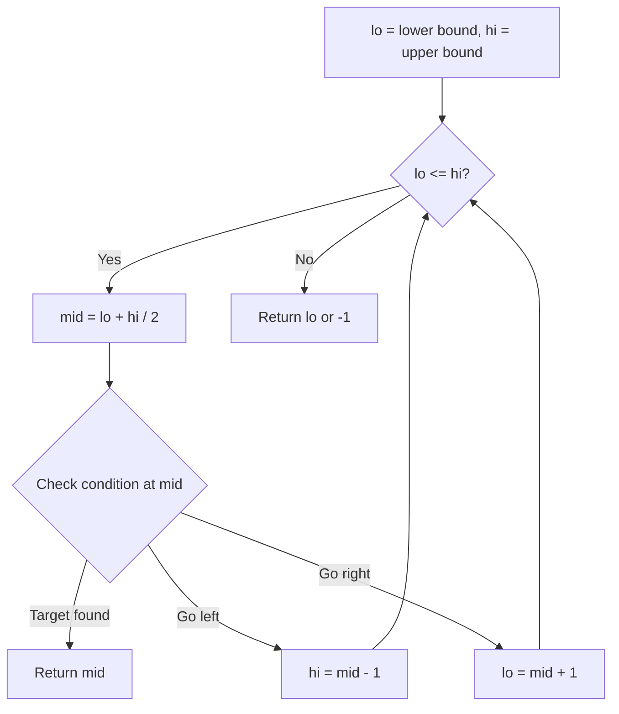
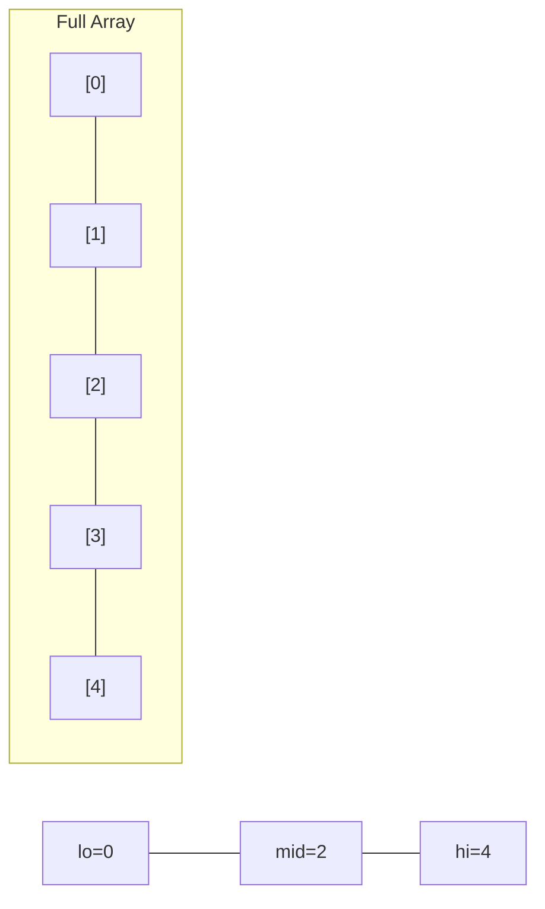
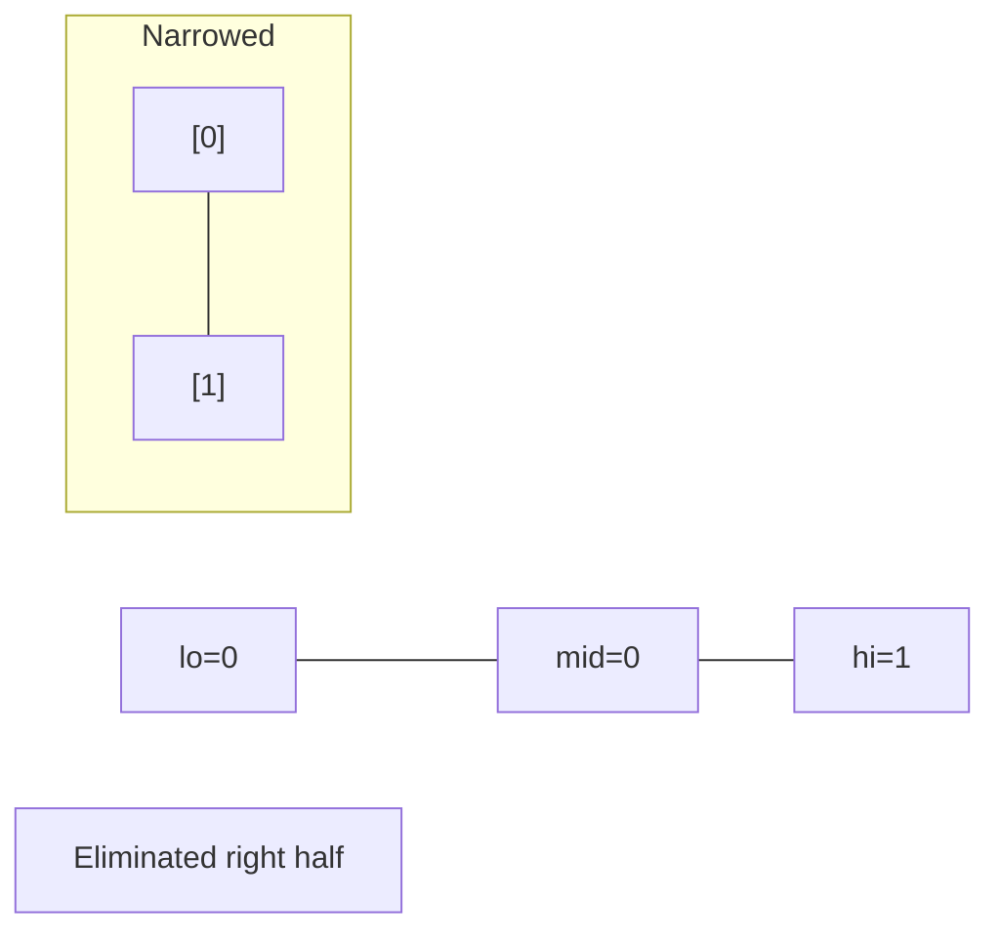
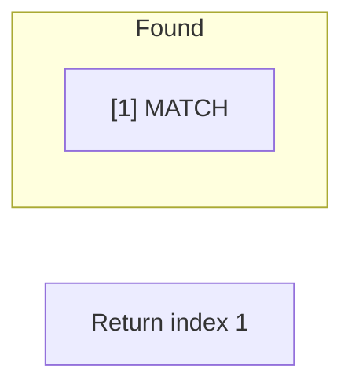

# Problem 1552: Magnetic Force Between Two Balls

**Difficulty:** Medium  
**Tags:** Array, Binary Search, Sorting  
**Pattern:** Binary Search  
**Link:** [leetcode.com/problems/magnetic-force-between-two-balls](https://leetcode.com/problems/magnetic-force-between-two-balls/)

## Description

In the universe Earth C-137, Rick discovered a special form of magnetic force between two balls if they are put in his new invented basket. Rick has `n` empty baskets, the `i^th` basket is at `position[i]`, Morty has `m` balls and needs to distribute the balls into the baskets such that the **minimum magnetic force** between any two balls is **maximum**.

Rick stated that magnetic force between two different balls at positions `x` and `y` is `|x - y|`.

Given the integer array `position` and the integer `m`. Return *the required force*.

 

Example 1:

```

**Input:** position = [1,2,3,4,7], m = 3
**Output:** 3
**Explanation:** Distributing the 3 balls into baskets 1, 4 and 7 will make the magnetic force between ball pairs [3, 3, 6]. The minimum magnetic force is 3. We cannot achieve a larger minimum magnetic force than 3.

```

Example 2:

```

**Input:** position = [5,4,3,2,1,1000000000], m = 2
**Output:** 999999999
**Explanation:** We can use baskets 1 and 1000000000.

```

 

**Constraints:**

	- `n == position.length`
	- `2 <= n <= 10^5`
	- `1 <= position[i] <= 10^9`
	- All integers in `position` are **distinct**.
	- `2 <= m <= position.length`

## Approach: Binary Search

Use binary search to halve the search space each iteration. Define the search range [lo, hi], compute mid, and decide which half to keep based on the problem's monotonic condition.

## Pseudocode

```
1. lo = lower_bound, hi = upper_bound
2. While lo <= hi (or lo < hi):
   a. mid = (lo + hi) // 2
   b. If condition(mid) is satisfied: record answer, search left half
   c. Else: search right half
3. Return answer
```

## Algorithm Flow



## Visual State Transitions

**Binary Search Step-by-Step:**

**Frame 1: Initial search space**


**Frame 2: Compare mid, narrow search**


**Frame 3: Found target**



## Complexity Analysis

- **Time:** O(log n)
- **Space:** O(1)

## Solution (Python3)

```python
class Solution:
    def maxDistance(self, position: List[int], m: int) -> int:
        # Binary search - O(log n) time, O(1) space
        lo, hi = 0, len(position) - 1
        while lo <= hi:
            mid = lo + (hi - lo) // 2
            if position[mid] == m:
                return mid
            elif position[mid] < m:
                lo = mid + 1
            else:
                hi = mid - 1
        return 0
```

## Solution (C++)

```cpp
#include <string>
#include <vector>
using namespace std;

class Solution {
public:
    int maxDistance(vector<int>& position, int m) {
        // Binary search - O(log n) time, O(1) space
        int lo = 0, hi = position.size() - 1;
        while (lo <= hi) {
            int mid = lo + (hi - lo) / 2;
            if (position[mid] == m) {
                return mid;
            } else if (position[mid] < m) {
                lo = mid + 1;
            } else {
                hi = mid - 1;
            }
        }
        return 0;
    }
};
```
