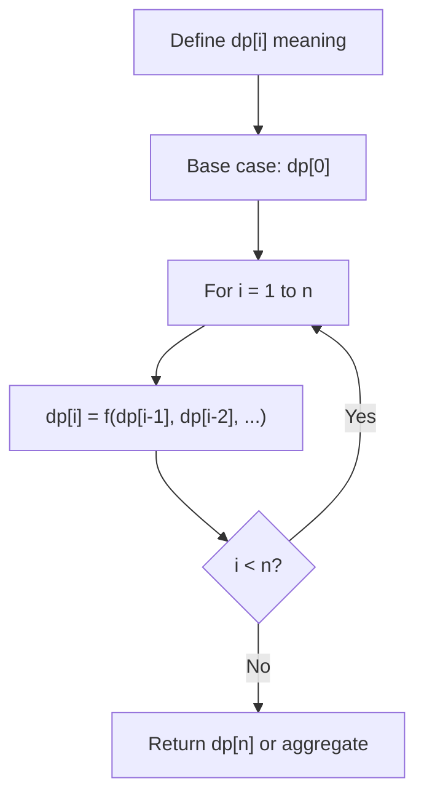
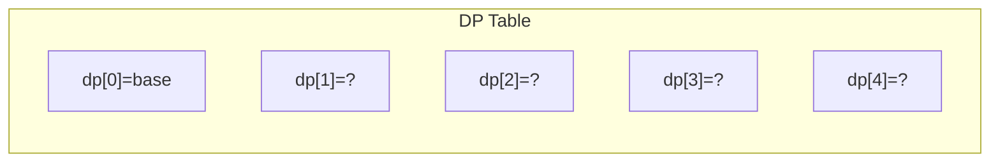
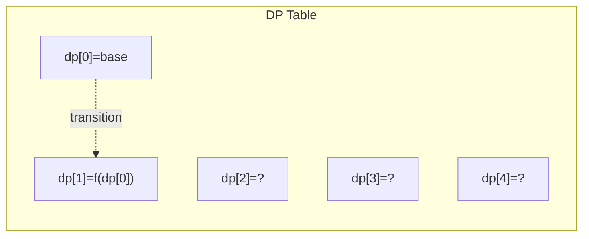
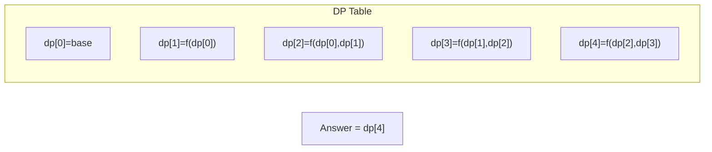

# Problem 1553: Minimum Number of Days to Eat N Oranges

**Difficulty:** Hard  
**Tags:** Dynamic Programming, Memoization  
**Pattern:** Dynamic Programming (1D)  
**Link:** [leetcode.com/problems/minimum-number-of-days-to-eat-n-oranges](https://leetcode.com/problems/minimum-number-of-days-to-eat-n-oranges/)

## Description

There are `n` oranges in the kitchen and you decided to eat some of these oranges every day as follows:

	- Eat one orange.
	- If the number of remaining oranges `n` is divisible by `2` then you can eat `n / 2` oranges.
	- If the number of remaining oranges `n` is divisible by `3` then you can eat `2 * (n / 3)` oranges.

You can only choose one of the actions per day.

Given the integer `n`, return *the minimum number of days to eat* `n` *oranges*.

 

Example 1:

```

**Input:** n = 10
**Output:** 4
**Explanation:** You have 10 oranges.
Day 1: Eat 1 orange,  10 - 1 = 9.  
Day 2: Eat 6 oranges, 9 - 2*(9/3) = 9 - 6 = 3. (Since 9 is divisible by 3)
Day 3: Eat 2 oranges, 3 - 2*(3/3) = 3 - 2 = 1. 
Day 4: Eat the last orange  1 - 1  = 0.
You need at least 4 days to eat the 10 oranges.

```

Example 2:

```

**Input:** n = 6
**Output:** 3
**Explanation:** You have 6 oranges.
Day 1: Eat 3 oranges, 6 - 6/2 = 6 - 3 = 3. (Since 6 is divisible by 2).
Day 2: Eat 2 oranges, 3 - 2*(3/3) = 3 - 2 = 1. (Since 3 is divisible by 3)
Day 3: Eat the last orange  1 - 1  = 0.
You need at least 3 days to eat the 6 oranges.

```

 

**Constraints:**

	- `1 <= n <= 2 * 10^9`

## Approach: Dynamic Programming (1D)

Break the problem into overlapping subproblems. Define dp[i] as the optimal value for the subproblem ending at or considering index i. Build the solution bottom-up, using previously computed dp values.

## Pseudocode

```
1. Define dp[i] = optimal value for subproblem i
2. Base case: dp[0] = initial value
3. For i from 1 to n:
   a. dp[i] = recurrence(dp[i-1], dp[i-2], ...)
4. Return dp[n] or max/min of dp
```

## Algorithm Flow



## Visual State Transitions

**1D Dynamic Programming Table Build:**

**Frame 1: Initialize base cases**


**Frame 2: Fill dp[1] from dp[0]**


**Frame 3: Fill remaining cells**



## Complexity Analysis

- **Time:** O(n)
- **Space:** O(n)

## Solution (Python3)

```python
class Solution:
    def minDays(self, n: int) -> int:
        # Dynamic programming (1D) - O(n) time, O(n) space
        if not n:
            return 0
        n = len(n) if isinstance(n, list) else n
        dp = [0] * (n + 1)
        dp[0] = 1  # base case
        for i in range(1, n + 1):
            dp[i] = dp[i-1]  # transition (customize per problem)
            if i >= 2:
                dp[i] += dp[i-2]
        return dp[n]
```

## Solution (C++)

```cpp
#include <string>
#include <vector>
using namespace std;

class Solution {
public:
    int minDays(int n) {
        // Dynamic programming (1D) - O(n) time, O(n) space
        int n = n;
        if (n <= 0) return 0;
        vector<int> dp(n + 1, 0);
        dp[0] = 1;
        for (int i = 1; i <= n; i++) {
            dp[i] = dp[i-1];
            if (i >= 2) dp[i] += dp[i-2];
        }
        return dp[n];
    }
};
```
