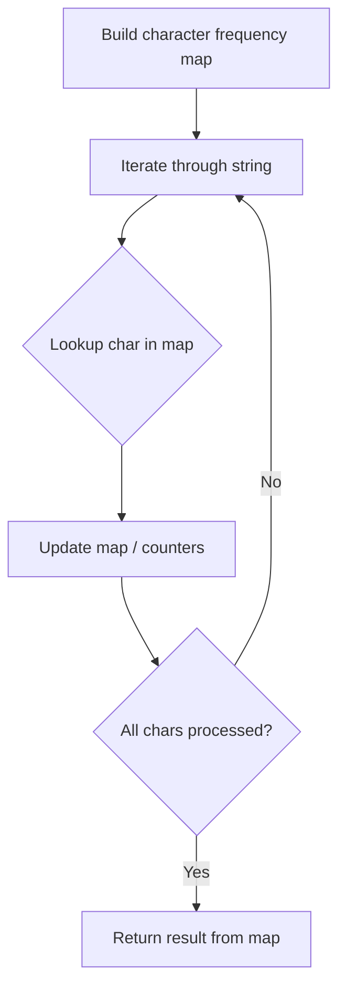

# Problem 1554: Strings Differ by One Character

**Difficulty:** Medium  
**Tags:** Hash Table, String, Rolling Hash, Hash Function  
**Pattern:** Hash Map String Processing  
**Link:** [leetcode.com/problems/strings-differ-by-one-character](https://leetcode.com/problems/strings-differ-by-one-character/)

## Description

*(Premium problem -- description requires LeetCode subscription)*

## Approach: Hash Map String Processing

Use a hash map to count character frequencies or map characters/strings for O(1) lookups. Process the string in one or two passes.

## Pseudocode

```
1. Build frequency map / char-to-index map
2. Iterate through string:
   a. Look up character in map
   b. Update counts or mappings
3. Return result based on map state
```

## Algorithm Flow



## Complexity Analysis

- **Time:** O(n)
- **Space:** O(n)

## Solution (Python3)

```python
class Solution:
    pass
```

## Solution (C++)

```cpp
class Solution {
public:
    // Design problem stub
};
```
