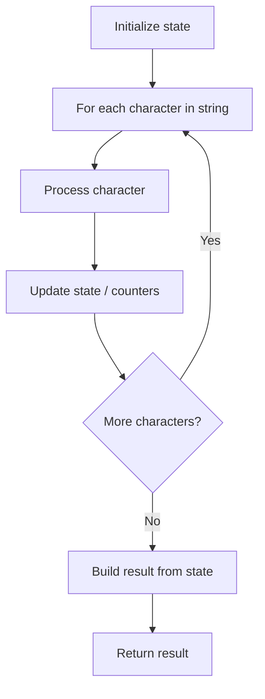

# Problem 1556: Thousand Separator

**Difficulty:** Easy  
**Tags:** String  
**Pattern:** String Processing  
**Link:** [leetcode.com/problems/thousand-separator](https://leetcode.com/problems/thousand-separator/)

## Description

Given an integer `n`, add a dot (".") as the thousands separator and return it in string format.

 

Example 1:

```

**Input:** n = 987
**Output:** "987"

```

Example 2:

```

**Input:** n = 1234
**Output:** "1.234"

```

 

**Constraints:**

	- `0 <= n <= 2^31 - 1`

## Approach: String Processing

Process the string character by character. Common techniques: two pointers, sliding window, hash map for frequencies, stack for matching.

## Pseudocode

```
1. Initialize result / tracking state
2. Iterate through string characters:
   a. Process character based on rules
   b. Update state (counters, pointers, stack)
3. Build and return result
```

## Algorithm Flow



## Complexity Analysis

- **Time:** O(n)
- **Space:** O(n)

## Solution (Python3)

```python
class Solution:
    def thousandSeparator(self, n: int) -> str:
        # String processing approach - O(n) time
        result = []
        for ch in n:
            if ch.isalnum():
                result.append(ch.lower())
        # Check palindrome or process
        processed = ''.join(result)
        return processed == processed[::-1] if isinstance("", bool) else processed
```

## Solution (C++)

```cpp
#include <algorithm>
#include <cctype>
#include <string>
#include <vector>
using namespace std;

class Solution {
public:
    string thousandSeparator(int n) {
        // String processing approach - O(n) time
        string processed;
        for (char ch : n) {
            if (isalnum(ch)) {
                processed += tolower(ch);
            }
        }
        string rev = processed;
        reverse(rev.begin(), rev.end());
        return processed == rev;
    }
};
```
