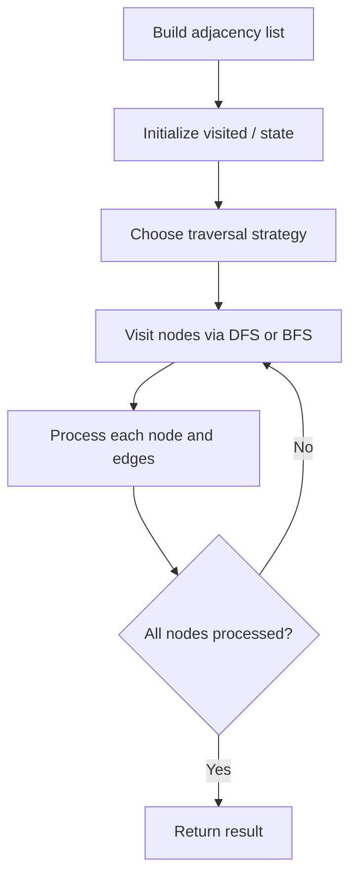

# Problem 1557: Minimum Number of Vertices to Reach All Nodes

**Difficulty:** Medium  
**Tags:** Graph Theory  
**Pattern:** Graph / Indegree  
**Link:** [leetcode.com/problems/minimum-number-of-vertices-to-reach-all-nodes](https://leetcode.com/problems/minimum-number-of-vertices-to-reach-all-nodes/)

## Description

Given a** directed acyclic graph**, with `n` vertices numbered from `0` to `n-1`, and an array `edges` where `edges[i] = [fromi, toi]` represents a directed edge from node `fromi` to node `toi`.

Find *the smallest set of vertices from which all nodes in the graph are reachable*. It's guaranteed that a unique solution exists.

Notice that you can return the vertices in any order.

 

Example 1:

```

**Input:** n = 6, edges = [[0,1],[0,2],[2,5],[3,4],[4,2]]
**Output:** [0,3]
**Explanation: **It's not possible to reach all the nodes from a single vertex. From 0 we can reach [0,1,2,5]. From 3 we can reach [3,4,2,5]. So we output [0,3].
```

Example 2:

```

**Input:** n = 5, edges = [[0,1],[2,1],[3,1],[1,4],[2,4]]
**Output:** [0,2,3]
**Explanation: **Notice that vertices 0, 3 and 2 are not reachable from any other node, so we must include them. Also any of these vertices can reach nodes 1 and 4.

```

 

**Constraints:**

	- `2 <= n <= 10^5`
	- `1 <= edges.length <= min(10^5, n * (n - 1) / 2)`
	- `edges[i].length == 2`
	- `0 <= fromi, toi < n`
	- All pairs `(fromi, toi)` are distinct.

## Approach: Graph / Indegree

Nodes with 0 in-degree must be starting points. All other nodes are reachable from these.

## Pseudocode

```
1. Build adjacency list from edges
2. Initialize visited/distance arrays
3. Apply traversal algorithm:
   - DFS/BFS for reachability
   - Dijkstra/Bellman-Ford for shortest path
   - Union-Find for connectivity
4. Return result
```

## Algorithm Flow



## Complexity Analysis

- **Time:** O(V + E)
- **Space:** O(V)

## Solution (Python3)

```python
class Solution:
    def findSmallestSetOfVertices(self, n: int, edges) -> list[int]:
        has_incoming = set()
        for _, v in edges:
            has_incoming.add(v)
        return [i for i in range(n) if i not in has_incoming]
```

## Solution (C++)

```cpp
#include <functional>
#include <string>
#include <vector>
using namespace std;

class Solution {
public:
    vector<int> findSmallestSetOfVertices(int n, vector<vector<int>>& edges) {
        // Graph traversal - O(V+E) time
        int n = n.size();
        vector<vector<int>> graph(n);
        vector<bool> visited(n, false);
        int result = 0;
        function<void(int)> dfs = [&](int node) {
            visited[node] = true;
            for (int neighbor : graph[node]) {
                if (!visited[neighbor]) dfs(neighbor);
            }
        };
        for (int i = 0; i < n; i++) {
            if (!visited[i]) {
                dfs(i);
                result++;
            }
        }
        return result;
    }
};
```
