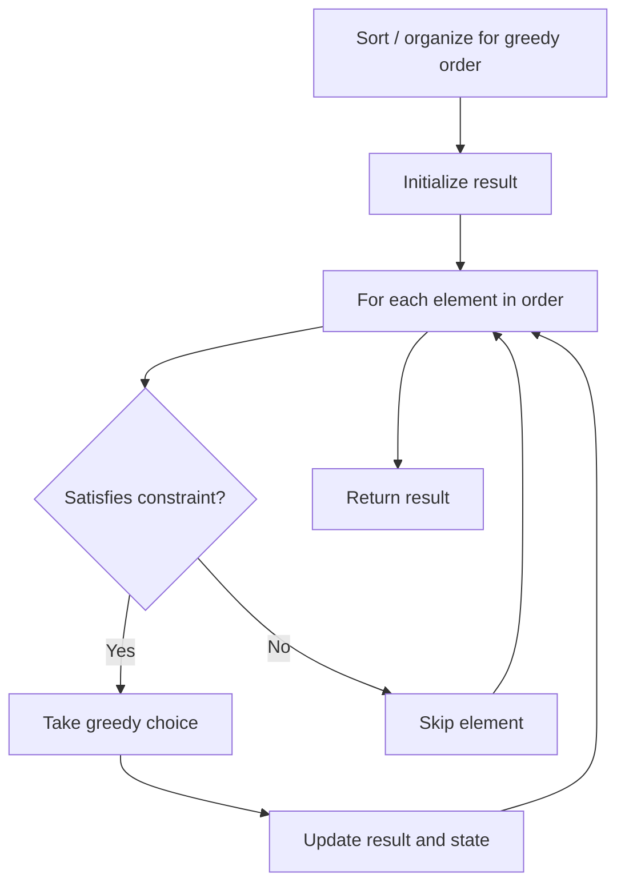

# Problem 1558: Minimum Numbers of Function Calls to Make Target Array

**Difficulty:** Medium  
**Tags:** Array, Greedy, Bit Manipulation  
**Pattern:** Greedy  
**Link:** [leetcode.com/problems/minimum-numbers-of-function-calls-to-make-target-array](https://leetcode.com/problems/minimum-numbers-of-function-calls-to-make-target-array/)

## Description

You are given an integer array `nums`. You have an integer array `arr` of the same length with all values set to `0` initially. You also have the following `modify` function:

You want to use the modify function to convert `arr` to `nums` using the minimum number of calls.

Return *the minimum number of function calls to make *`nums`* from *`arr`.

The test cases are generated so that the answer fits in a **32-bit** signed integer.

 

Example 1:

```

**Input:** nums = [1,5]
**Output:** 5
**Explanation:** Increment by 1 (second element): [0, 0] to get [0, 1] (1 operation).
Double all the elements: [0, 1] -> [0, 2] -> [0, 4] (2 operations).
Increment by 1 (both elements)  [0, 4] -> [1, 4] -> **[1, 5]** (2 operations).
Total of operations: 1 + 2 + 2 = 5.

```

Example 2:

```

**Input:** nums = [2,2]
**Output:** 3
**Explanation:** Increment by 1 (both elements) [0, 0] -> [0, 1] -> [1, 1] (2 operations).
Double all the elements: [1, 1] -> **[2, 2]** (1 operation).
Total of operations: 2 + 1 = 3.

```

Example 3:

```

**Input:** nums = [4,2,5]
**Output:** 6
**Explanation:** (initial)[0,0,0] -> [1,0,0] -> [1,0,1] -> [2,0,2] -> [2,1,2] -> [4,2,4] -> **[4,2,5]**(nums).

```

 

**Constraints:**

	- `1 <= nums.length <= 10^5`
	- `0 <= nums[i] <= 10^9`

## Approach: Greedy

Make the locally optimal choice at each step, trusting it leads to a global optimum. Greedy works when the problem has the greedy-choice property and optimal substructure.

## Pseudocode

```
1. Sort or organize data for greedy ordering
2. Initialize result
3. For each element in greedy order:
   a. If element satisfies constraint:
      - Take the greedy choice
      - Update result and state
4. Return result
```

## Algorithm Flow



## Complexity Analysis

- **Time:** O(n log n)
- **Space:** O(1)

## Solution (Python3)

```python
class Solution:
    def minOperations(self, nums: List[int]) -> int:
        # Greedy approach - O(n) time
        result = 0
        curr_max = 0
        for i in range(len(nums)):
            if isinstance(nums[i], int):
                curr_max = max(curr_max, nums[i])
                result = max(result, curr_max)
            else:
                result += 1
        return result
```

## Solution (C++)

```cpp
#include <algorithm>
#include <string>
#include <vector>
using namespace std;

class Solution {
public:
    int minOperations(vector<int>& nums) {
        // Greedy approach - O(n) time
        int result = 0, curr_max = 0;
        for (int i = 0; i < (int)nums.size(); i++) {
            curr_max = max(curr_max, nums[i]);
            result = max(result, curr_max);
        }
        return result;
    }
};
```
