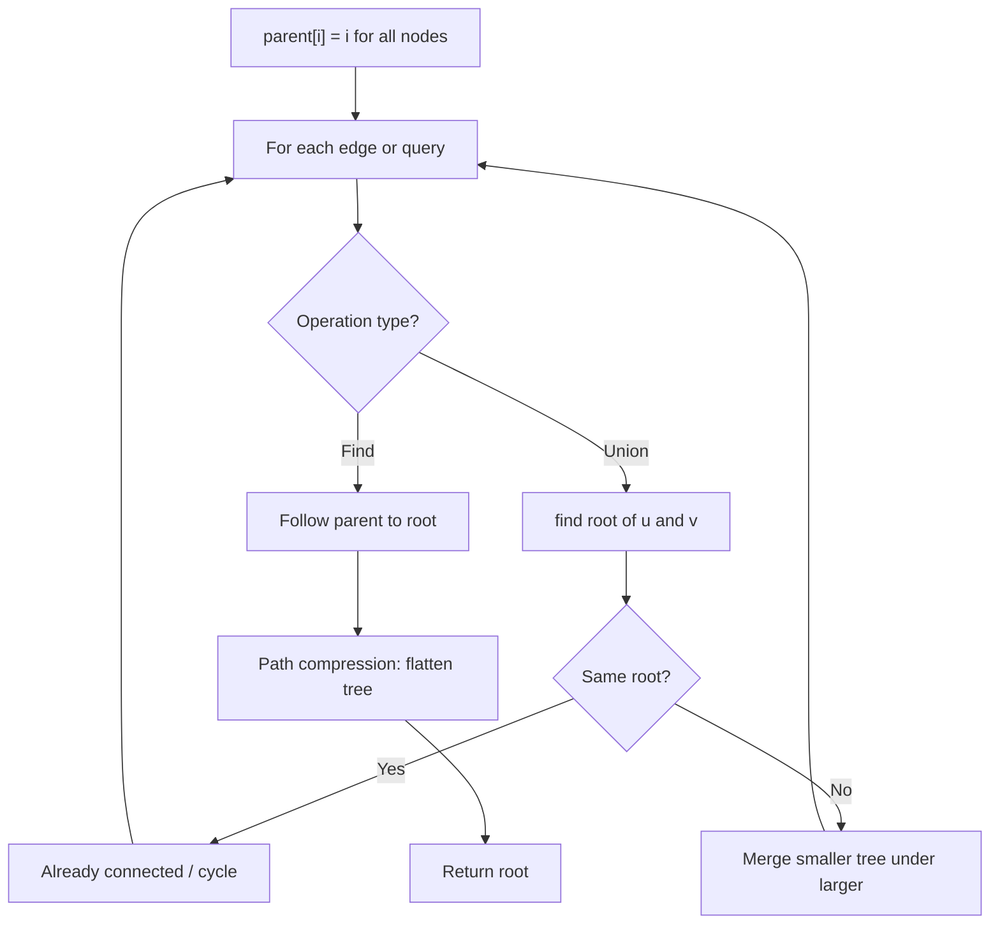
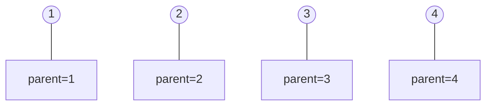
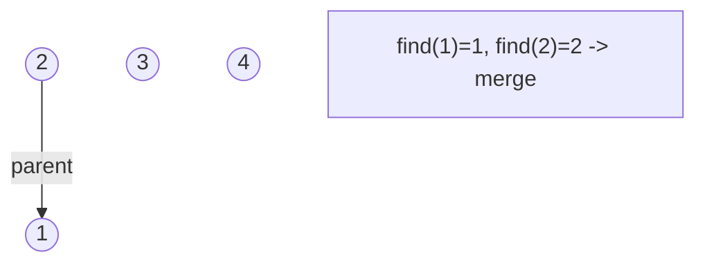
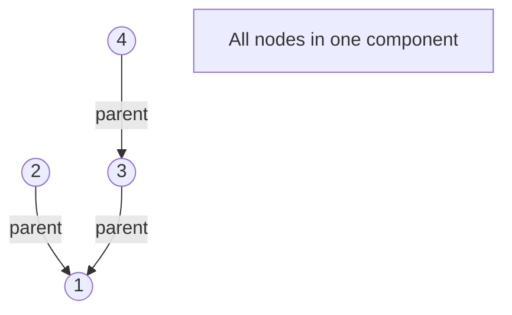
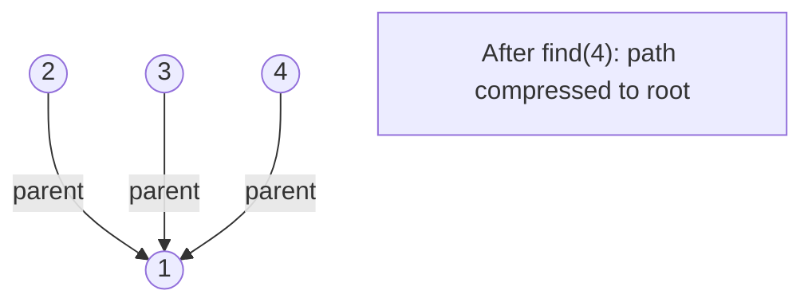

# Problem 1559: Detect Cycles in 2D Grid

**Difficulty:** Medium  
**Tags:** Array, Depth-First Search, Breadth-First Search, Union-Find, Matrix  
**Pattern:** Union-Find / Disjoint Set  
**Link:** [leetcode.com/problems/detect-cycles-in-2d-grid](https://leetcode.com/problems/detect-cycles-in-2d-grid/)

## Description

Given a 2D array of characters `grid` of size `m x n`, you need to find if there exists any cycle consisting of the **same value** in `grid`.

A cycle is a path of **length 4 or more** in the grid that starts and ends at the same cell. From a given cell, you can move to one of the cells adjacent to it - in one of the four directions (up, down, left, or right), if it has the **same value** of the current cell.

Also, you cannot move to the cell that you visited in your last move. For example, the cycle `(1, 1) -> (1, 2) -> (1, 1)` is invalid because from `(1, 2)` we visited `(1, 1)` which was the last visited cell.

Return `true` if any cycle of the same value exists in `grid`, otherwise, return `false`.

 

Example 1:

****

```

**Input:** grid = [["a","a","a","a"],["a","b","b","a"],["a","b","b","a"],["a","a","a","a"]]
**Output:** true
**Explanation: **There are two valid cycles shown in different colors in the image below:

```

Example 2:

****

```

**Input:** grid = [["c","c","c","a"],["c","d","c","c"],["c","c","e","c"],["f","c","c","c"]]
**Output:** true
**Explanation: **There is only one valid cycle highlighted in the image below:

```

Example 3:

****

```

**Input:** grid = [["a","b","b"],["b","z","b"],["b","b","a"]]
**Output:** false

```

 

**Constraints:**

	- `m == grid.length`
	- `n == grid[i].length`
	- `1 <= m, n <= 500`
	- `grid` consists only of lowercase English letters.

## Approach: Union-Find / Disjoint Set

Use Union-Find with path compression and union by rank to efficiently manage connected components. Find(x) returns the root of x's component; Union(x,y) merges two components.

## Pseudocode

```
1. parent[i] = i for all nodes (each is its own set)
2. find(x): follow parent pointers to root (with path compression)
3. union(x, y): merge sets of x and y by rank
4. Process edges/operations:
   a. For each edge (u, v): union(u, v)
5. Answer queries using find()
```

## Algorithm Flow



## Visual State Transitions

**Union-Find Step-by-Step:**

**Frame 1: Initial - each node is own parent**


**Frame 2: Union(1,2) - merge components**


**Frame 3: Union(3,4) then Union(2,3)**


**Frame 4: Path compression on find(4)**



## Complexity Analysis

- **Time:** O(n * alpha(n))
- **Space:** O(n)

## Solution (Python3)

```python
class Solution:
    def containsCycle(self, grid: List[List[str]]) -> bool:
        # Union Find (Disjoint Set Union) - O(n * alpha(n))
        parent = list(range(len(grid) + 1 if isinstance(grid, list) else grid + 1))
        rank = [0] * len(parent)
        
        def find(x):
            if parent[x] != x:
                parent[x] = find(parent[x])
            return parent[x]
        
        def union(x, y):
            px, py = find(x), find(y)
            if px == py:
                return False
            if rank[px] < rank[py]:
                px, py = py, px
            parent[py] = px
            if rank[px] == rank[py]:
                rank[px] += 1
            return True
        
        components = len(parent)
        # Process edges/connections
        return components
```

## Solution (C++)

```cpp
#include <functional>
#include <numeric>
#include <string>
#include <vector>
using namespace std;

class Solution {
public:
    bool containsCycle(vector<vector<string>>& grid) {
        // Union Find (DSU) - O(n * alpha(n))
        int n = grid.size();
        vector<int> parent(n + 1), rnk(n + 1, 0);
        iota(parent.begin(), parent.end(), 0);
        function<int(int)> find = [&](int x) -> int {
            return parent[x] == x ? x : parent[x] = find(parent[x]);
        };
        auto unite = [&](int x, int y) -> bool {
            int px = find(x), py = find(y);
            if (px == py) return false;
            if (rnk[px] < rnk[py]) swap(px, py);
            parent[py] = px;
            if (rnk[px] == rnk[py]) rnk[px]++;
            return true;
        };
        int components = n;
        return components;
    }
};
```
