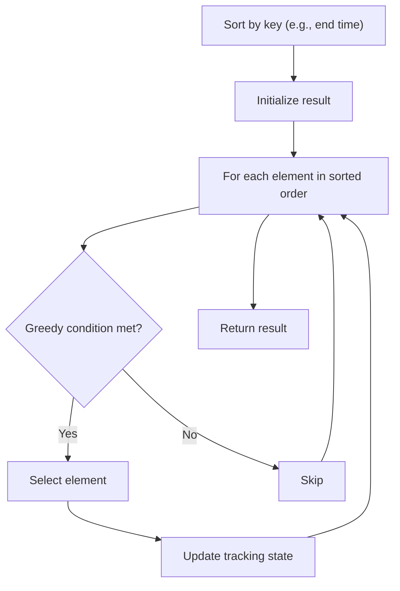

# Problem 1561: Maximum Number of Coins You Can Get

**Difficulty:** Medium  
**Tags:** Array, Math, Greedy, Sorting, Game Theory  
**Pattern:** Greedy with Sorting  
**Link:** [leetcode.com/problems/maximum-number-of-coins-you-can-get](https://leetcode.com/problems/maximum-number-of-coins-you-can-get/)

## Description

There are `3n` piles of coins of varying size, you and your friends will take piles of coins as follows:

	- In each step, you will choose **any **`3` piles of coins (not necessarily consecutive).
	- Of your choice, Alice will pick the pile with the maximum number of coins.
	- You will pick the next pile with the maximum number of coins.
	- Your friend Bob will pick the last pile.
	- Repeat until there are no more piles of coins.

Given an array of integers `piles` where `piles[i]` is the number of coins in the `i^th` pile.

Return the maximum number of coins that you can have.

 

Example 1:

```

**Input:** piles = [2,4,1,2,7,8]
**Output:** 9
**Explanation: **Choose the triplet (2, 7, 8), Alice Pick the pile with 8 coins, you the pile with **7** coins and Bob the last one.
Choose the triplet (1, 2, 4), Alice Pick the pile with 4 coins, you the pile with **2** coins and Bob the last one.
The maximum number of coins which you can have are: 7 + 2 = 9.
On the other hand if we choose this arrangement (1, **2**, 8), (2, **4**, 7) you only get 2 + 4 = 6 coins which is not optimal.

```

Example 2:

```

**Input:** piles = [2,4,5]
**Output:** 4

```

Example 3:

```

**Input:** piles = [9,8,7,6,5,1,2,3,4]
**Output:** 18

```

 

**Constraints:**

	- `3 <= piles.length <= 10^5`
	- `piles.length % 3 == 0`
	- `1 <= piles[i] <= 10^4`

## Approach: Greedy with Sorting

Sort the input by a key criterion, then greedily process elements in sorted order. The sorting ensures the greedy choice is always optimal.

## Pseudocode

```
1. Sort elements by key (start time, weight, etc.)
2. Initialize result, tracking variables
3. For each element in sorted order:
   a. Apply greedy selection rule
   b. Update result
4. Return result
```

## Algorithm Flow



## Complexity Analysis

- **Time:** O(n log n)
- **Space:** O(n)

## Solution (Python3)

```python
class Solution:
    def maxCoins(self, piles: List[int]) -> int:
        # Sort + greedy - O(n log n) time
        piles.sort()
        result = 0
        curr_end = 0
        for item in piles:
            if isinstance(item, (list, tuple)):
                if item[0] >= curr_end:
                    result += 1
                    curr_end = item[1]
            else:
                result += 1
        return result
```

## Solution (C++)

```cpp
#include <algorithm>
#include <string>
#include <vector>
using namespace std;

class Solution {
public:
    int maxCoins(vector<int>& piles) {
        // Sort + greedy - O(n log n) time
        sort(piles.begin(), piles.end());
        int result = 0, curr_end = 0;
        for (auto& item : piles) {
            result++;
        }
        return result;
    }
};
```
