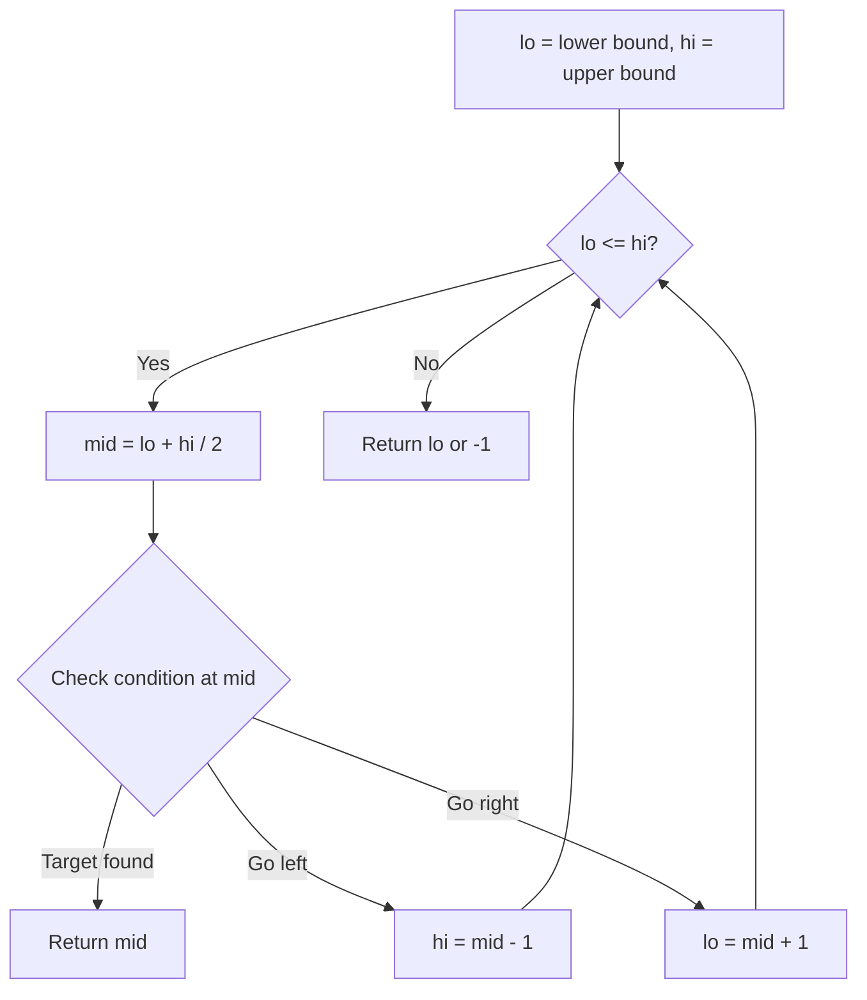
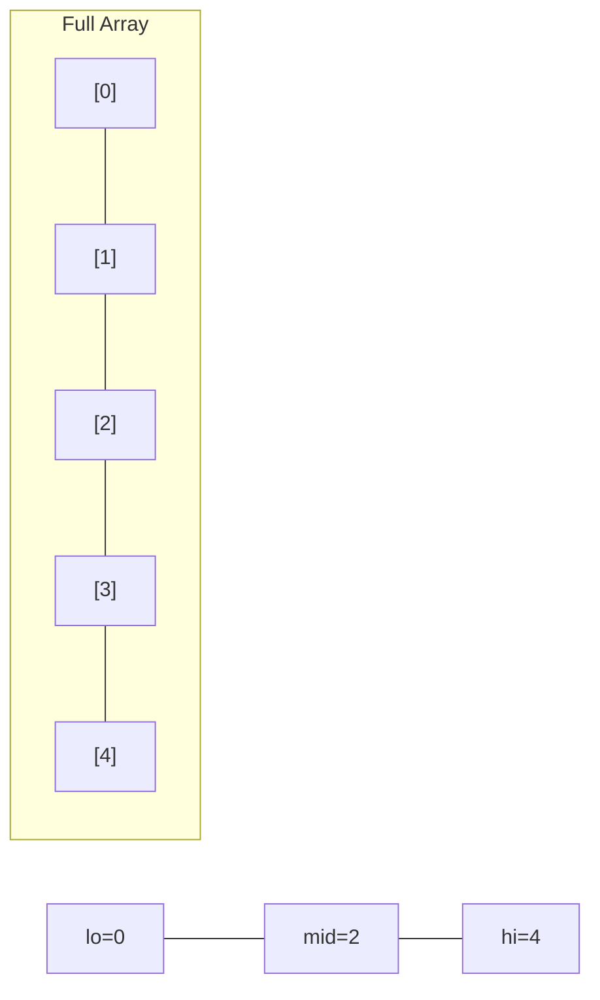
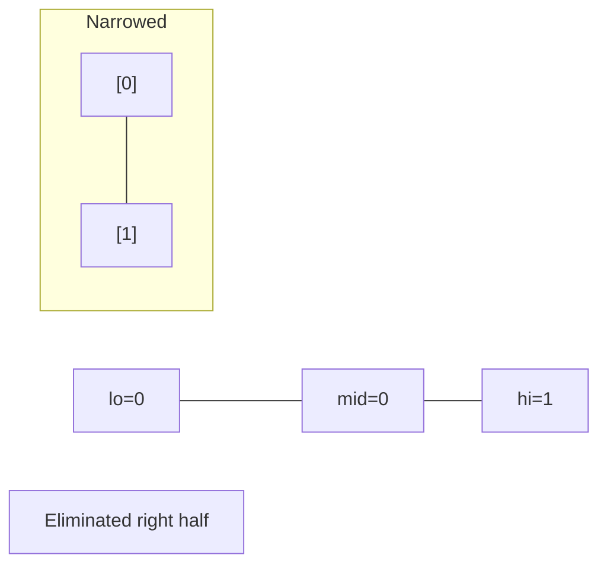
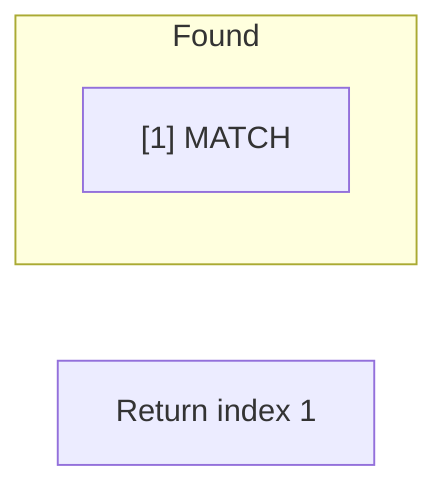

# Problem 1562: Find Latest Group of Size M

**Difficulty:** Medium  
**Tags:** Array, Hash Table, Binary Search, Simulation  
**Pattern:** Binary Search  
**Link:** [leetcode.com/problems/find-latest-group-of-size-m](https://leetcode.com/problems/find-latest-group-of-size-m/)

## Description

Given an array `arr` that represents a permutation of numbers from `1` to `n`.

You have a binary string of size `n` that initially has all its bits set to zero. At each step `i` (assuming both the binary string and `arr` are 1-indexed) from `1` to `n`, the bit at position `arr[i]` is set to `1`.

You are also given an integer `m`. Find the latest step at which there exists a group of ones of length `m`. A group of ones is a contiguous substring of `1`'s such that it cannot be extended in either direction.

Return *the latest step at which there exists a group of ones of length **exactly*** `m`. *If no such group exists, return* `-1`.

 

Example 1:

```

**Input:** arr = [3,5,1,2,4], m = 1
**Output:** 4
**Explanation:** 
Step 1: "00100", groups: ["1"]
Step 2: "00101", groups: ["1", "1"]
Step 3: "10101", groups: ["1", "1", "1"]
Step 4: "11101", groups: ["111", "1"]
Step 5: "11111", groups: ["11111"]
The latest step at which there exists a group of size 1 is step 4.

```

Example 2:

```

**Input:** arr = [3,1,5,4,2], m = 2
**Output:** -1
**Explanation:** 
Step 1: "00100", groups: ["1"]
Step 2: "10100", groups: ["1", "1"]
Step 3: "10101", groups: ["1", "1", "1"]
Step 4: "10111", groups: ["1", "111"]
Step 5: "11111", groups: ["11111"]
No group of size 2 exists during any step.

```

 

**Constraints:**

	- `n == arr.length`
	- `1 <= m <= n <= 10^5`
	- `1 <= arr[i] <= n`
	- All integers in `arr` are **distinct**.

## Approach: Binary Search

Use binary search to halve the search space each iteration. Define the search range [lo, hi], compute mid, and decide which half to keep based on the problem's monotonic condition.

## Pseudocode

```
1. lo = lower_bound, hi = upper_bound
2. While lo <= hi (or lo < hi):
   a. mid = (lo + hi) // 2
   b. If condition(mid) is satisfied: record answer, search left half
   c. Else: search right half
3. Return answer
```

## Algorithm Flow



## Visual State Transitions

**Binary Search Step-by-Step:**

**Frame 1: Initial search space**


**Frame 2: Compare mid, narrow search**


**Frame 3: Found target**



## Complexity Analysis

- **Time:** O(log n)
- **Space:** O(1)

## Solution (Python3)

```python
class Solution:
    def findLatestStep(self, arr: List[int], m: int) -> int:
        # Binary search - O(log n) time, O(1) space
        lo, hi = 0, len(arr) - 1
        while lo <= hi:
            mid = lo + (hi - lo) // 2
            if arr[mid] == m:
                return mid
            elif arr[mid] < m:
                lo = mid + 1
            else:
                hi = mid - 1
        return 0
```

## Solution (C++)

```cpp
#include <string>
#include <vector>
using namespace std;

class Solution {
public:
    int findLatestStep(vector<int>& arr, int m) {
        // Binary search - O(log n) time, O(1) space
        int lo = 0, hi = arr.size() - 1;
        while (lo <= hi) {
            int mid = lo + (hi - lo) / 2;
            if (arr[mid] == m) {
                return mid;
            } else if (arr[mid] < m) {
                lo = mid + 1;
            } else {
                hi = mid - 1;
            }
        }
        return 0;
    }
};
```
