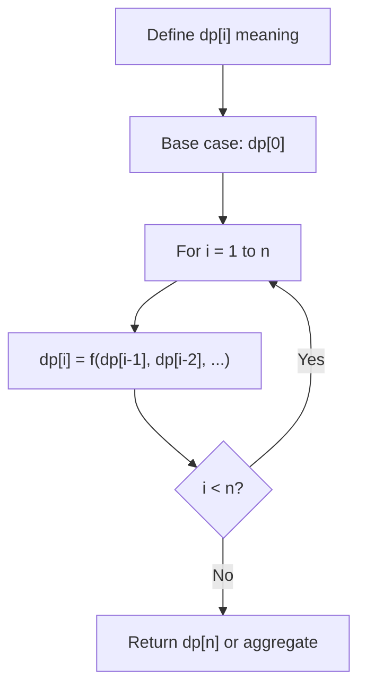
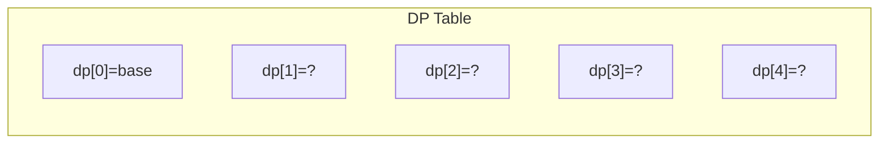
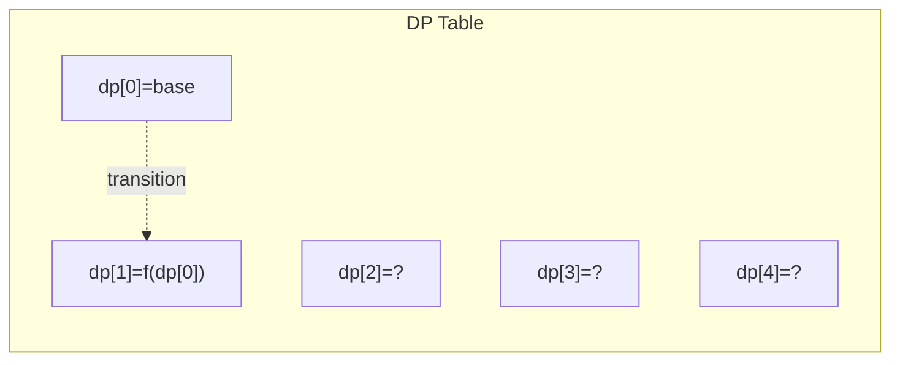
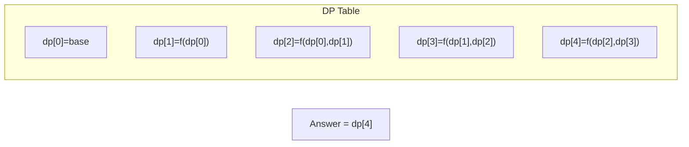

# Problem 1563: Stone Game V

**Difficulty:** Hard  
**Tags:** Array, Math, Dynamic Programming, Game Theory  
**Pattern:** Dynamic Programming (1D)  
**Link:** [leetcode.com/problems/stone-game-v](https://leetcode.com/problems/stone-game-v/)

## Description

There are several stones **arranged in a row**, and each stone has an associated value which is an integer given in the array `stoneValue`.

In each round of the game, Alice divides the row into **two non-empty rows** (i.e. left row and right row), then Bob calculates the value of each row which is the sum of the values of all the stones in this row. Bob throws away the row which has the maximum value, and Alice's score increases by the value of the remaining row. If the value of the two rows are equal, Bob lets Alice decide which row will be thrown away. The next round starts with the remaining row.

The game ends when there is only **one stone remaining**. Alice's score is initially **zero**.

Return *the maximum score that Alice can obtain*.

 

Example 1:

```

**Input:** stoneValue = [6,2,3,4,5,5]
**Output:** 18
**Explanation:** In the first round, Alice divides the row to [6,2,3], [4,5,5]. The left row has the value 11 and the right row has value 14. Bob throws away the right row and Alice's score is now 11.
In the second round Alice divides the row to [6], [2,3]. This time Bob throws away the left row and Alice's score becomes 16 (11 + 5).
The last round Alice has only one choice to divide the row which is [2], [3]. Bob throws away the right row and Alice's score is now 18 (16 + 2). The game ends because only one stone is remaining in the row.

```

Example 2:

```

**Input:** stoneValue = [7,7,7,7,7,7,7]
**Output:** 28

```

Example 3:

```

**Input:** stoneValue = [4]
**Output:** 0

```

 

**Constraints:**

	- `1 <= stoneValue.length <= 500`
	- `1 <= stoneValue[i] <= 10^6`

## Approach: Dynamic Programming (1D)

Break the problem into overlapping subproblems. Define dp[i] as the optimal value for the subproblem ending at or considering index i. Build the solution bottom-up, using previously computed dp values.

## Pseudocode

```
1. Define dp[i] = optimal value for subproblem i
2. Base case: dp[0] = initial value
3. For i from 1 to n:
   a. dp[i] = recurrence(dp[i-1], dp[i-2], ...)
4. Return dp[n] or max/min of dp
```

## Algorithm Flow



## Visual State Transitions

**1D Dynamic Programming Table Build:**

**Frame 1: Initialize base cases**


**Frame 2: Fill dp[1] from dp[0]**


**Frame 3: Fill remaining cells**



## Complexity Analysis

- **Time:** O(n)
- **Space:** O(n)

## Solution (Python3)

```python
class Solution:
    def stoneGameV(self, stoneValue: List[int]) -> int:
        # Dynamic programming (1D) - O(n) time, O(n) space
        if not stoneValue:
            return 0
        n = len(stoneValue) if isinstance(stoneValue, list) else stoneValue
        dp = [0] * (n + 1)
        dp[0] = 1  # base case
        for i in range(1, n + 1):
            dp[i] = dp[i-1]  # transition (customize per problem)
            if i >= 2:
                dp[i] += dp[i-2]
        return dp[n]
```

## Solution (C++)

```cpp
#include <string>
#include <vector>
using namespace std;

class Solution {
public:
    int stoneGameV(vector<int>& stoneValue) {
        // Dynamic programming (1D) - O(n) time, O(n) space
        int n = stoneValue;
        if (n <= 0) return 0;
        vector<int> dp(n + 1, 0);
        dp[0] = 1;
        for (int i = 1; i <= n; i++) {
            dp[i] = dp[i-1];
            if (i >= 2) dp[i] += dp[i-2];
        }
        return dp[n];
    }
};
```
