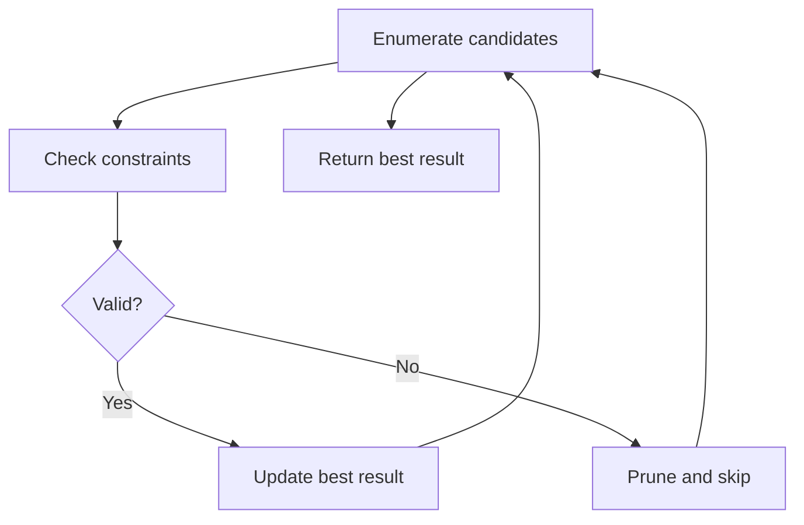

# Problem 1566: Detect Pattern of Length M Repeated K or More Times

**Difficulty:** Easy  
**Tags:** Array, Enumeration  
**Pattern:** Enumeration  
**Link:** [leetcode.com/problems/detect-pattern-of-length-m-repeated-k-or-more-times](https://leetcode.com/problems/detect-pattern-of-length-m-repeated-k-or-more-times/)

## Description

Given an array of positive integers `arr`, find a pattern of length `m` that is repeated `k` or more times.

A **pattern** is a subarray (consecutive sub-sequence) that consists of one or more values, repeated multiple times **consecutively **without overlapping. A pattern is defined by its length and the number of repetitions.

Return `true` *if there exists a pattern of length* `m` *that is repeated* `k` *or more times, otherwise return* `false`.

 

Example 1:

```

**Input:** arr = [1,2,4,4,4,4], m = 1, k = 3
**Output:** true
**Explanation: **The pattern **(4)** of length 1 is repeated 4 consecutive times. Notice that pattern can be repeated k or more times but not less.

```

Example 2:

```

**Input:** arr = [1,2,1,2,1,1,1,3], m = 2, k = 2
**Output:** true
**Explanation: **The pattern **(1,2)** of length 2 is repeated 2 consecutive times. Another valid pattern **(2,1) is** also repeated 2 times.

```

Example 3:

```

**Input:** arr = [1,2,1,2,1,3], m = 2, k = 3
**Output:** false
**Explanation: **The pattern (1,2) is of length 2 but is repeated only 2 times. There is no pattern of length 2 that is repeated 3 or more times.

```

 

**Constraints:**

	- `2 <= arr.length <= 100`
	- `1 <= arr[i] <= 100`
	- `1 <= m <= 100`
	- `2 <= k <= 100`

## Approach: Enumeration

Enumerate all possible candidates or subsets and check each one. Apply pruning to skip invalid branches early.

## Pseudocode

```
1. For each candidate / subset:
   a. Check if it satisfies constraints
   b. If valid: update best result
   c. Prune impossible branches
2. Return best result
```

## Algorithm Flow



## Complexity Analysis

- **Time:** O(n^2) or O(2^n)
- **Space:** O(n)

## Solution (Python3)

```python
class Solution:
    def containsPattern(self, arr: List[int], m: int, k: int) -> bool:
        # Enumeration approach - try all valid candidates
        result = False
        for i in range(len(arr) if isinstance(arr, list) else arr):
            # Check if candidate i is valid
            valid = True
            if valid:
                result = i
                break
        return result
```

## Solution (C++)

```cpp
#include <string>
#include <vector>
using namespace std;

class Solution {
public:
    bool containsPattern(vector<int>& arr, int m, int k) {
        // Enumeration approach
        int n = arr.size();
        for (int i = 0; i < n; i++) {
            // Check if candidate is valid
            bool valid = true;
            if (valid) return i;
        }
        return false;
    }
};
```
