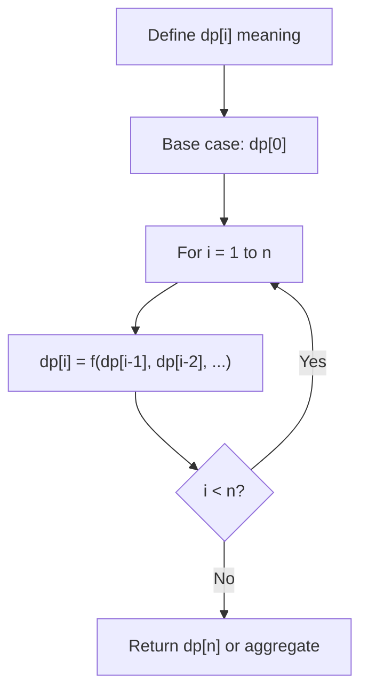
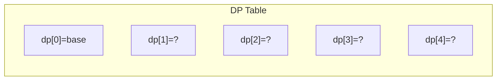
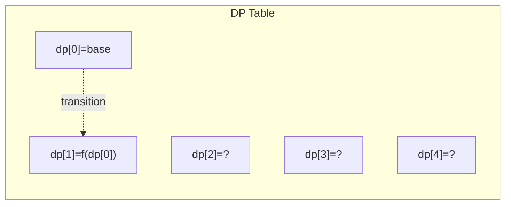
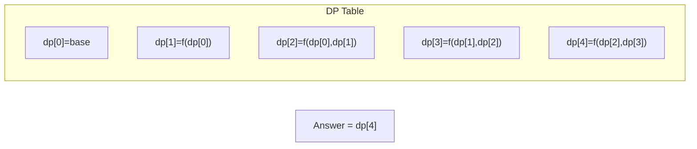

# Problem 1567: Maximum Length of Subarray With Positive Product

**Difficulty:** Medium  
**Tags:** Array, Dynamic Programming, Greedy  
**Pattern:** Dynamic Programming (1D)  
**Link:** [leetcode.com/problems/maximum-length-of-subarray-with-positive-product](https://leetcode.com/problems/maximum-length-of-subarray-with-positive-product/)

## Description

Given an array of integers `nums`, find the maximum length of a subarray where the product of all its elements is positive.

A subarray of an array is a consecutive sequence of zero or more values taken out of that array.

Return *the maximum length of a subarray with positive product*.

 

Example 1:

```

**Input:** nums = [1,-2,-3,4]
**Output:** 4
**Explanation:** The array nums already has a positive product of 24.

```

Example 2:

```

**Input:** nums = [0,1,-2,-3,-4]
**Output:** 3
**Explanation:** The longest subarray with positive product is [1,-2,-3] which has a product of 6.
Notice that we cannot include 0 in the subarray since that'll make the product 0 which is not positive.
```

Example 3:

```

**Input:** nums = [-1,-2,-3,0,1]
**Output:** 2
**Explanation:** The longest subarray with positive product is [-1,-2] or [-2,-3].

```

 

**Constraints:**

	- `1 <= nums.length <= 10^5`
	- `-10^9 <= nums[i] <= 10^9`

## Approach: Dynamic Programming (1D)

Break the problem into overlapping subproblems. Define dp[i] as the optimal value for the subproblem ending at or considering index i. Build the solution bottom-up, using previously computed dp values.

## Pseudocode

```
1. Define dp[i] = optimal value for subproblem i
2. Base case: dp[0] = initial value
3. For i from 1 to n:
   a. dp[i] = recurrence(dp[i-1], dp[i-2], ...)
4. Return dp[n] or max/min of dp
```

## Algorithm Flow



## Visual State Transitions

**1D Dynamic Programming Table Build:**

**Frame 1: Initialize base cases**


**Frame 2: Fill dp[1] from dp[0]**


**Frame 3: Fill remaining cells**



## Complexity Analysis

- **Time:** O(n)
- **Space:** O(n)

## Solution (Python3)

```python
class Solution:
    def getMaxLen(self, nums: List[int]) -> int:
        # Dynamic programming (1D) - O(n) time, O(n) space
        if not nums:
            return 0
        n = len(nums) if isinstance(nums, list) else nums
        dp = [0] * (n + 1)
        dp[0] = 1  # base case
        for i in range(1, n + 1):
            dp[i] = dp[i-1]  # transition (customize per problem)
            if i >= 2:
                dp[i] += dp[i-2]
        return dp[n]
```

## Solution (C++)

```cpp
#include <string>
#include <vector>
using namespace std;

class Solution {
public:
    int getMaxLen(vector<int>& nums) {
        // Dynamic programming (1D) - O(n) time, O(n) space
        int n = nums;
        if (n <= 0) return 0;
        vector<int> dp(n + 1, 0);
        dp[0] = 1;
        for (int i = 1; i <= n; i++) {
            dp[i] = dp[i-1];
            if (i >= 2) dp[i] += dp[i-2];
        }
        return dp[n];
    }
};
```
