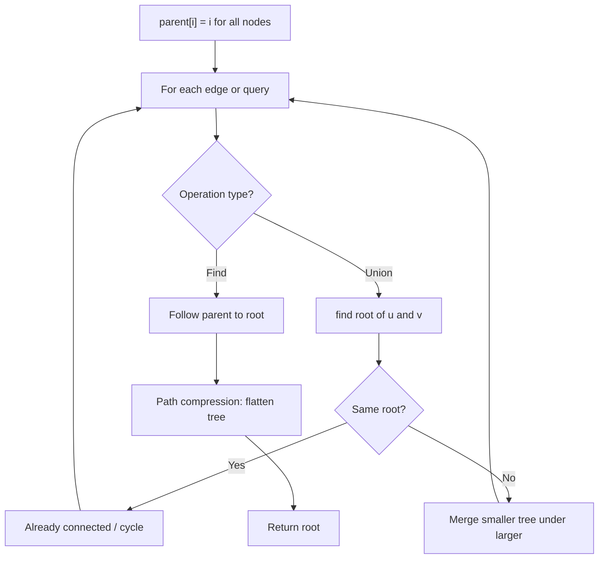
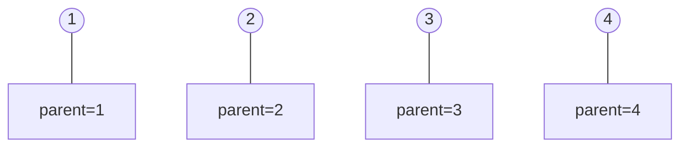
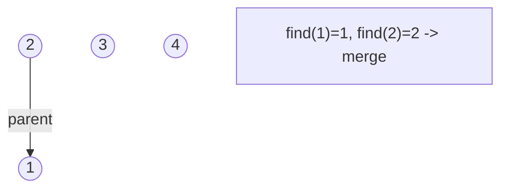
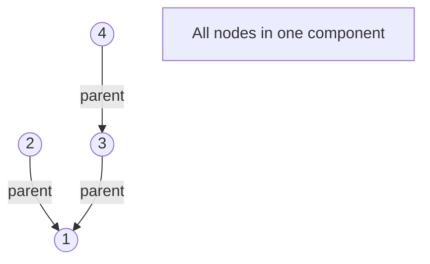
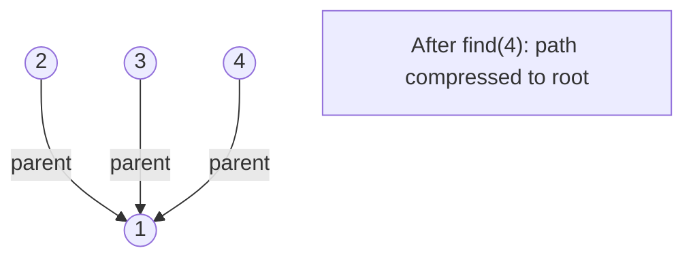

# Problem 1569: Number of Ways to Reorder Array to Get Same BST

**Difficulty:** Hard  
**Tags:** Array, Math, Divide and Conquer, Dynamic Programming, Tree, Union-Find, Binary Search Tree, Memoization, Combinatorics, Binary Tree  
**Pattern:** Union-Find / Disjoint Set  
**Link:** [leetcode.com/problems/number-of-ways-to-reorder-array-to-get-same-bst](https://leetcode.com/problems/number-of-ways-to-reorder-array-to-get-same-bst/)

## Description

Given an array `nums` that represents a permutation of integers from `1` to `n`. We are going to construct a binary search tree (BST) by inserting the elements of `nums` in order into an initially empty BST. Find the number of different ways to reorder `nums` so that the constructed BST is identical to that formed from the original array `nums`.

	- For example, given `nums = [2,1,3]`, we will have 2 as the root, 1 as a left child, and 3 as a right child. The array `[2,3,1]` also yields the same BST but `[3,2,1]` yields a different BST.

Return *the number of ways to reorder* `nums` *such that the BST formed is identical to the original BST formed from* `nums`.

Since the answer may be very large, **return it modulo **`10^9 + 7`.

 

Example 1:

```

**Input:** nums = [2,1,3]
**Output:** 1
**Explanation:** We can reorder nums to be [2,3,1] which will yield the same BST. There are no other ways to reorder nums which will yield the same BST.

```

Example 2:

```

**Input:** nums = [3,4,5,1,2]
**Output:** 5
**Explanation:** The following 5 arrays will yield the same BST: 
[3,1,2,4,5]
[3,1,4,2,5]
[3,1,4,5,2]
[3,4,1,2,5]
[3,4,1,5,2]

```

Example 3:

```

**Input:** nums = [1,2,3]
**Output:** 0
**Explanation:** There are no other orderings of nums that will yield the same BST.

```

 

**Constraints:**

	- `1 <= nums.length <= 1000`
	- `1 <= nums[i] <= nums.length`
	- All integers in `nums` are **distinct**.

## Approach: Union-Find / Disjoint Set

Use Union-Find with path compression and union by rank to efficiently manage connected components. Find(x) returns the root of x's component; Union(x,y) merges two components.

## Pseudocode

```
1. parent[i] = i for all nodes (each is its own set)
2. find(x): follow parent pointers to root (with path compression)
3. union(x, y): merge sets of x and y by rank
4. Process edges/operations:
   a. For each edge (u, v): union(u, v)
5. Answer queries using find()
```

## Algorithm Flow



## Visual State Transitions

**Union-Find Step-by-Step:**

**Frame 1: Initial - each node is own parent**


**Frame 2: Union(1,2) - merge components**


**Frame 3: Union(3,4) then Union(2,3)**


**Frame 4: Path compression on find(4)**



## Complexity Analysis

- **Time:** O(n * alpha(n))
- **Space:** O(n)

## Solution (Python3)

```python
class Solution:
    def numOfWays(self, nums: List[int]) -> int:
        # Union Find (Disjoint Set Union) - O(n * alpha(n))
        parent = list(range(len(nums) + 1 if isinstance(nums, list) else nums + 1))
        rank = [0] * len(parent)
        
        def find(x):
            if parent[x] != x:
                parent[x] = find(parent[x])
            return parent[x]
        
        def union(x, y):
            px, py = find(x), find(y)
            if px == py:
                return False
            if rank[px] < rank[py]:
                px, py = py, px
            parent[py] = px
            if rank[px] == rank[py]:
                rank[px] += 1
            return True
        
        components = len(parent)
        # Process edges/connections
        return components
```

## Solution (C++)

```cpp
#include <functional>
#include <numeric>
#include <string>
#include <vector>
using namespace std;

class Solution {
public:
    int numOfWays(vector<int>& nums) {
        // Union Find (DSU) - O(n * alpha(n))
        int n = nums.size();
        vector<int> parent(n + 1), rnk(n + 1, 0);
        iota(parent.begin(), parent.end(), 0);
        function<int(int)> find = [&](int x) -> int {
            return parent[x] == x ? x : parent[x] = find(parent[x]);
        };
        auto unite = [&](int x, int y) -> bool {
            int px = find(x), py = find(y);
            if (px == py) return false;
            if (rnk[px] < rnk[py]) swap(px, py);
            parent[py] = px;
            if (rnk[px] == rnk[py]) rnk[px]++;
            return true;
        };
        int components = n;
        return components;
    }
};
```
