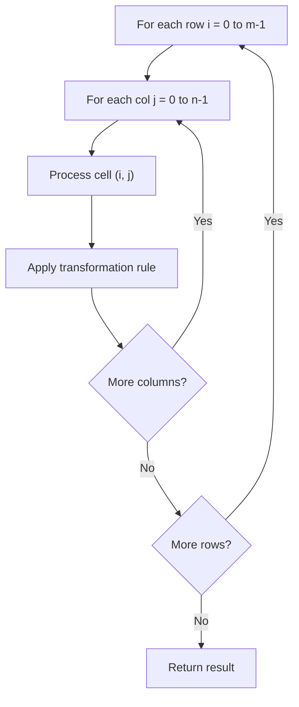

# Problem 1572: Matrix Diagonal Sum

**Difficulty:** Easy  
**Tags:** Array, Matrix  
**Pattern:** Matrix / 2D Array  
**Link:** [leetcode.com/problems/matrix-diagonal-sum](https://leetcode.com/problems/matrix-diagonal-sum/)

## Description

Given a square matrix `mat`, return the sum of the matrix diagonals.

Only include the sum of all the elements on the primary diagonal and all the elements on the secondary diagonal that are not part of the primary diagonal.

 

Example 1:

```

**Input:** mat = [[**1**,2,**3**],
              [4,**5**,6],
              [**7**,8,**9**]]
**Output:** 25
**Explanation: **Diagonals sum: 1 + 5 + 9 + 3 + 7 = 25
Notice that element mat[1][1] = 5 is counted only once.

```

Example 2:

```

**Input:** mat = [[**1**,1,1,**1**],
              [1,**1**,**1**,1],
              [1,**1**,**1**,1],
              [**1**,1,1,**1**]]
**Output:** 8

```

Example 3:

```

**Input:** mat = [[**5**]]
**Output:** 5

```

 

**Constraints:**

	- `n == mat.length == mat[i].length`
	- `1 <= n <= 100`
	- `1 <= mat[i][j] <= 100`

## Approach: Matrix / 2D Array

Process the matrix row by row or column by column. Common patterns: rotation, spiral traversal, in-place modification, transposition.

## Pseudocode

```
1. For each row i:
   For each column j:
     Process cell (i, j) based on neighbors or rules
2. Handle boundary conditions
3. Return modified matrix or computed result
```

## Algorithm Flow



## Complexity Analysis

- **Time:** O(m * n)
- **Space:** O(1) extra

## Solution (Python3)

```python
class Solution:
    def diagonalSum(self, mat: List[List[int]]) -> int:
        # Matrix manipulation - O(m*n) time
        if not mat:
            return 0
        m, n = len(mat), len(mat[0])
        # Process matrix in-place or build result
        for i in range(m):
            for j in range(n):
                pass  # Process mat[i][j]
        return 0
```

## Solution (C++)

```cpp
#include <string>
#include <vector>
using namespace std;

class Solution {
public:
    int diagonalSum(vector<vector<int>>& mat) {
        // Matrix manipulation - O(m*n) time
        if (mat.empty()) return 0;
        int m = mat.size(), n = mat[0].size();
        for (int i = 0; i < m; i++) {
            for (int j = 0; j < n; j++) {
                // Process matrix[i][j]
            }
        }
        return 0;
    }
};
```
