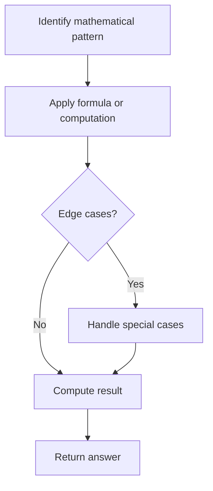

# Problem 1573: Number of Ways to Split a String

**Difficulty:** Medium  
**Tags:** Math, String  
**Pattern:** Math  
**Link:** [leetcode.com/problems/number-of-ways-to-split-a-string](https://leetcode.com/problems/number-of-ways-to-split-a-string/)

## Description

Given a binary string `s`, you can split `s` into 3 **non-empty** strings `s1`, `s2`, and `s3` where `s1 + s2 + s3 = s`.

Return the number of ways `s` can be split such that the number of ones is the same in `s1`, `s2`, and `s3`. Since the answer may be too large, return it **modulo** `10^9 + 7`.

 

Example 1:

```

**Input:** s = "10101"
**Output:** 4
**Explanation:** There are four ways to split s in 3 parts where each part contain the same number of letters '1'.
"1|010|1"
"1|01|01"
"10|10|1"
"10|1|01"

```

Example 2:

```

**Input:** s = "1001"
**Output:** 0

```

Example 3:

```

**Input:** s = "0000"
**Output:** 3
**Explanation:** There are three ways to split s in 3 parts.
"0|0|00"
"0|00|0"
"00|0|0"

```

 

**Constraints:**

	- `3 <= s.length <= 10^5`
	- `s[i]` is either `'0'` or `'1'`.

## Approach: Math

Apply mathematical properties, formulas, or number-theoretic concepts. Look for patterns, modular arithmetic, or closed-form solutions.

## Pseudocode

```
1. Identify the mathematical pattern or formula
2. Apply computation:
   - Modular arithmetic for large numbers
   - GCD/LCM for divisibility
   - Sieve for primes
3. Handle edge cases
4. Return result
```

## Algorithm Flow



## Complexity Analysis

- **Time:** O(n) or O(sqrt(n))
- **Space:** O(1)

## Solution (Python3)

```python
class Solution:
    def numWays(self, s: str) -> int:
        # Mathematical approach
        result = 0
        x = s
        while x != 0:
            result = result * 10 + x % 10
            x //= 10 if isinstance(x, int) else 1
        return result
```

## Solution (C++)

```cpp
#include <string>
#include <vector>
using namespace std;

class Solution {
public:
    int numWays(string& s) {
        // Mathematical approach
        long long result = 0;
        int x = s;
        while (x != 0) {
            result = result * 10 + x % 10;
            x /= 10;
        }
        return (int)result;
    }
};
```
