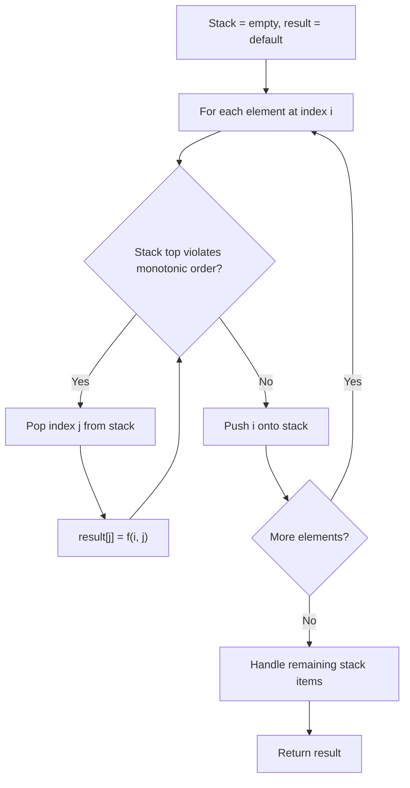
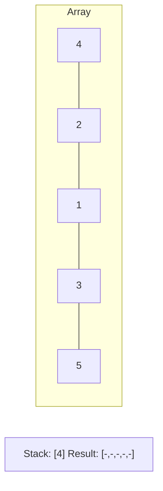
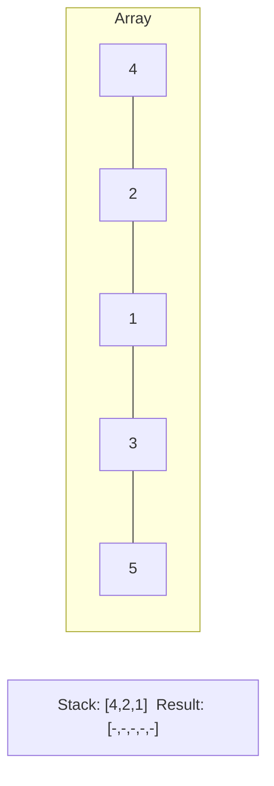
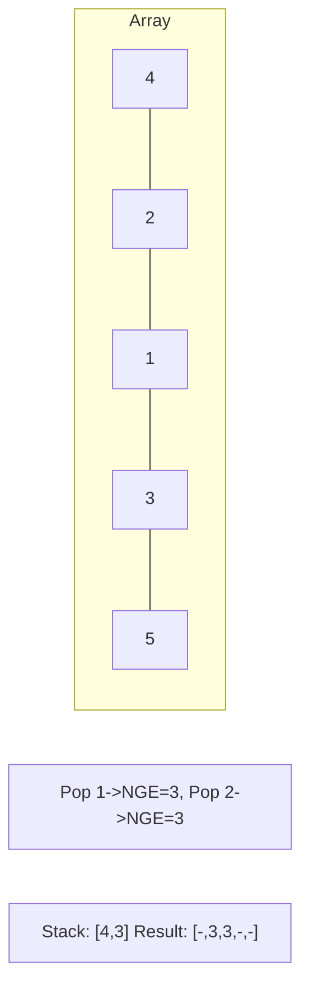
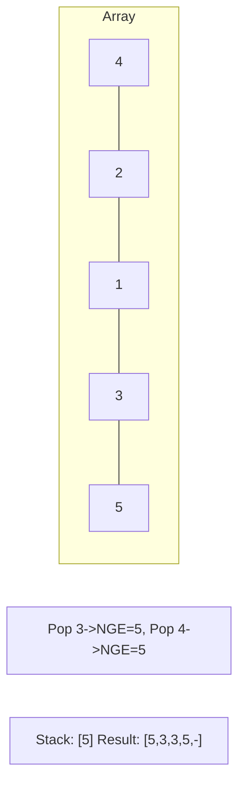

# Problem 1574: Shortest Subarray to be Removed to Make Array Sorted

**Difficulty:** Medium  
**Tags:** Array, Two Pointers, Binary Search, Stack, Monotonic Stack  
**Pattern:** Monotonic Stack  
**Link:** [leetcode.com/problems/shortest-subarray-to-be-removed-to-make-array-sorted](https://leetcode.com/problems/shortest-subarray-to-be-removed-to-make-array-sorted/)

## Description

Given an integer array `arr`, remove a subarray (can be empty) from `arr` such that the remaining elements in `arr` are **non-decreasing**.

Return *the length of the shortest subarray to remove*.

A **subarray** is a contiguous subsequence of the array.

 

Example 1:

```

**Input:** arr = [1,2,3,10,4,2,3,5]
**Output:** 3
**Explanation:** The shortest subarray we can remove is [10,4,2] of length 3. The remaining elements after that will be [1,2,3,3,5] which are sorted.
Another correct solution is to remove the subarray [3,10,4].

```

Example 2:

```

**Input:** arr = [5,4,3,2,1]
**Output:** 4
**Explanation:** Since the array is strictly decreasing, we can only keep a single element. Therefore we need to remove a subarray of length 4, either [5,4,3,2] or [4,3,2,1].

```

Example 3:

```

**Input:** arr = [1,2,3]
**Output:** 0
**Explanation:** The array is already non-decreasing. We do not need to remove any elements.

```

 

**Constraints:**

	- `1 <= arr.length <= 10^5`
	- `0 <= arr[i] <= 10^9`

## Approach: Monotonic Stack

Maintain a stack where elements are always in monotonic order (increasing or decreasing). When a new element violates the monotonic property, pop elements and compute results (e.g., next greater/smaller element, spans, areas).

## Pseudocode

```
1. Initialize empty stack, result array
2. For each element (index i):
   a. While stack not empty and arr[i] breaks monotonic order:
      - Pop index j from stack
      - result[j] = compute(i, j)
   b. Push i onto stack
3. Handle remaining elements in stack
4. Return result
```

## Algorithm Flow



## Visual State Transitions

**Monotonic Stack (Next Greater Element):**

**Frame 1: Process first elements**


**Frame 2: Push smaller elements**


**Frame 3: Element 3 pops 1 and 2**


**Frame 4: Element 5 pops all**



## Complexity Analysis

- **Time:** O(n)
- **Space:** O(n)

## Solution (Python3)

```python
class Solution:
    def findLengthOfShortestSubarray(self, arr: List[int]) -> int:
        # Monotonic stack - O(n) time, O(n) space
        n = len(arr)
        result = [0] * n
        stack = []  # indices
        for i in range(n):
            while stack and arr[i] > arr[stack[-1]]:
                idx = stack.pop()
                result[idx] = i - idx
            stack.append(i)
        return result
```

## Solution (C++)

```cpp
#include <stack>
#include <string>
#include <vector>
using namespace std;

class Solution {
public:
    int findLengthOfShortestSubarray(vector<int>& arr) {
        // Monotonic stack - O(n) time, O(n) space
        int n = arr.size();
        vector<int> result(n, 0);
        stack<int> st;
        for (int i = 0; i < n; i++) {
            while (!st.empty() && arr[i] > arr[st.top()]) {
                int idx = st.top(); st.pop();
                result[idx] = i - idx;
            }
            st.push(i);
        }
        return result;
    }
};
```
