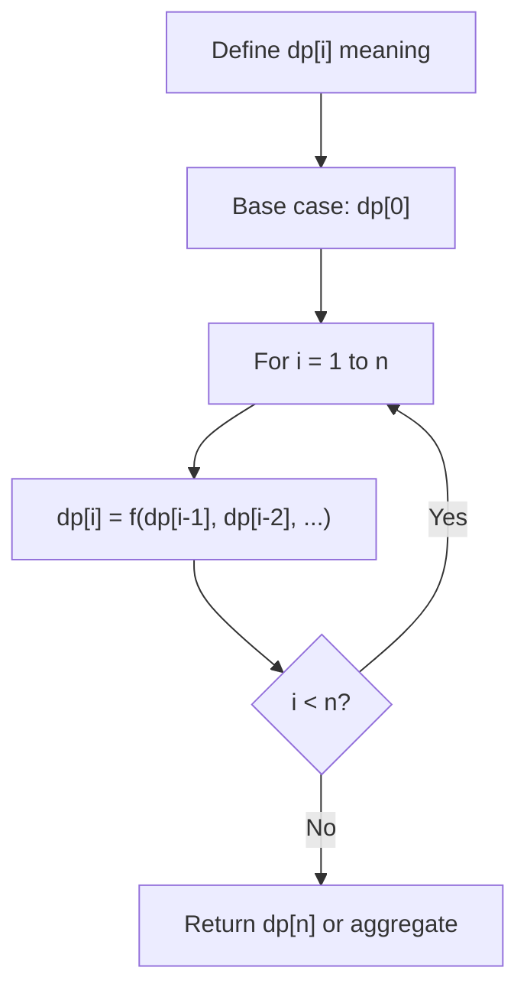
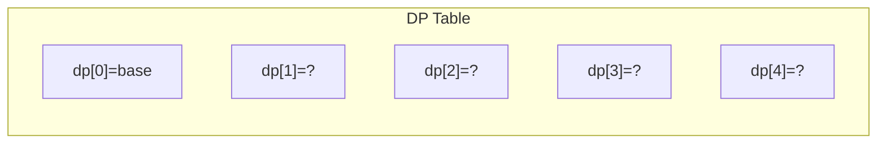
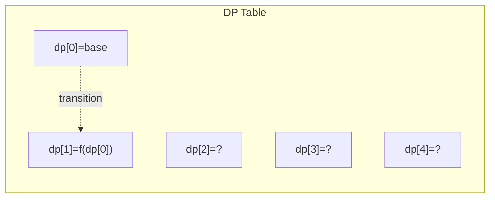
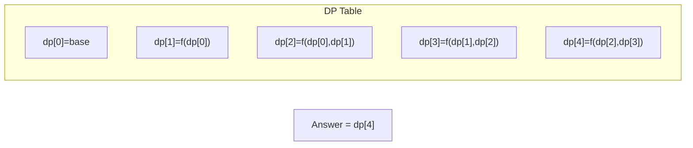

# Problem 1575: Count All Possible Routes

**Difficulty:** Hard  
**Tags:** Array, Dynamic Programming, Memoization  
**Pattern:** Dynamic Programming (1D)  
**Link:** [leetcode.com/problems/count-all-possible-routes](https://leetcode.com/problems/count-all-possible-routes/)

## Description

You are given an array of **distinct** positive integers locations where `locations[i]` represents the position of city `i`. You are also given integers `start`, `finish` and `fuel` representing the starting city, ending city, and the initial amount of fuel you have, respectively.

At each step, if you are at city `i`, you can pick any city `j` such that `j != i` and `0 <= j < locations.length` and move to city `j`. Moving from city `i` to city `j` reduces the amount of fuel you have by `|locations[i] - locations[j]|`. Please notice that `|x|` denotes the absolute value of `x`.

Notice that `fuel` **cannot** become negative at any point in time, and that you are **allowed** to visit any city more than once (including `start` and `finish`).

Return *the count of all possible routes from *`start` *to* `finish`. Since the answer may be too large, return it modulo `10^9 + 7`.

 

Example 1:

```

**Input:** locations = [2,3,6,8,4], start = 1, finish = 3, fuel = 5
**Output:** 4
**Explanation:** The following are all possible routes, each uses 5 units of fuel:
1 -> 3
1 -> 2 -> 3
1 -> 4 -> 3
1 -> 4 -> 2 -> 3

```

Example 2:

```

**Input:** locations = [4,3,1], start = 1, finish = 0, fuel = 6
**Output:** 5
**Explanation:** The following are all possible routes:
1 -> 0, used fuel = 1
1 -> 2 -> 0, used fuel = 5
1 -> 2 -> 1 -> 0, used fuel = 5
1 -> 0 -> 1 -> 0, used fuel = 3
1 -> 0 -> 1 -> 0 -> 1 -> 0, used fuel = 5

```

Example 3:

```

**Input:** locations = [5,2,1], start = 0, finish = 2, fuel = 3
**Output:** 0
**Explanation:** It is impossible to get from 0 to 2 using only 3 units of fuel since the shortest route needs 4 units of fuel.

```

 

**Constraints:**

	- `2 <= locations.length <= 100`
	- `1 <= locations[i] <= 10^9`
	- All integers in `locations` are **distinct**.
	- `0 <= start, finish < locations.length`
	- `1 <= fuel <= 200`

## Approach: Dynamic Programming (1D)

Break the problem into overlapping subproblems. Define dp[i] as the optimal value for the subproblem ending at or considering index i. Build the solution bottom-up, using previously computed dp values.

## Pseudocode

```
1. Define dp[i] = optimal value for subproblem i
2. Base case: dp[0] = initial value
3. For i from 1 to n:
   a. dp[i] = recurrence(dp[i-1], dp[i-2], ...)
4. Return dp[n] or max/min of dp
```

## Algorithm Flow



## Visual State Transitions

**1D Dynamic Programming Table Build:**

**Frame 1: Initialize base cases**


**Frame 2: Fill dp[1] from dp[0]**


**Frame 3: Fill remaining cells**



## Complexity Analysis

- **Time:** O(n)
- **Space:** O(n)

## Solution (Python3)

```python
class Solution:
    def countRoutes(self, locations: List[int], start: int, finish: int, fuel: int) -> int:
        # Dynamic programming (1D) - O(n) time, O(n) space
        if not locations:
            return 0
        n = len(locations) if isinstance(locations, list) else locations
        dp = [0] * (n + 1)
        dp[0] = 1  # base case
        for i in range(1, n + 1):
            dp[i] = dp[i-1]  # transition (customize per problem)
            if i >= 2:
                dp[i] += dp[i-2]
        return dp[n]
```

## Solution (C++)

```cpp
#include <string>
#include <vector>
using namespace std;

class Solution {
public:
    int countRoutes(vector<int>& locations, int start, int finish, int fuel) {
        // Dynamic programming (1D) - O(n) time, O(n) space
        int n = locations;
        if (n <= 0) return 0;
        vector<int> dp(n + 1, 0);
        dp[0] = 1;
        for (int i = 1; i <= n; i++) {
            dp[i] = dp[i-1];
            if (i >= 2) dp[i] += dp[i-2];
        }
        return dp[n];
    }
};
```
