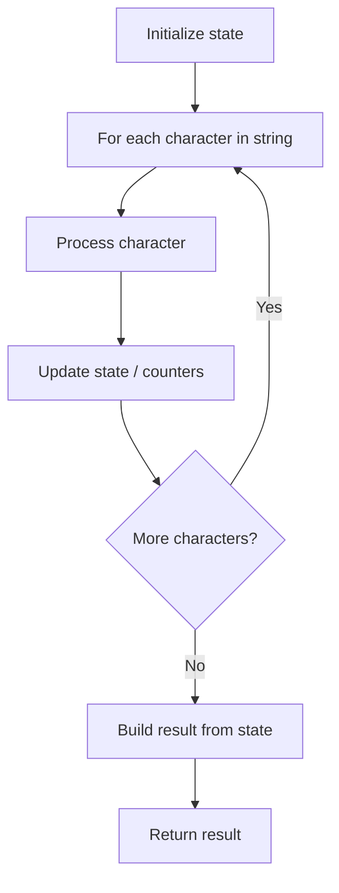

# Problem 1576: Replace All ?'s to Avoid Consecutive Repeating Characters

**Difficulty:** Easy  
**Tags:** String  
**Pattern:** String Processing  
**Link:** [leetcode.com/problems/replace-all-s-to-avoid-consecutive-repeating-characters](https://leetcode.com/problems/replace-all-s-to-avoid-consecutive-repeating-characters/)

## Description

Given a string `s` containing only lowercase English letters and the `'?'` character, convert **all **the `'?'` characters into lowercase letters such that the final string does not contain any **consecutive repeating **characters. You **cannot **modify the non `'?'` characters.

It is **guaranteed **that there are no consecutive repeating characters in the given string **except **for `'?'`.

Return *the final string after all the conversions (possibly zero) have been made*. If there is more than one solution, return **any of them**. It can be shown that an answer is always possible with the given constraints.

 

Example 1:

```

**Input:** s = "?zs"
**Output:** "azs"
**Explanation:** There are 25 solutions for this problem. From "azs" to "yzs", all are valid. Only "z" is an invalid modification as the string will consist of consecutive repeating characters in "zzs".

```

Example 2:

```

**Input:** s = "ubv?w"
**Output:** "ubvaw"
**Explanation:** There are 24 solutions for this problem. Only "v" and "w" are invalid modifications as the strings will consist of consecutive repeating characters in "ubvvw" and "ubvww".

```

 

**Constraints:**

	- `1 <= s.length <= 100`
	- `s` consist of lowercase English letters and `'?'`.

## Approach: String Processing

Process the string character by character. Common techniques: two pointers, sliding window, hash map for frequencies, stack for matching.

## Pseudocode

```
1. Initialize result / tracking state
2. Iterate through string characters:
   a. Process character based on rules
   b. Update state (counters, pointers, stack)
3. Build and return result
```

## Algorithm Flow



## Complexity Analysis

- **Time:** O(n)
- **Space:** O(n)

## Solution (Python3)

```python
class Solution:
    def modifyString(self, s: str) -> str:
        # String processing approach - O(n) time
        result = []
        for ch in s:
            if ch.isalnum():
                result.append(ch.lower())
        # Check palindrome or process
        processed = ''.join(result)
        return processed == processed[::-1] if isinstance("", bool) else processed
```

## Solution (C++)

```cpp
#include <algorithm>
#include <cctype>
#include <string>
#include <vector>
using namespace std;

class Solution {
public:
    string modifyString(string& s) {
        // String processing approach - O(n) time
        string processed;
        for (char ch : s) {
            if (isalnum(ch)) {
                processed += tolower(ch);
            }
        }
        string rev = processed;
        reverse(rev.begin(), rev.end());
        return processed == rev;
    }
};
```
