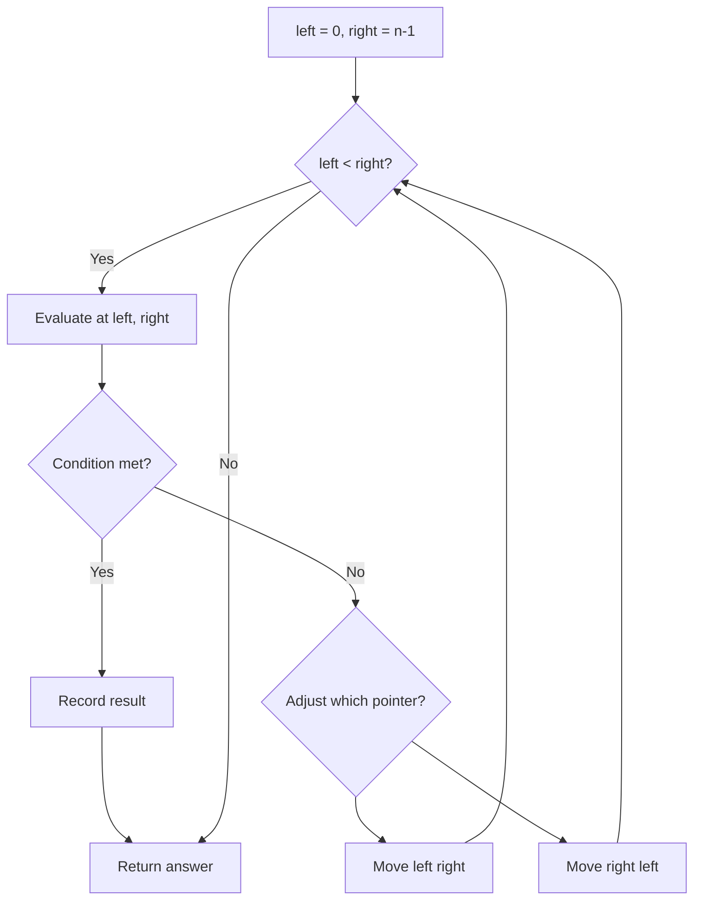
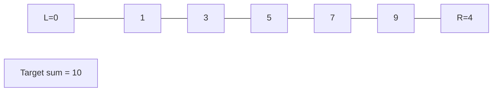
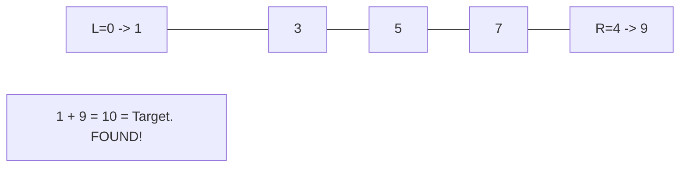

# Problem 1577: Number of Ways Where Square of Number Is Equal to Product of Two Numbers

**Difficulty:** Medium  
**Tags:** Array, Hash Table, Math, Two Pointers  
**Pattern:** Two Pointers  
**Link:** [leetcode.com/problems/number-of-ways-where-square-of-number-is-equal-to-product-of-two-numbers](https://leetcode.com/problems/number-of-ways-where-square-of-number-is-equal-to-product-of-two-numbers/)

## Description

Given two arrays of integers `nums1` and `nums2`, return the number of triplets formed (type 1 and type 2) under the following rules:

	- Type 1: Triplet (i, j, k) if `nums1[i]^2 == nums2[j] * nums2[k]` where `0 <= i < nums1.length` and `0 <= j < k < nums2.length`.
	- Type 2: Triplet (i, j, k) if `nums2[i]^2 == nums1[j] * nums1[k]` where `0 <= i < nums2.length` and `0 <= j < k < nums1.length`.

 

Example 1:

```

**Input:** nums1 = [7,4], nums2 = [5,2,8,9]
**Output:** 1
**Explanation:** Type 1: (1, 1, 2), nums1[1]2 = nums2[1] * nums2[2]. (42 = 2 * 8). 

```

Example 2:

```

**Input:** nums1 = [1,1], nums2 = [1,1,1]
**Output:** 9
**Explanation:** All Triplets are valid, because 12 = 1 * 1.
Type 1: (0,0,1), (0,0,2), (0,1,2), (1,0,1), (1,0,2), (1,1,2).  nums1[i]2 = nums2[j] * nums2[k].
Type 2: (0,0,1), (1,0,1), (2,0,1). nums2[i]2 = nums1[j] * nums1[k].

```

Example 3:

```

**Input:** nums1 = [7,7,8,3], nums2 = [1,2,9,7]
**Output:** 2
**Explanation:** There are 2 valid triplets.
Type 1: (3,0,2).  nums1[3]2 = nums2[0] * nums2[2].
Type 2: (3,0,1).  nums2[3]2 = nums1[0] * nums1[1].

```

 

**Constraints:**

	- `1 <= nums1.length, nums2.length <= 1000`
	- `1 <= nums1[i], nums2[i] <= 10^5`

## Approach: Two Pointers

Use two pointers moving through the data structure. Depending on the problem, pointers may move toward each other (converging), in the same direction (fast/slow), or independently.

## Pseudocode

```
1. Initialize left = 0, right = n-1 (or two independent pointers)
2. While pointers haven't crossed:
   a. Evaluate condition at pointer positions
   b. Move left pointer right or right pointer left
3. Return result
```

## Algorithm Flow



## Visual State Transitions

**Two Pointer Convergence:**

**Frame 1: Initialize pointers**


**Frame 2: Sum = 1+9 = 10, found!**



## Complexity Analysis

- **Time:** O(n)
- **Space:** O(1)

## Solution (Python3)

```python
class Solution:
    def numTriplets(self, nums1: List[int], nums2: List[int]) -> int:
        # Two pointer approach - O(n) time, O(1) space
        left, right = 0, len(nums1) - 1
        while left < right:
            curr = nums1[left] + nums1[right]
            if curr == nums2:
                return [left, right]
            elif curr < nums2:
                left += 1
            else:
                right -= 1
        return 0
```

## Solution (C++)

```cpp
#include <string>
#include <vector>
using namespace std;

class Solution {
public:
    int numTriplets(vector<int>& nums1, vector<int>& nums2) {
        // Two pointer approach - O(n) time, O(1) space
        int left = 0, right = nums1.size() - 1;
        while (left < right) {
            int curr = nums1[left] + nums1[right];
            if (curr == nums2) {
                return {left, right};
            } else if (curr < nums2) {
                left++;
            } else {
                right--;
            }
        }
        return 0;
    }
};
```
