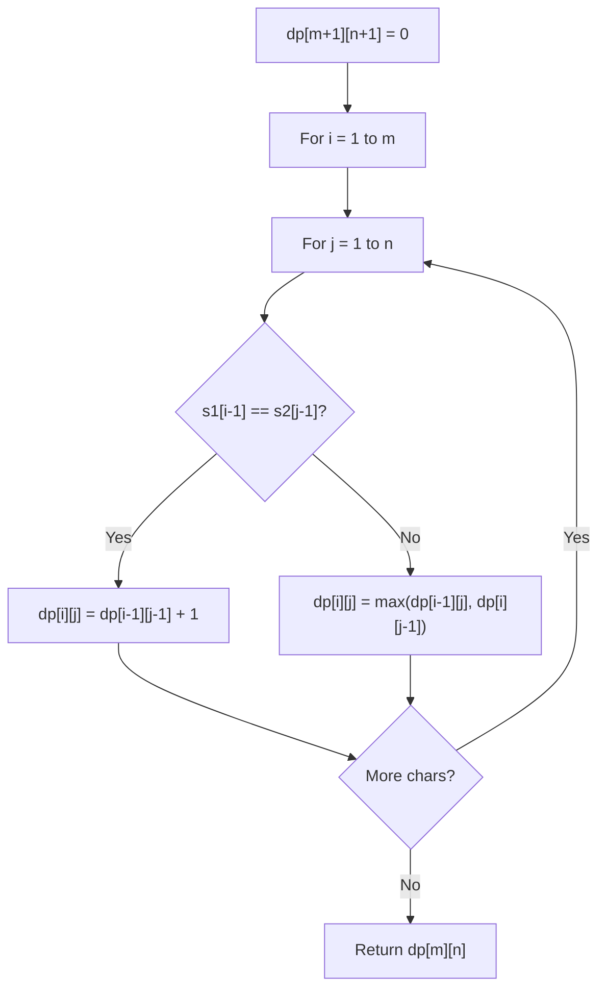

# Problem 1578: Minimum Time to Make Rope Colorful

**Difficulty:** Medium  
**Tags:** Array, String, Dynamic Programming, Greedy  
**Pattern:** Dynamic Programming (String)  
**Link:** [leetcode.com/problems/minimum-time-to-make-rope-colorful](https://leetcode.com/problems/minimum-time-to-make-rope-colorful/)

## Description

Alice has `n` balloons arranged on a rope. You are given a **0-indexed** string `colors` where `colors[i]` is the color of the `i^th` balloon.

Alice wants the rope to be **colorful**. She does not want **two consecutive balloons** to be of the same color, so she asks Bob for help. Bob can remove some balloons from the rope to make it **colorful**. You are given a **0-indexed** integer array `neededTime` where `neededTime[i]` is the time (in seconds) that Bob needs to remove the `i^th` balloon from the rope.

Return *the **minimum time** Bob needs to make the rope **colorful***.

 

Example 1:

```

**Input:** colors = "abaac", neededTime = [1,2,3,4,5]
**Output:** 3
**Explanation:** In the above image, 'a' is blue, 'b' is red, and 'c' is green.
Bob can remove the blue balloon at index 2. This takes 3 seconds.
There are no longer two consecutive balloons of the same color. Total time = 3.
```

Example 2:

```

**Input:** colors = "abc", neededTime = [1,2,3]
**Output:** 0
**Explanation:** The rope is already colorful. Bob does not need to remove any balloons from the rope.

```

Example 3:

```

**Input:** colors = "aabaa", neededTime = [1,2,3,4,1]
**Output:** 2
**Explanation:** Bob will remove the balloons at indices 0 and 4. Each balloons takes 1 second to remove.
There are no longer two consecutive balloons of the same color. Total time = 1 + 1 = 2.

```

 

**Constraints:**

	- `n == colors.length == neededTime.length`
	- `1 <= n <= 10^5`
	- `1 <= neededTime[i] <= 10^4`
	- `colors` contains only lowercase English letters.

## Approach: Dynamic Programming (String)

Compare or match two strings using a 2D DP table. dp[i][j] represents the answer for substrings s1[0..i-1] and s2[0..j-1]. Common patterns: LCS, edit distance, regex matching.

## Pseudocode

```
1. Create dp[m+1][n+1]
2. Initialize base cases
3. For i from 1 to m:
   For j from 1 to n:
     If s1[i-1] == s2[j-1]: dp[i][j] = dp[i-1][j-1] + 1
     Else: dp[i][j] = best of (dp[i-1][j], dp[i][j-1], dp[i-1][j-1])
4. Return dp[m][n]
```

## Algorithm Flow



## Complexity Analysis

- **Time:** O(m * n)
- **Space:** O(m * n)

## Solution (Python3)

```python
class Solution:
    def minCost(self, colors: str, neededTime: List[int]) -> int:
        # String DP - O(m*n) time and space
        m, n = len(colors), len(neededTime)
        dp = [[0] * (n + 1) for _ in range(m + 1)]
        for i in range(1, m + 1):
            for j in range(1, n + 1):
                if colors[i-1] == neededTime[j-1]:
                    dp[i][j] = dp[i-1][j-1] + 1
                else:
                    dp[i][j] = max(dp[i-1][j], dp[i][j-1])
        return dp[m][n]
```

## Solution (C++)

```cpp
#include <algorithm>
#include <string>
#include <vector>
using namespace std;

class Solution {
public:
    int minCost(string& colors, vector<int>& neededTime) {
        // String DP - O(m*n) time and space
        int m = colors.size(), n = neededTime.size();
        vector<vector<int>> dp(m + 1, vector<int>(n + 1, 0));
        for (int i = 1; i <= m; i++) {
            for (int j = 1; j <= n; j++) {
                if (colors[i-1] == neededTime[j-1])
                    dp[i][j] = dp[i-1][j-1] + 1;
                else
                    dp[i][j] = max(dp[i-1][j], dp[i][j-1]);
            }
        }
        return dp[m][n];
    }
};
```
