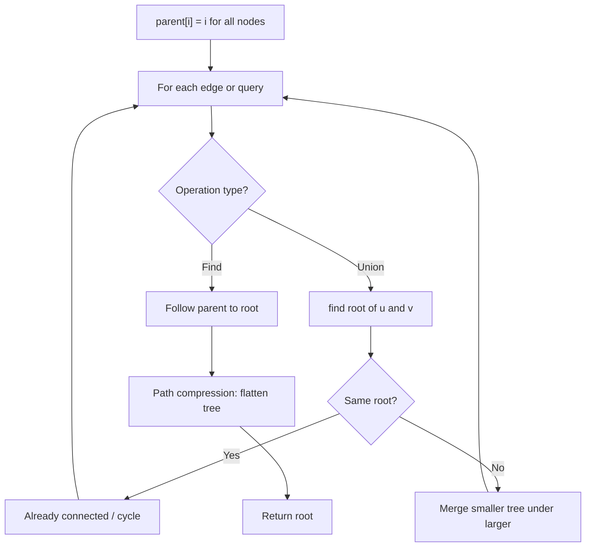
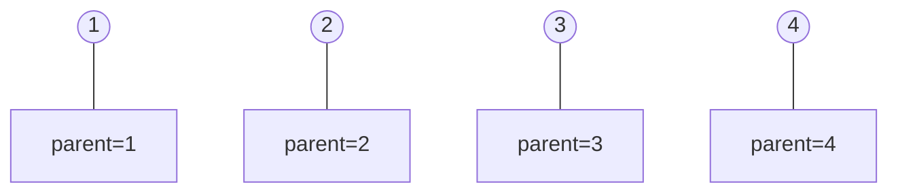
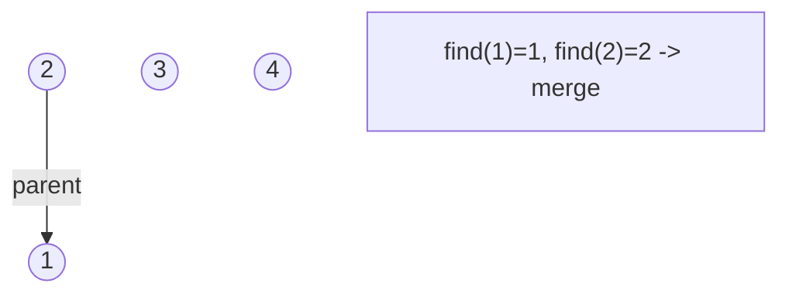
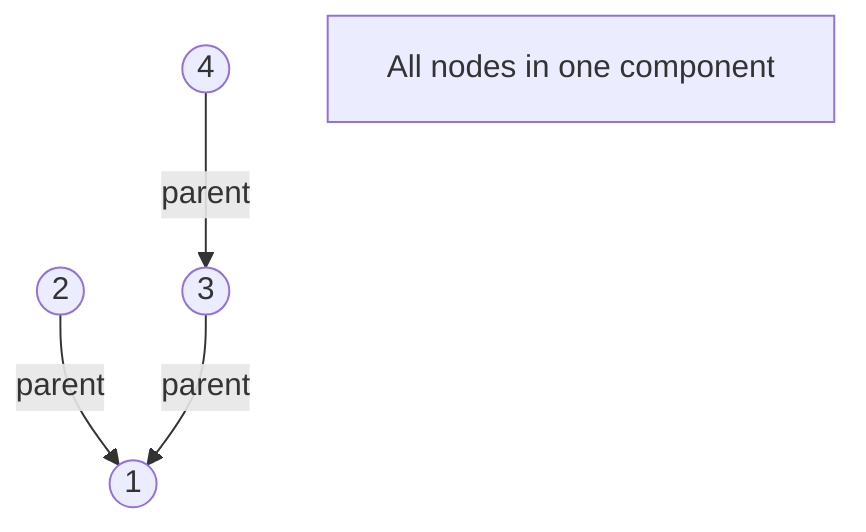
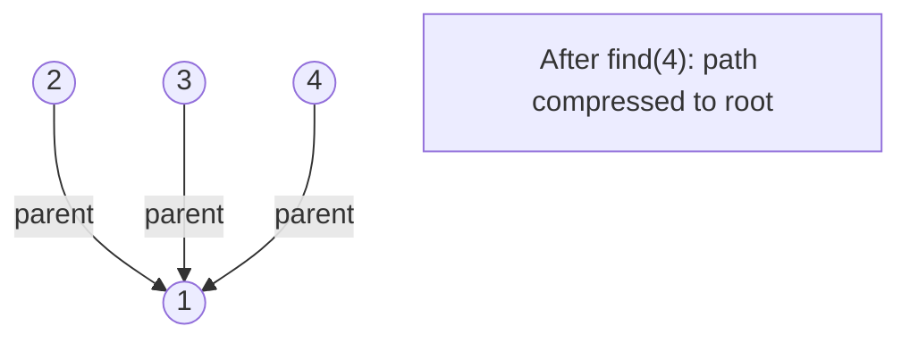

# Problem 1579: Remove Max Number of Edges to Keep Graph Fully Traversable

**Difficulty:** Hard  
**Tags:** Union-Find, Graph Theory  
**Pattern:** Union-Find / Disjoint Set  
**Link:** [leetcode.com/problems/remove-max-number-of-edges-to-keep-graph-fully-traversable](https://leetcode.com/problems/remove-max-number-of-edges-to-keep-graph-fully-traversable/)

## Description

Alice and Bob have an undirected graph of `n` nodes and three types of edges:

	- Type 1: Can be traversed by Alice only.
	- Type 2: Can be traversed by Bob only.
	- Type 3: Can be traversed by both Alice and Bob.

Given an array `edges` where `edges[i] = [typei, ui, vi]` represents a bidirectional edge of type `typei` between nodes `ui` and `vi`, find the maximum number of edges you can remove so that after removing the edges, the graph can still be fully traversed by both Alice and Bob. The graph is fully traversed by Alice and Bob if starting from any node, they can reach all other nodes.

Return *the maximum number of edges you can remove, or return* `-1` *if Alice and Bob cannot fully traverse the graph.*

 

Example 1:

****

```

**Input:** n = 4, edges = [[3,1,2],[3,2,3],[1,1,3],[1,2,4],[1,1,2],[2,3,4]]
**Output:** 2
**Explanation: **If we remove the 2 edges [1,1,2] and [1,1,3]. The graph will still be fully traversable by Alice and Bob. Removing any additional edge will not make it so. So the maximum number of edges we can remove is 2.

```

Example 2:

****

```

**Input:** n = 4, edges = [[3,1,2],[3,2,3],[1,1,4],[2,1,4]]
**Output:** 0
**Explanation: **Notice that removing any edge will not make the graph fully traversable by Alice and Bob.

```

Example 3:

****

```

**Input:** n = 4, edges = [[3,2,3],[1,1,2],[2,3,4]]
**Output:** -1
**Explanation: **In the current graph, Alice cannot reach node 4 from the other nodes. Likewise, Bob cannot reach 1. Therefore it's impossible to make the graph fully traversable.
```

 

 

**Constraints:**

	- `1 <= n <= 10^5`
	- `1 <= edges.length <= min(10^5, 3 * n * (n - 1) / 2)`
	- `edges[i].length == 3`
	- `1 <= typei <= 3`
	- `1 <= ui < vi <= n`
	- All tuples `(typei, ui, vi)` are distinct.

## Approach: Union-Find / Disjoint Set

Use Union-Find with path compression and union by rank to efficiently manage connected components. Find(x) returns the root of x's component; Union(x,y) merges two components.

## Pseudocode

```
1. parent[i] = i for all nodes (each is its own set)
2. find(x): follow parent pointers to root (with path compression)
3. union(x, y): merge sets of x and y by rank
4. Process edges/operations:
   a. For each edge (u, v): union(u, v)
5. Answer queries using find()
```

## Algorithm Flow



## Visual State Transitions

**Union-Find Step-by-Step:**

**Frame 1: Initial - each node is own parent**


**Frame 2: Union(1,2) - merge components**


**Frame 3: Union(3,4) then Union(2,3)**


**Frame 4: Path compression on find(4)**



## Complexity Analysis

- **Time:** O(n * alpha(n))
- **Space:** O(n)

## Solution (Python3)

```python
class Solution:
    def maxNumEdgesToRemove(self, n: int, edges: List[List[int]]) -> int:
        # Union Find (Disjoint Set Union) - O(n * alpha(n))
        parent = list(range(len(n) + 1 if isinstance(n, list) else n + 1))
        rank = [0] * len(parent)
        
        def find(x):
            if parent[x] != x:
                parent[x] = find(parent[x])
            return parent[x]
        
        def union(x, y):
            px, py = find(x), find(y)
            if px == py:
                return False
            if rank[px] < rank[py]:
                px, py = py, px
            parent[py] = px
            if rank[px] == rank[py]:
                rank[px] += 1
            return True
        
        components = len(parent)
        # Process edges/connections
        return components
```

## Solution (C++)

```cpp
#include <functional>
#include <numeric>
#include <string>
#include <vector>
using namespace std;

class Solution {
public:
    int maxNumEdgesToRemove(int n, vector<vector<int>>& edges) {
        // Union Find (DSU) - O(n * alpha(n))
        int n = n.size();
        vector<int> parent(n + 1), rnk(n + 1, 0);
        iota(parent.begin(), parent.end(), 0);
        function<int(int)> find = [&](int x) -> int {
            return parent[x] == x ? x : parent[x] = find(parent[x]);
        };
        auto unite = [&](int x, int y) -> bool {
            int px = find(x), py = find(y);
            if (px == py) return false;
            if (rnk[px] < rnk[py]) swap(px, py);
            parent[py] = px;
            if (rnk[px] == rnk[py]) rnk[px]++;
            return true;
        };
        int components = n;
        return components;
    }
};
```
