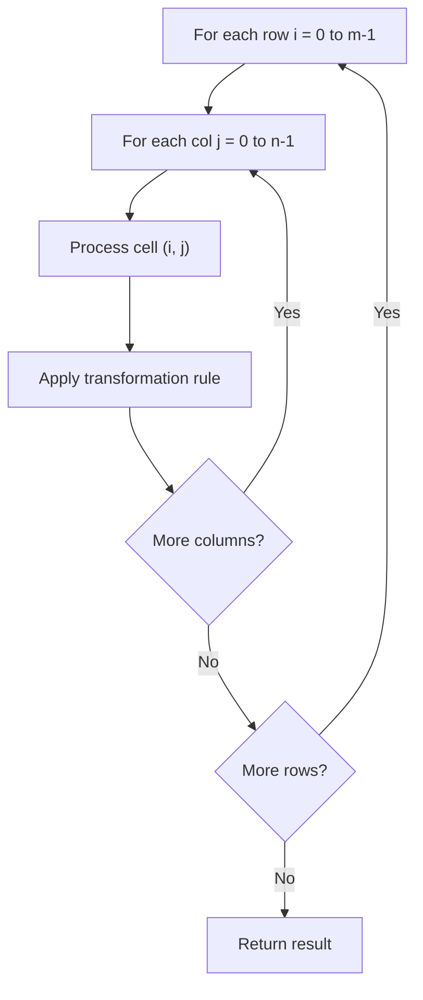

# Problem 1582: Special Positions in a Binary Matrix

**Difficulty:** Easy  
**Tags:** Array, Matrix  
**Pattern:** Matrix / 2D Array  
**Link:** [leetcode.com/problems/special-positions-in-a-binary-matrix](https://leetcode.com/problems/special-positions-in-a-binary-matrix/)

## Description

Given an `m x n` binary matrix `mat`, return *the number of special positions in *`mat`*.*

A position `(i, j)` is called **special** if `mat[i][j] == 1` and all other elements in row `i` and column `j` are `0` (rows and columns are **0-indexed**).

 

Example 1:

```

**Input:** mat = [[1,0,0],[0,0,1],[1,0,0]]
**Output:** 1
**Explanation:** (1, 2) is a special position because mat[1][2] == 1 and all other elements in row 1 and column 2 are 0.

```

Example 2:

```

**Input:** mat = [[1,0,0],[0,1,0],[0,0,1]]
**Output:** 3
**Explanation:** (0, 0), (1, 1) and (2, 2) are special positions.

```

 

**Constraints:**

	- `m == mat.length`
	- `n == mat[i].length`
	- `1 <= m, n <= 100`
	- `mat[i][j]` is either `0` or `1`.

## Approach: Matrix / 2D Array

Process the matrix row by row or column by column. Common patterns: rotation, spiral traversal, in-place modification, transposition.

## Pseudocode

```
1. For each row i:
   For each column j:
     Process cell (i, j) based on neighbors or rules
2. Handle boundary conditions
3. Return modified matrix or computed result
```

## Algorithm Flow



## Complexity Analysis

- **Time:** O(m * n)
- **Space:** O(1) extra

## Solution (Python3)

```python
class Solution:
    def numSpecial(self, mat: List[List[int]]) -> int:
        # Matrix manipulation - O(m*n) time
        if not mat:
            return 0
        m, n = len(mat), len(mat[0])
        # Process matrix in-place or build result
        for i in range(m):
            for j in range(n):
                pass  # Process mat[i][j]
        return 0
```

## Solution (C++)

```cpp
#include <string>
#include <vector>
using namespace std;

class Solution {
public:
    int numSpecial(vector<vector<int>>& mat) {
        // Matrix manipulation - O(m*n) time
        if (mat.empty()) return 0;
        int m = mat.size(), n = mat[0].size();
        for (int i = 0; i < m; i++) {
            for (int j = 0; j < n; j++) {
                // Process matrix[i][j]
            }
        }
        return 0;
    }
};
```
