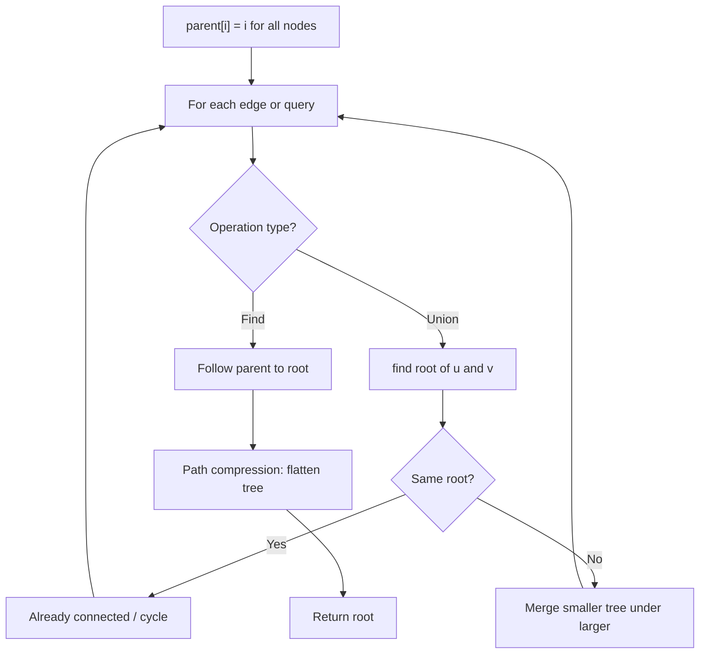
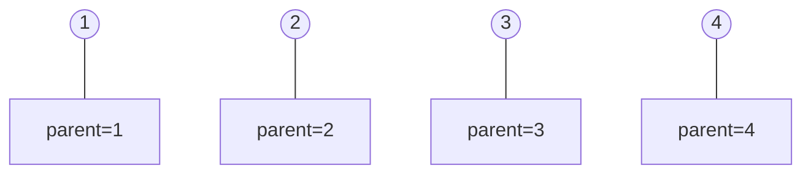
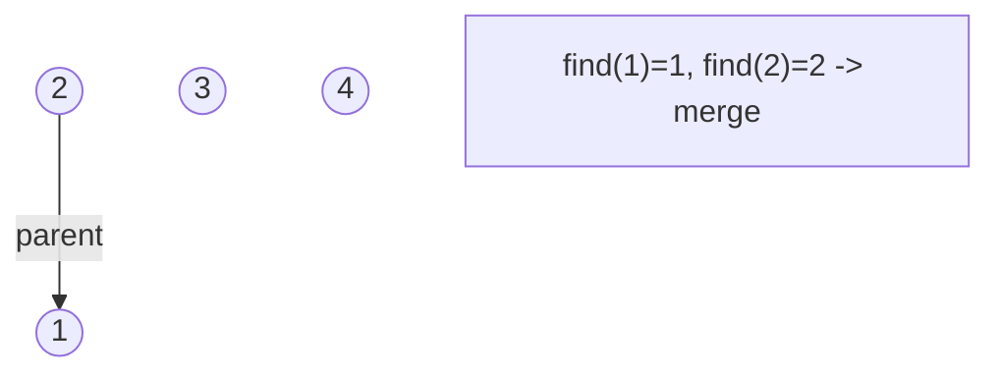
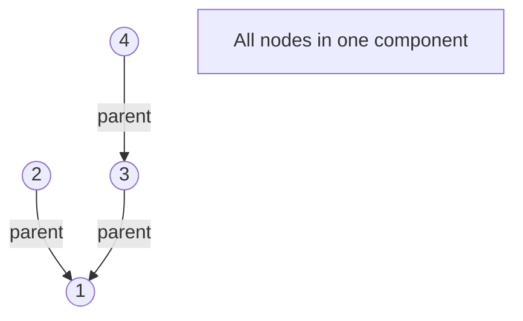
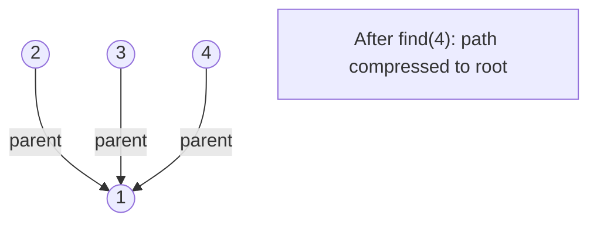

# Problem 1584: Min Cost to Connect All Points

**Difficulty:** Medium  
**Tags:** Array, Union-Find, Graph Theory, Minimum Spanning Tree  
**Pattern:** Prim's MST / Graph  
**Link:** [leetcode.com/problems/min-cost-to-connect-all-points](https://leetcode.com/problems/min-cost-to-connect-all-points/)

## Description

You are given an array `points` representing integer coordinates of some points on a 2D-plane, where `points[i] = [xi, yi]`.

The cost of connecting two points `[xi, yi]` and `[xj, yj]` is the **manhattan distance** between them: `|xi - xj| + |yi - yj|`, where `|val|` denotes the absolute value of `val`.

Return *the minimum cost to make all points connected.* All points are connected if there is **exactly one** simple path between any two points.

 

Example 1:

```

**Input:** points = [[0,0],[2,2],[3,10],[5,2],[7,0]]
**Output:** 20
**Explanation:** 

We can connect the points as shown above to get the minimum cost of 20.
Notice that there is a unique path between every pair of points.

```

Example 2:

```

**Input:** points = [[3,12],[-2,5],[-4,1]]
**Output:** 18

```

 

**Constraints:**

	- `1 <= points.length <= 1000`
	- `-10^6 <= xi, yi <= 10^6`
	- All pairs `(xi, yi)` are distinct.

## Approach: Prim's MST / Graph

Prim's algorithm: greedily add cheapest edge to MST. Use min-heap.

## Pseudocode

```
1. parent[i] = i for all nodes (each is its own set)
2. find(x): follow parent pointers to root (with path compression)
3. union(x, y): merge sets of x and y by rank
4. Process edges/operations:
   a. For each edge (u, v): union(u, v)
5. Answer queries using find()
```

## Algorithm Flow



## Visual State Transitions

**Union-Find Step-by-Step:**

**Frame 1: Initial - each node is own parent**


**Frame 2: Union(1,2) - merge components**


**Frame 3: Union(3,4) then Union(2,3)**


**Frame 4: Path compression on find(4)**



## Complexity Analysis

- **Time:** O(n^2 log n)
- **Space:** O(n^2)

## Solution (Python3)

```python
class Solution:
    def minCostConnectPoints(self, points: list[list[int]]) -> int:
        import heapq
        n = len(points)
        visited = set()
        heap = [(0, 0)]
        cost = 0
        while len(visited) < n:
            d, u = heapq.heappop(heap)
            if u in visited:
                continue
            visited.add(u)
            cost += d
            for v in range(n):
                if v not in visited:
                    dist = abs(points[u][0]-points[v][0]) + abs(points[u][1]-points[v][1])
                    heapq.heappush(heap, (dist, v))
        return cost
```

## Solution (C++)

```cpp
#include <functional>
#include <numeric>
#include <string>
#include <vector>
using namespace std;

class Solution {
public:
    int minCostConnectPoints(vector<vector<int>>& points) {
        // Union Find (DSU) - O(n * alpha(n))
        int n = points.size();
        vector<int> parent(n + 1), rnk(n + 1, 0);
        iota(parent.begin(), parent.end(), 0);
        function<int(int)> find = [&](int x) -> int {
            return parent[x] == x ? x : parent[x] = find(parent[x]);
        };
        auto unite = [&](int x, int y) -> bool {
            int px = find(x), py = find(y);
            if (px == py) return false;
            if (rnk[px] < rnk[py]) swap(px, py);
            parent[py] = px;
            if (rnk[px] == rnk[py]) rnk[px]++;
            return true;
        };
        int components = n;
        return components;
    }
};
```
