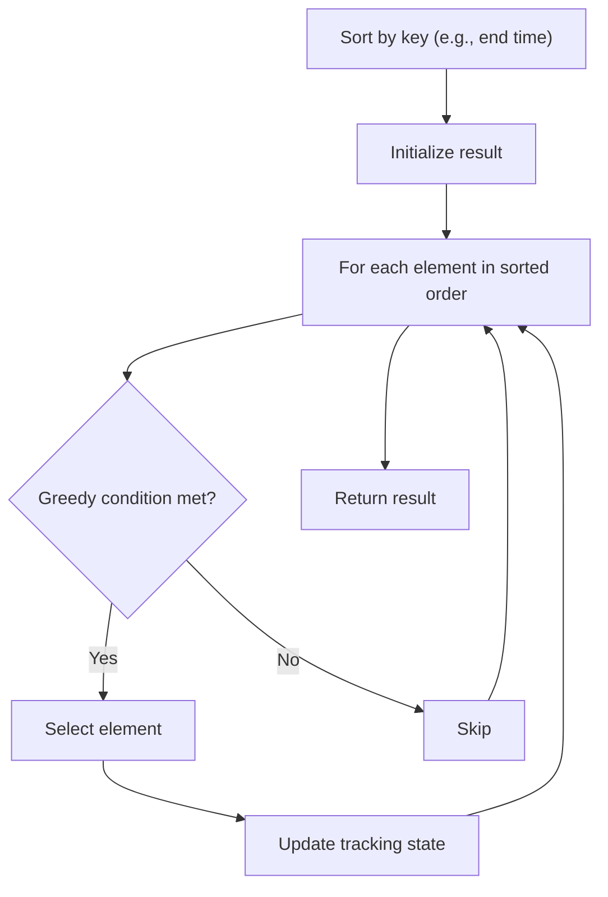

# Problem 1585: Check If String Is Transformable With Substring Sort Operations

**Difficulty:** Hard  
**Tags:** String, Greedy, Sorting  
**Pattern:** Greedy with Sorting  
**Link:** [leetcode.com/problems/check-if-string-is-transformable-with-substring-sort-operations](https://leetcode.com/problems/check-if-string-is-transformable-with-substring-sort-operations/)

## Description

Given two strings `s` and `t`, transform string `s` into string `t` using the following operation any number of times:

	- Choose a **non-empty** substring in `s` and sort it in place so the characters are in **ascending order**.

	
		For example, applying the operation on the underlined substring in `"14234"` results in `"12344"`.
	
	

Return `true` if *it is possible to transform `s` into `t`*. Otherwise, return `false`.

A **substring** is a contiguous sequence of characters within a string.

 

Example 1:

```

**Input:** s = "84532", t = "34852"
**Output:** true
**Explanation:** You can transform s into t using the following sort operations:
"84532" (from index 2 to 3) -> "84352"
"84352" (from index 0 to 2) -> "34852"

```

Example 2:

```

**Input:** s = "34521", t = "23415"
**Output:** true
**Explanation:** You can transform s into t using the following sort operations:
"34521" -> "23451"
"23451" -> "23415"

```

Example 3:

```

**Input:** s = "12345", t = "12435"
**Output:** false

```

 

**Constraints:**

	- `s.length == t.length`
	- `1 <= s.length <= 10^5`
	- `s` and `t` consist of only digits.

## Approach: Greedy with Sorting

Sort the input by a key criterion, then greedily process elements in sorted order. The sorting ensures the greedy choice is always optimal.

## Pseudocode

```
1. Sort elements by key (start time, weight, etc.)
2. Initialize result, tracking variables
3. For each element in sorted order:
   a. Apply greedy selection rule
   b. Update result
4. Return result
```

## Algorithm Flow



## Complexity Analysis

- **Time:** O(n log n)
- **Space:** O(n)

## Solution (Python3)

```python
class Solution:
    def isTransformable(self, s: str, t: str) -> bool:
        # Sort + greedy - O(n log n) time
        s.sort()
        result = 0
        curr_end = 0
        for item in s:
            if isinstance(item, (list, tuple)):
                if item[0] >= curr_end:
                    result += 1
                    curr_end = item[1]
            else:
                result += 1
        return result
```

## Solution (C++)

```cpp
#include <algorithm>
#include <string>
#include <vector>
using namespace std;

class Solution {
public:
    bool isTransformable(string& s, string& t) {
        // Sort + greedy - O(n log n) time
        sort(s.begin(), s.end());
        int result = 0, curr_end = 0;
        for (auto& item : s) {
            result++;
        }
        return result;
    }
};
```
